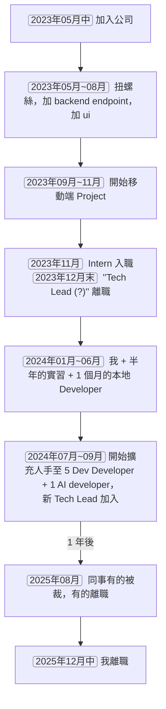
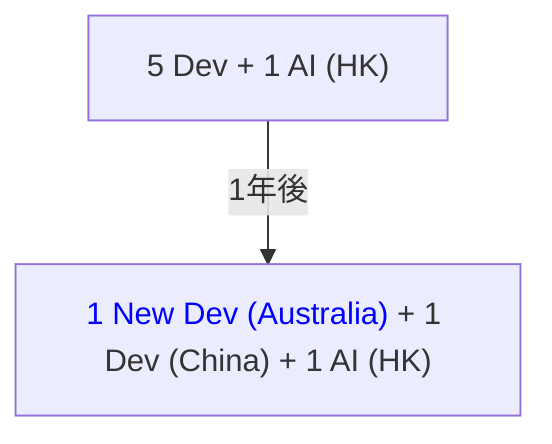

<style>
  video {
    border-radius: 4px;
    max-width: 660px;
  }
  img {
    max-width: 660px !important;
  }

  .label-container {
    border: none;
    stroke: none !important;
    fill : transparent !important;
  }
  .edgeLabel {
    padding: 10px;
    background-color : rgb(248, 249, 250) !important;
  }
</style>

### Office 環境的改變

#### 2023 ~ 2024 年末

這是環境最舒適的兩年（有地墊會加分）。


#### 2025 年

這是工作環境最差的 office，在灣仔，真的就一間房間，連個會客室也沒有。說實話辦工室不舒服是很影響求職者加入的意欲 ...。

可是公司的方向是不再在香港招人了，所以是盡量壓低香港的所有成本吧。


### 談談工作了兩年半的初創公司

#### 時間線



#### 2023 年 5 月 ~ 2023 年 11 月

##### 對 "Tech Lead" 的不信任

大概二年半前我剛加入現在的公司的時候，剛好是當時公司主力項目的最終階段。我主要都在修他們已有的 feature，加加功能，扭扭螺絲。那個時段正好是人力交替周期，辭職的辭職，各有不同的出路。IT 相關的職員只剩下一個 senior 的 "Tech Lead" 跟一個 AI engineer。

三個月後，公司展開一個新的手機項目。這領域對這位 "Tech Lead" 來說非常陌生。

其一，他不熟 React；其二，他沒有幹過 native mobile application 的項目。以致他沒有任何基礎在新項目上作出任何技術上的決策。而作為 react developer 的我，理所當然決定使用 react-native 來開發新項目了。

因為我有參與舊 project 的一些短期維護，所以看到這位 Lead 帶領下 project 的一些慘況以及他的行為令我對他抱有極為負面的看法。

###### ❌ 都 2023 年了還沒在用 Typescript ？

我不了解他們的技術選型是如何做到 3 人合作 (我入職前的 team size)，但堅持使用 `js` 來跑這個網頁 project。到我接手的時候，他只是一個到處都是 `any` type 的炸彈。我要花很多時間從 chrome debugger (source 頁面) 把 data type 弄清楚，再把重點要改的頁面變成 `.ts` 檔才有辦法改下去。

這年頭不選 `typescript` 是根本沒有 nodejs 生態的知識嗎？


###### ❌ 不合理地從 MySQL 遷移到 MongoDB

後端用的 Spring Boot，原本是使用 MySQL，然後有一半已經改為 MongoDB。詢問轉換原因，"Tech Lead" 認為 business 經常改變，所以 MongoDB 這種沒有 schema 的 persistence solution 更適合，因為 schema 更具彈性（蛤？）。

這絕對是一個***嚴重的 Skill Issue***。

2023 年年底的新 React Native Project 我直接從 MongoDB 改成使用 Prisma + PostgreSQL。這個新 project 至今跑了兩年，還是走得好好的，business 還一直改，用的是 (從 Nodejs Express 變成) Spring Boot。

###### ❌ 允許沒有 CI/CD

簡單的一個 React Application，原來是在 EC2 上跟 Spring Boot Backend 綁在一起，順便在 EC2 上 host 的。Deployment 方法是使用純手工的精美 shell script，連到 EC2 上作一輪精彩的操作 (打斷 spring，上傳 zip，unzip，啟動，...)。這是我第一家公司沒在用 CI/CD 的，也是太精彩了。

作為 "Tech Lead" 竟然允許公司做的是手動 deploy？無論是前端還是後端，`DEV` 應該是 merge 了就立刻 deploy，所有爆炸性問題應盡早在 `DEV` 找到。UAT 同理。


###### ❌ 沒有 Repository 的 Spring Boot

Spring Boot 以齊全的腳手架而聞名。

這個舊 Spring Boot Project 有一個絕妙的點，整個項目 ***完全沒有*** repository 的概念。你都使用 mongo 了，不是有 `spring-data-mongodb` 可以用嗎？難道所有簡單的 "query" 都要自己手擼出來嗎。

Nodejs 的話好歹還是有個 `Model` (from `mongoose`) 的概念，這個 Spring Boot Project 直接用 `MongoTemplate` 硬幹到底。還滿佈沒有 Type 的 `bson.Document` object，比 `js` 還更 `js`。

如何在 Spring Boot 正確使用 MongoDB，請參看本 blog 文章: [Spring Data MongoDB](/blog/article/Spring-Data-MongoDB)。

###### ❌ 不學無術，愛擺架子

抱有過份的階級觀念。他技術不行，但又死愛面子。在我這些認真好學，經常鑽研技術的 developer 眼中，根本沒辦法跟這種不好好做學問的人相處。我記得我進公司第 4 個月吧，我差點要鬧辭職了。

後來如我所料，它在離職後在自己的 Linkedin 自我介紹加上跟他完全沒關係的工作經驗 (整個 React Native 關他屁事呢？)。


我早已看清這個人沒甚麼學術誠信，我從直覺上就覺得跟這種人合不來。

#### 2023 年 11 月 ~ 2024 年 6 月

##### "Tech Lead" 的離去

十月份左右，他終於覺得自己可以做的貢獻太少，所以提出離職了。他的通知期是兩個月，12 份月離開。


當時的 Tech Lead 偏愛 MongoDB，而因為他即將離去所以選擇我當時熟悉的 Tech Stack。為了開發效率我們嘗試 Express + MongoDB (最終變成 Spring Boot + PostgreSQL，這又是另一個故事了)。工作這幾年都由更 senior 的人來***從零***建立後端，這方面我沒甚麼 hands-on 經驗，也只好邊學邊做。


後來我們使用 MongoDB 的方式根本與 relational db 方式沒差別，所以在 2023 年年底從 MongoDB 遷移到 PostgreSQL 去了。這遷移工作自然也是由我來做的。


##### 得來不易的決策機會


<spacer></spacer>


"Tech Lead" 的離開令我不得不從後端，Schema Design，上 Cloud，走 Lambda Function，CI/CD，一手包辦。這是一個很好的機會，在 "有一位比你更 senior 的人存在" 下，以下

- Deployment Strategy
- Backend Architecture
- Schema Design

根本不可能讓 "更 junior" 的人隨便做決策的。Senior 很大機會把最有價值的工作搶來做的 (更何況有些人單純只會邀功的？) 。

正好這位 "Tech Lead" 的離開令我有隨意發揮的機會。同時我的發揮令到公司的原型產品能如期推出。我敢肯定這位 "Tech Lead" 繼續留下來的話，原型開發進度不可能有那麼快。


##### 建立 Development Team 所有基礎設施


在小公司，當公司***缺人***的時候，你就可以得到這種中等或以上規模的公司得不到的機會。託賴公司對我的信任，加上我自己私人時間的研究，我在公司建立了

1. **所有 CI/CD Workflow.** \
   包括所有 backend (Python, Spring Boot, Nestjs, Express) 其 pipeline (workflow) 所需的 `yml` file，以及提倡 Github Action 作為 CI/CD 工具 (後來 Gitlab 才宣佈不再支援香港)。

2. **兩㮔 Deployment 模式.** \
   CI/CD workflow 有兩種 deployment 模式，一種是經 Lambda Function，一種是經 ECS。

   Lambda Function 也有很多種類︰
   - 有 python 的；
   - 有 nodejs 的；
   - 有 spring boot (snap-started) 的；
   - 有 unzipped size 超過 250 mb，經 docker image 跑的。

   每一種都經過很多時間研究。

3. **完整的 Database Schema Migration 制度.** \
   這對多人合作建立 Backend 非常重要，每位成員 migrate schema 時都確保是當前最新狀態 (不然報錯)。

4. **所有必需的 Cloud Infrastructure.** \
   包括 rds, rds-proxy, load-balancer, private load-balancer, cloudfront, ..., 應有的都有。以及後來使用 Terraform 來達成整個 Infrastructure 的可重覆性。

5. **完善的 Cloud Infrastructure 網頁.** \
   讓團隊成員可以取得所有 Infrastructure 的資訊 (從 terraform export 出來的)。例如
   - Websocket endpoints;
   - Loadbalancer 每一個 port 對應的 service;
   - 各 service 的 cloudwatch log 連結

   等等。以上的內容都是從一個 backend endpoint 取得，並建立了一個簡單的 Google Authentication (只有本公司 email 可登入成功)，只有登入成功後才可以從 endpoint 取得資訊，以確保內容保密。


##### 幾乎獨撐的半年，人事小變動


###### 一位半年的實習生

為了減輕我的工作量，公司試驗性地增聘人手。在 2023 年 11 月公司請了一位實習生，很會用 AI（我當時還不怎麼用），交付給實習生的任務大都能處理好。儘管我們後端用的是直接用 SQL 跟 database 交互的方式，都可以很快上手然後處理後台的 business logic。

後端方面，他主要是負責 UI 的新頁面，有需要甚麼 data 的話，他都可以自己去聯一下表弄一個 `GET` endpoint。因為沒有 ORM，完全沒有 N+1 問題的包袱，寫出來的東西在 query builder 加持下也鮮有 performance 問題。

前端日常我會偶爾指導一下 AI 不會提到，但實作時才會發現的問題。最典型就是修改 list 的內容時瘋狂 `useState` 導致的效能問題。用 redux 精準控制需要 rerender 的組件即可解決。這是一類遇不到就很難解釋清楚的前端陷阱。

最後這半年的成果也成功幫他後來在恒生銀行取得另一份實習工作。

###### 一位待了一個月的本地 Developer，Domain Driven Design 的啟蒙老師

這半年間 (4月還是5月份) 我們也面試了一位本地的 Developer，跟我一樣是念數學系的。Domain Driven Design (DDD) 這種概念都是從他那邊學的，研究過 DDD 更加能發現現在 Nodejs Backend 的問題 (我們在 [#backend_failed] 再討論)。

只可惜 DDD 是很吃 framework 的一種設計模式。現存的 nodejs + express 是不可能做到的。就算使用 NestJS + TypeORM 還是會有一定的困難，例如︰

1. 沒有一個對標 Spring Boot 的 `ApplicationEventPublisher`；

2. 沒有機制能對標 Spring Boot 的 Proxy 來處理 `@OneToMany`，`@ManyToMany` 等 annotation。

   你沒有明確寫 left join，他會變成 `undefined`。而 maintain 那條 left join list 也會演變成一場悲劇。

3. 沒有 `@Transactional` 等通用的 annotation (如何模仿 Spring Boot 的 `@Transactional`，詳見 [For Transactions](/blog/article/Fundamentals-of-Nestjs#9.1.1.-decorator-to-set-metadata)) 。

4. 沒有 `@Embedded` 跟 `@Embeddable` 來自然地把 Entity class 跟 Value Object 綁定 (在 Spring Boot 以外強行使用這個 Pattern 是徒增 Project Complexity) 。

由於這位 Developer 的知識對這公司來說有點超前，而他又花太多時間在這方面，以致新的 feature 做得很緩慢甚至比實習生更差。所以被老闆一個月後勸退了。

這對我來說是一個***示例***，如果想帶來創新及改變，必須先在 Personal Project 做，再對團隊提出 (也不要自己偷偷做在公司 Project 做，其他人不認同只會空辛苦一場) 。不用實例說明的話只會變成讓公司在你的 idea 上*賭時間*。

明顯***帶來改變***是費力不討好的，你沒有一定熱情和想法很難為公司帶來改變，何況有很多不願意改變的人，~~但我就愛推動改變~~。

現在我很習慣用 Spring Boot 跑 DDD 這套 Methodology 了，也希望有機會可以再跟他合作。因為有認知要使用 DDD 人真的不多，實在是太多把第一年經驗重覆 10 年的人，也很難找到對 DDD 有同樣研究程度的人。

##### 從零建立 Backend 吸取的教訓
###### 失敗談 {#backend_failed}

雖然我花了很多很多時間去研究，力求做到最好。可是我也是第一次***從零***去建立後端，包括 table design 和後端架構完全憑直覺，加上我沒有參與過好 Project 的經驗，歷時一年的 nodejs backend 在新 Tech Lead 的帶領下用 Spring Boot 重寫。

這個 nodejs 發生甚麼事呢？

1. **缺乏 Repository Layer.** \
   Database 交互主要用一種名為 Kysely 的 query builder。儘管 architecture 走的是 controller service，但沒有 repository。

2. **Data/SQL 驅動的 Domain Logic.** \
   所有 domain logic 都是用 query builder 來描寫。有時候甚至在 controller level 就擼 query 了。

   當所有 domain logic 都是 data 驅動，也就是經由 sql 去操弄，將導致下一個結果︰

3. **開始出現複雜及難以維的 Query.** \
    開始有很長的 sql，無數的 left join，複雜的 pgsql-specific 語句。

   > [詳細例子](/blog/article/Problem-of-SQL-Based-Nodejs-Backend-Should-we-use-Query-Builder-)

   Domain logic 開始不容易維護了，你不可能在 SQL 上加 Break Point。
   
   這令我開始確信後台應***盡量避免***使用 SQL 或 SQL Builder 來維護 domain logic。也令我開始相信 domain logic 應該是***行為驅動***的。

5. **Services 沒有按 Domain 劃分好.** \
   基本上變成了一個大泥球，再加上其他團隊成員的加入，就變得愈來愈亂了。實際上在系統設計初期並沒有把 Domain 裏的 Context 劃分出來。

看着這個後端變成這個樣子，自己也有一點心痛。

###### Spring Boot 不是萬靈丹

是不是用 Spring Boot 上面的問題就解決了？答案是***否定***的。Spring Boot 充其量是多了一個 JPA，可以幫你自動建立 Repository；或是多了一個 `@Transactional` 幫助你滅少 "爛 data"。但沒有走對正確的方法論（思考框架），最後其實用甚麼語言都會變成一托 $*$。

以下都是沒有方法論的通病

- 胡亂建立的 services (都跟 util 沒差別了)
- 互相引用導致的 cycle dependencies
- Logics of the same domain spread to multiple services

等等。它們從根本上沒法避免。具個例子，你可以告訴我同樣的 domain logic

- `memberService.joinProject` 跟
- `projectService.addMember`

哪個是正確的？答案是**沒有對錯**，因為後端從根本沒有 Aggregate 這個概念，所有 resource 的建立都沒有層級可以規範。這種沒有對錯的 *N* 選 1 選擇題將會不停發生，你可以想像跟 Project 這個 domain 有關的 logic 在各個 services 之間到處亂跑了嗎？

說到底，怎樣才能構成一個 Service？他的建立是基於甚麼原則？如果沒有原則，那就是即興，亂源，成為 `util`/`helper` 的另一個命名用詞而已。

很明顯，使用 Spring Boot 並不能解決上述問題。***但是***，使用 Spring Boot 令以下的 Methodology 變得容易實現︰

###### 系統設計的方法論（思想框架，實行方法）

所以為免重蹈覆轍，開始學習後端的一些方法論。到網上找一找的話除了傳統的 Controller-Service-Repository (最簡單的)，你會看到︰

- Clean Architecture
- Onion Architecture
- Hexagonal Architecture (Ports & Adapters)
- Domain Driven Design

他們其實都非常相似，dependency list 最終的依賴是 domain business 本身 (也就是 entity 的 domain behaviour)，而不是單單作為資料儲存的 Data Class, Repository。

- DDD:

  

- Hexagonal Architecture:

  

<spacer></spacer>

我選擇深入的方向是 Domain Driven Design。

- 從戰略層面 (design system by context 以及 event storming);
- 到戰術層面 (domain behaviour, value object, aggregate, etc)

我都花了不少時間去研究。另外 DDD 是其中一種 Event Driven Design，他使到系統能更容易處理 side effect 以及其 logging。同時因為 DDD 中`Command` 跟 `Event` 的概念，為 Event Storming 提供了系統設計的基礎 Building Unit。


我覺得 DDD 對我最大影響是 schema design 的一些思維改變。例如所有 table 被設計時都一定需要思考它在一個 domain 裏的哪個 ***Context*** (Context-First)。這些設計不管你後端走不走 domain driven design 的戰術路線都通用的。

關於 DDD 的戰術部分，其*實戰*可參考我的文章 (第 5.1.1 開始)︰

- [Timetable System for an Art School :: Invoke the command from controller](/portfolio/Commercial-Timetable-System-for-an-Art-School#5.1.1.-step-1.-invoke-the-command-from-controller)

更多的參考可到文章的 [Book and Video References](http://localhost:3000/portfolio/Commercial-Timetable-System-for-an-Art-School#8.-book-and-video-references) 找到。

#### 2024 年 7 月 ~ 2024 年 9 月


##### 第一次擔當 Interviewer 這角色

因為缺人，公司終於認真擴充人手。同時我是公司唯二的 developer，所以就由我來尋找未來的伙伴了。因為當時我只有五年的經驗，我沒自信能帶領一個項目走向成功，所以要老闆盡可能也找一些資深的人來帶領我們。

不想踩雷，所以要求比較嚴謹。有前端需要的話，***必須***有 Portfolio。有後端需要的話，會由我旁邊的 AI engineer 補充我沒問到的問題。有的 candidate 讀書成績好但沒甚麼經驗的，也會被老闆抓來讓我們看看。

面試問題大概是從 CV 的工作內容中選幾項我感興趣的追問下去，看是不是我們需要的和有沒有在撒謊（學術誠信也是能力一部分）。除了 CV 外，我會問問自己遇到的痛點（討教嘛）。

總結而言，一個好的 interview 不單是快樂的，面試雙方可以互相指導大家不熟悉的地方，互相學習。我面試了兩類人，這兩類人我們要求的能力都不同︰

1. **跟我一樣做 Feature 為主的 Contributor.**

   在我面試過的 candidate 之中，確實有很多地雷被我成功 filter 走。具體例子︰
   - **地雷 1.** 說自己手機 FYP 在校拿了個 A grade，但沒辦法 demo (那你當時怎樣拿評分的？CV 上有就有機會問啊 ...，我們也在找做手機應用的人啊 ...)。

   - **地雷 2.** CV 說會 Tensorflow。問他項目裏 model 是幹甚麼，他說是 image classification。問他這個 model 用過甚麼 layer，答不出來。我黑人問號？？？

   - **地雷 3.** 我的 interview 有 live-coding 環節，跟我一起修改一個 hack.md 的檔案來達成某個 UI。

     我們要找有 react 經驗的，candidate CV 上也寫有 react 經驗，但怎麼組件寫好了，會出現好幾個

     ```ts
       const { state1, state2 } = useState()
       const { state3, state4 } = useState()
       ...
     ```

     之類的怪東西，花括號是甚麼鬼 ...。在 `<input />` box 利用 `onChange` 或 `useRef` 來 紀錄/拿取 輸入內容也做不到。

   - **地雷 4.** 問後台有甚麼方法確認 request user 身份，竟然完全沒經驗，答不出任何方案（例如可以經 header / cookie 傳訊息 ...），更不用問要傳甚麼訊息了。

   說來真的很神奇，十個 applicant 裏面，真的只有 1, 2 個會有 Portfolio。這明明是引導 interviewer 問你熟悉的問題的好機會。

2. **Tech Lead，了解老闆需要，做決策，分派任務的.**

   這類 candidate 就跟老闆一起 interview，到了這程度我們就不看 Portfolio 了。我問我遇到的問題，老闆問管理團隊的問題。最後老闆跟 candidate 閉門討論比較私密的問題。

   感覺到這階段我只是頭緝毒犬？？？

##### 正式成員的編成

原型建立好後，老闆便開始持續招聘，最後把整個團隊擴展到 5 個 developer + 1 個 AI developer。有在香港本地的大陸人，有在大陸 fully remote 的。

而在這公司中，我是唯一一個香港人 ...。這其中

- 有 Full-Stack 的
- 有專門做 Frontend 的
- 有從業快 20 年的新 Tech Lead
- 有資深的 Android Developer（這比 iOS developer 更有優勢，因為可以寫 Kotlin Spring Boot）

陣容在當時來說非常全面了。只可惜這位 Android Developer 學不動 expo 生態，最終也用不上他的 android 知識來為 expo project 添加功能。而且他的前端能力完全沒辦法在 react 生態下表現出來 ...。

#### 2024 年 10 月 ~ 2025 年 8 月 (離職念頭的萌芽)


##### 失去很多想要的機會

在這些 developer 中，有些人是幾乎在前端幫不上忙，愈幫愈忙的，就被派去做後端。而我這種六邊形戰士，甚麼都可以做的，就被迫做更多前端的工作。久而久之，我變成主力做 cloud 加前端，都不是我想要做的工作。

##### Lovable UI 之亂，No Code Manager 之變本加厲

AI 工具令 project manager 更輕鬆，同時令 developer 更忙更難受。

以前這位 no code manager 會在 figma 畫原型，當半個 ui designer。會用 lovable UI 後，直接整個生成出來。但是需求不停變，他也沒辦法用咒語把他 "想要的" 的呈現到 lovable UI 的預覽中，導致需求跟預覽沒辦法統一，根本不知道要不要再參考這個***預覽***。

正常一間公司，都會有 ui designer 在產品開發的最初期跟 project manager 緊密聯系，做出一個可以模疑整個 business flow 的假貨，在早期就把邏輯，ux，都確定好。現在這公司嘗試 skip 掉這個 ui designer，來折磨 developer。

其次，他想要我們從 lovable UI 的原碼開始改，要做到跟他一模一樣，可是 lovable UI 的 code 動輒 4000 行.....，甚麼 logic 都塞進同一個檔案。我可是花了很大力氣把它 refactor 成 1000 行，且重新綁定成我們處理 state 的套路。

後來他乾脆 ui 都不弄了，要我們通靈，我們做好後他再想怎麼改。所以我們要以 "會被改掉" 前提下去做新的 UI。這算是這公司的一大特色，大開眼界了。

#### 各自離職，前端將成缺口

- 2025 年 7 月底大陸同事被辭退；

- 2025 年 8 月底一位前端同事有其他機會而離職。

各方溝通後能看出公司想以限制加薪的方式讓 香港/大陸 職員自然流失，把重心放在澳洲。這也促使我尋找更好的發展機會。經過 [#find_job] 後︰

- 2025 年 12 月中旬 我離職；

- 2026 年 1 月中旬 新 Tech Lead 離職。




9 月份新聘的澳洲 developer 不會前端，也就是 2026 年 1 月後所有***極為繁重***的 frontend (手機 + 網頁) 工作將全推給***一個人***承擔。

而公司最近 interview 的下一任新 Tech Lead 非常會 Cloud，但只會 Angular，也就等於在這公司的前端上沒有任何輸出能力。前端這工作量沒有兩個人來分擔基本上是啃不下的。尤其是手機端需要 Android + iOS 同時維護，還要理解 Expo Ecosystem 和 App Store Connect 跟 Google Play Console 的各種 configuration，不是隨便找個 React Developer 就能夠應付的。

看來前端部分將成為一個極大的流失缺口，都是被工作量和不恰當人才聘用迫走的。


#### 公司最大的問題


<spacer></spacer>

> <spacer height="0"></spacer>
> 由沒有編程經驗的人來做 Product Manager。


<spacer height="0"></spacer>

他們一天沒有意識到這個問題，基本上公司都不會走得遠。

沒有編程經驗的 PM ，或者是說，沒有在 IT 公司***受聘過***的 no code PM，真的應該每天下班拿個一小時出來學習怎樣寫程式，不然這種 PM 只會把一個又一個 developer 趕走。

要不要看看對岸台灣的 no code PM 都在幹甚麼的？

- https://www.threads.com/@paullwc/post/DRomZ-zk4pf

再看看我們現在公司那位？

我們耐性非常高的新 Tech Lead 也跟他對不上嘴，更何況是我這種性格比較剛烈的 developer？我不在乎錢，你有種可以跟我對着幹，我是隨時就能離職那種。

其實我幹了一年就想跑路了，累得跟狗一樣。可是新增聘的人手確實不錯所以再待個一年看看，這樣一待就是兩年半。基本上到這階段 (9 月份) 都把所有責任都分散出去了，是隨時都能離開的狀態。

### 求職 (2025 年 9 月) {#find_job}

#### 策略


<spacer></spacer>

最後工作找了一個多月，因為我一路以來（無論是上班時，或者是下班後）都在不斷思考和不斷作出新的嘗試，我把這些嘗試總結成 [Portfolio](/portfolio)，或者是 [Blog](/blog) 中的文章，方便以後重塑同一塊知識點。

展示這些 "作品" 後面試機會還挺多的。我的方向是 全端/純後端，技術棧方面，後端找的是 Spring Boot, Nodejs 或者是 Rust，前端找的是 React / React-Native，且***拒絕所有***純前端的工作，因為這與我的職涯規劃相沖。

我個人認為一個合格的 application 需要有

- **能展示你能力的個人網站.** \
   其中包括 Portfolio，前後端的設計理念 (如技術選型，其原因)，***能用***的 Deployment，相關的 Github project。

- **一份容易閱讀的 CV.** \
   這吃一點點美術。你要有能力***突出重點***，包括︰
  1. ***用心的排版***，資訊量控制（美術的虛實，在排版中就是留白，字的疏密度）

     

  2. ***講重點***，不要加上
     - "令系統少了 85% error"
     - "令前端提昇了 30% 速度"

     等等。這些沒辦法被證明的陳述遠比想像中虛。如實說出你幹過甚麼就好。

  3. ***不要說謊***，你沒有做過就誠實面對，面試官很愛從你的工作內容把細節問到底。
  
      每一個工作上的決策背後都有前因後果的，如果你的工作內容是***編***出來的很容易就被問出來。

      這次求職過程有面試過 Axa 香港（保險業的），被 4 個 Team Lead 連番轟炸 ...，真的把 CV 連同平常 工作/合作 方式都問得很徹底。

      

#### 兩個 Offer


<spacer></spacer>

尋尋覓覓，有些公司還在做那種我不想碰的 AI wrapper 所以沒有談下去，最後得到兩個 offer︰

1. I-Charge Solutions International (ICS) 的 Analyst Progammer
2. 中國銀行的 System Analyst

I-Charge 如其說是一個 offer，他更像是一個 rejection。其實我薪金加幅寫了 HKD 5000，是留一個空間讓對方壓價，你但凡加個 HKD 3000 到 HKD 4000 我都會立刻接受，畢竟我真的很想轉環境。I-Charge 出 offer 的時候直接把加幅壓到只剩 HKD 1000。

這就像跟我開一個玩笑，我花時間請個假去面試，但對他們來說原來我就像一個小丑一樣，用來打發他們的時間，用來浪費我的 annual leave。

收到電話通知後從有 offer 到 reject offer 整個過程不到 1 分鐘，心裏只道：「好傢伙。」

另一邊面試中國銀行後，過了兩個禮拜我才收到中國銀行對我有興趣的消息，並從獵頭那邊知道他們想給我 offer。再 3 個禮拜後才正式通知我可以去簽約 ...（太多不確定性了，我完全不知道中國銀行對我的 case 進行到哪一個地步）。

整個等待的過程非常的煎熬，因為我很期待這份工作，且薪金的加幅也很理想。

#### 小插曲︰甚麼？我的通知期是兩個月？

在這間初創公司 兩年半 內經歷過 3 次加薪。加上最一開始的合約，這 4 次簽約我不知道甚麼時候通知期開始變成 兩 個月，但我在外面求職都寫自己通知期是 1 個月。

天 ...，我不是甚麼 Lead Role，跟人事提出離職意願時他幫我查一下才發現我的真實通知期。萬幸的是老闆也很支持我到外面闖一闖，而且信任我寫文檔交接的能力（整間公司會瘋狂寫文檔的就我了，而且為了方便閱讀我的文檔都 deploy 成一個 frontend，經 cloudfront share 出去），所以允許我變成正常的一個月通知期。

感謝一直以來提供的機會，他日技術變強了，頭也禿了，看有沒有機會再跟這間公司合作。


