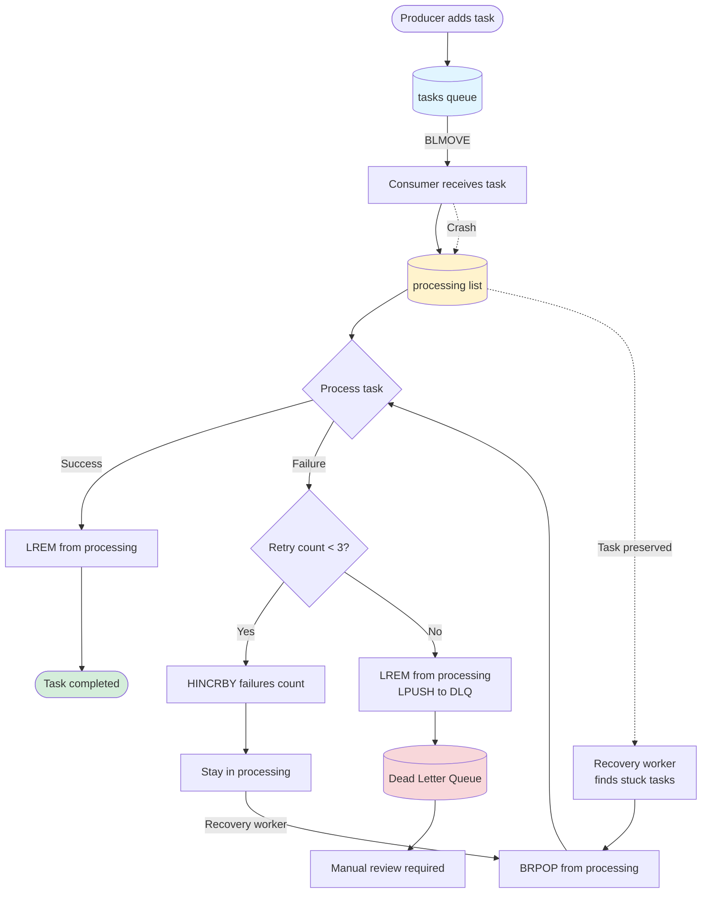

<style>
  video {
    border-radius: 4px;
    max-width: 660px;
  }
  img {
    max-width: 660px !important;
  }
</style>

### Redis List Fundamentals

#### What is a Redis List?

A Redis List is an ordered collection of strings, sorted by insertion order. 

Key characteristics:
- Maximum length: $2^{32} - 1$ elements
- Operations on both ends are $O(1)$
- Accessed by index with $O(N)$ complexity
- Perfect for queues, stacks, and message processing

#### Internal Implementation

Redis Lists use different encodings based on size to optimize memory usage:

<item>

**Small Lists (Listpack).**
When a list is small, Redis implements it using a compact data structure called **listpack** (or **ziplist** in Redis < 7.0). This encoding:
- Stores all elements in a single contiguous block of memory
- Minimizes memory overhead (no pointers between elements)
- Faster cache locality for small lists
- Automatically used when both conditions are met:
  - List has fewer than 512 elements (configurable via `list-max-listpack-entries`)
  - Each element is smaller than 64 bytes (configurable via `list-max-listpack-value`)

</item>

<item>

**Large Lists (Quicklist).**
When thresholds are exceeded, Redis converts to a **quicklist**:
- Hybrid structure: doubly-linked list of listpacks
- Balances memory efficiency with performance
- Each node in the quicklist is a listpack
- Allows efficient insertion/deletion at both ends

</item>


Simply put:

1. Internally redis use `Listpack` (an array of entries with various sizes) and `LinkedList` interchangeably. The underlying reason is that for small list pointers is even bigger than the internal data. 

2. Plus `LinkedList` cannot fully utilize the cache feteched from memory into  CPU: looping over pointer is highly inefficient.


#### Create and Add to Lists

Redis Lists are ***created automatically*** when you add the first element (on the other hand, we cannot create an empty list):

```bash
LPUSH mylist "world"
LPUSH mylist "hello"
RPUSH mylist "!"
# Push multiple elements at once
LPUSH tasks "task1" "task2" "task3"
```

- `LPUSH` = **L**eft push (add to **head**)
- `RPUSH` = **R**ight push (add to **tail**)

#### Read from Lists

```bash
# View all elements (0 = first, -1 = last)
LRANGE mylist 0 -1
# Get first 2 elements
LRANGE mylist 0 1
# Get last 2 elements  
LRANGE mylist -2 -1
# Check list length
LLEN mylist
# Get element at specific index
LINDEX mylist 0
LINDEX mylist 1
```

#### Remove from Lists

```bash
LPOP mylist
RPOP mylist  
LPUSH fruits "apple" "banana" "apple" "orange" "apple"

# Remove first 2 occurrences of "apple"
LREM fruits 2 "apple"
# Remove all occurrences (use 0)
LREM fruits 0 "apple"
```


### `BLMOVE` - Reliable List-Based Message Queue

#### On `BLMOVE`

##### What is it?

`BLMOVE` (Blocking List Move) is a Redis command that atomically moves an element from one list to another. It's the blocking version of `LMOVE`, meaning it will wait for an element to be available if the source list is empty.

Syntax:
```text
BLMOVE source destination LEFT|RIGHT LEFT|RIGHT timeout
```

Parameters:
- `source` - The list to move from
- `destination` - The list to move to  
- First `LEFT|RIGHT` - Which end to pop from source (LEFT = head, RIGHT = tail)
- Second `LEFT|RIGHT` - Which end to push to destination
- `timeout` - Maximum seconds to wait (0 = wait forever)


##### Why `BLMOVE`?


**Problem it solves.** When building a message queue with Redis Lists, we face a critical issue: what happens if a consumer ***crashes*** while processing a message?

Without `BLMOVE` (using `RPOP`):
```bash
# Consumer pops a message
RPOP tasks
# Returns: "process-payment-order-123"
```
1. Now processing... but consumer crashes!
2. Message is lost forever - payment was ***never*** processed.

This situation is ***recoverable*** with `BLMOVE`:
```bash
# Atomically move from tasks to processing
# POP from RIGHT from source, 
# INSERT from LEFT to destination
BLMOVE tasks processing RIGHT LEFT 0
# Returns: "process-payment-order-123"
```

1. Consumer crashes!
2. Message is still in "processing" list, thus it ***can be*** recovered!


##### Timeout behavior


The ***timeout*** is the **maximum** time `BLMOVE` will wait. Once a message arrives, `BLMOVE` returns immediately, no matter how much time is left in the timeout period.


<item>

**Example 1 (Source list is empty, timeout=5).**

```bash
BLMOVE empty_queue processing RIGHT LEFT 5
```

Redis blocks for 5 seconds, waiting for an element. After 5 seconds, returns `nil` (nothing available).

</item>
<item>

**Example 2 (Source list is empty, timeout=0).**

```bash
BLMOVE empty_queue processing RIGHT LEFT 0
```

Redis blocks ***forever*** until an element is available.

</item>

<item>

**Example 3 (Source list has elements).**

```bash
LPUSH orders "order:123"
BLMOVE orders processing RIGHT LEFT 30
```

Returns immediately (`"order:123"` (no waiting at all).).

</item>
<item>

**Example 4 (Message arrives during timeout period).**

```bash
BLMOVE orders processing RIGHT LEFT 30
```
- Starts blocking... waiting... and after 29 seconds, a message arrives. 
- It returns ***immediately*** with the message (doesn't wait another 30 seconds!).

</item>


##### Example of Dedicated Worker Machines


`timeout=0` is perfect for containerized workers - single purpose
```python
while True:
    result = r.blmove('tasks', 'processing', 0, 'RIGHT', 'LEFT')
    process(result)
    r.lrem('processing', 1, result)
```


Why `timeout=0` works well here?
- The only job for the  worker is to process messages (no other responsibilities)
- Container/process manager handles ***lifecycle*** (Kubernetes sends `SIGTERM`)
- Most efficient - no unnecessary wake-ups
- Modern deployment pattern: stateless, disposable workers
- Failed messages will be left in `processing` queue (list).


#### Scenarios

<item> 

**Scenario 1 (Order Processing System).**

```bash
LPUSH orders "order:1001"
LPUSH orders "order:1002"
LPUSH orders "order:1003"

# Consumer 1 starts processing
# Timeout=30: Wait up to 30 seconds for message, then return nil
BLMOVE orders processing:consumer1 RIGHT LEFT 30
# Returns: "order:1001"

# Consumer 2 starts processing
BLMOVE orders processing:consumer2 RIGHT LEFT 30
# Returns: "order:1002"

# If Consumer 1 completes successfully, remove from processing
LREM processing:consumer1 1 "order:1001"
```


Now if Consumer 2 crashes, `order:1002` stays in `processing:consumer2`, recovery process can find it and reprocess.

Here `LREM` serves the purpose of **`ACK`-ing** the processed message.

</item>

<item>


**Scenario 2 (Email Notification Queue).**

```bash
# Add email jobs
LPUSH email:queue "send-welcome-email:user123"
LPUSH email:queue "send-receipt-email:order456"

# Worker picks up job
BLMOVE email:queue email:processing RIGHT LEFT 0
# Returns: "send-welcome-email:user123"

# Email sent successfully - acknowledge
LREM email:processing 1 "send-welcome-email:user123"
```

</item>

#### Handling Failed Consumption with BRPOP

When a task fails and remains in the processing list, we can reconsume it:

```bash
# Check what's stuck in processing
LRANGE processing 0 -1
# Returns: ["task2", "task5", "task8"]

# Reconsume failed task (blocking pop from processing queue)
BRPOP processing 30
# Returns: ["processing", "task2"]

# Retry processing
# ... retry logic ...

# If successful
LREM processing 1 "task2"

# If still fails, increment failure counter
HINCRBY task:task2:failures count 1
```

#### Dead Letter Queue (DLQ) Pattern

When a task fails multiple times, move it to a dead letter queue for manual review:

```bash
# Track failure count with hash
HSET task:failures task1 0

# Consumer logic (pseudocode):
task = BLMOVE tasks processing RIGHT LEFT 0

try:
    process(task)
    # Success - ACK
    LREM processing 1 task
    HDEL task:failures task
catch error:
    # Increment failure count
    failures = HINCRBY task:failures task 1
    
    if failures >= 3:
        # Too many failures - move to DLQ
        LREM processing 1 task
        LPUSH dead_letter_queue task
        HSET task:dlq:task timestamp "2026-03-01T10:00:00"
        HSET task:dlq:task error error.message
    else:
        # Keep in processing for retry
        # Recovery worker will pick it up
```

Complete example with retry logic:

```python
import redis
import time
import json

r = redis.Redis(host='localhost', port=6379, decode_responses=True)

def process_with_retry(task_data):
    """Simulate task processing with retry and DLQ"""
    task_id = task_data
    max_retries = 3
    
    while True:
        # Get current failure count
        failures = int(r.hget(f'task:failures', task_id) or 0)
        
        if failures >= max_retries:
            # Move to dead letter queue
            r.lrem('processing', 1, task_id)
            r.lpush('dead_letter_queue', task_id)
            r.hset(f'task:dlq:{task_id}', mapping={
                'timestamp': time.time(),
                'failures': failures,
                'reason': 'Max retries exceeded'
            })
            print(f'Task {task_id} moved to DLQ after {failures} failures')
            break
        
        try:
            # Simulate processing
            print(f'Processing {task_id} (attempt {failures + 1})')
            
            # Your actual processing logic here
            # raise Exception("Simulated failure")  # Uncomment to test failure
            
            # Success - ACK
            r.lrem('processing', 1, task_id)
            r.hdel('task:failures', task_id)
            print(f'Task {task_id} completed successfully')
            break
            
        except Exception as e:
            # Increment failure count
            r.hincrby('task:failures', task_id, 1)
            print(f'Task {task_id} failed: {e}')
            time.sleep(2 ** failures)  # Exponential backoff

# Consumer loop
while True:
    # Wait for task (30 second timeout)
    result = r.blmove('tasks', 'processing', 30, 'RIGHT', 'LEFT')
    
    if result:
        process_with_retry(result)
    else:
        print('No tasks available, waiting...')
```

#### Flow Diagram



### Problems of `BLMOVE`

While `BLMOVE` provides reliability for message queues, it has several limitations that make it unsuitable for complex messaging scenarios:
#### The Problems 

##### No Native ACK Mechanism

> **Problem.** Redis Lists don't have built-in acknowledgment support.

We must manually implement ACK using `LREM`, which creates additional complexity:
- Need to track processing state separately
- Manual retry logic required
- No automatic redelivery on consumer failure

Example of the manual work required:
```bash
# Must manually manage all these steps:
BLMOVE tasks processing RIGHT LEFT 0  # 1. Consume
# ... process ...
LREM processing 1 "task1"             # 2. Manual ACK
HINCRBY failures "task1" 1            # 3. Track failures manually
# ... check retry count ...
LPUSH dlq "task1"                     # 4. Manual DLQ management
```

Comparison with proper MQ systems:
```javascript
// With Kafka/RabbitMQ - built-in ACK
consumer.consume((message) => {
  process(message)
  message.ack()  // Automatic redelivery if not acked
})
```

##### No Consumer Group Support

> **Problem.** Cannot distribute messages among multiple consumers efficiently.

With Lists, each message can only be consumed by one consumer, but there's no coordination:

```bash
# Setup: 3 consumers, 1 queue
LPUSH tasks "task1" "task2" "task3"

# All consumers call:
BLMOVE tasks processing:consumer1 RIGHT LEFT 0
BLMOVE tasks processing:consumer2 RIGHT LEFT 0  
BLMOVE tasks processing:consumer3 RIGHT LEFT 0

# Result: Each gets different task (good)
# But: No load balancing, no consumer state tracking, no automatic rebalancing
```

Missing features:
- No automatic message distribution
- No consumer health tracking
- No rebalancing when consumers join/leave
- No pending message ownership tracking
- Cannot see which consumer is processing which message

What Kafka consumer groups provide:
```javascript
// Kafka automatically:
// - Assigns partitions to consumers
// - Rebalances when consumers join/leave  
// - Tracks consumer offsets
// - Handles consumer failures with automatic reassignment
consumer.subscribe(['orders'], {
  groupId: 'order-processors'  // Automatic distribution!
})
```

##### Performance Degradation at Scale

> **Problem.** Messages accumulate faster than consumers can process them.

When production rate exceeds consumption rate, the processing list grows indefinitely.


List also suffers from Time complexity issues:

| Operation | Complexity | Performance at Scale |
|-----------|-----------|---------------------|
| `LPUSH` | O(1) | Fast |
| `BLMOVE` | O(1) | Fast |
| `LREM` | O(N) | Slow when N is large! |
| `LRANGE` | O(S+N) | Slow for large ranges |

##### Linear Structure Query Inefficiency

> **Problem.** Finding specific messages requires $O(N)$ operations.

Lists are sequential data structures - no random access by ID:

```bash
# Want to check status of order:123?
# Must scan entire list!

LRANGE processing 0 -1  # Get all messages
# Returns: ["order:456", "order:789", ..., "order:123", ...]
# Client must scan through results

# With 100,000 messages:
# - Redis sends all 100k over network
# - Client must iterate to find "order:123"
# - Inefficient and slow
```

Common queries that are inefficient:

```bash
# 1. Check if specific task exists
LRANGE processing 0 -1 | grep "order:123"  # O(N) scan

# 2. Count tasks by type  
LRANGE tasks 0 -1 | grep "payment:" | wc -l  # O(N) scan + filter

# 3. Find tasks older than 5 minutes
# Impossible without external tracking!

# 4. Get all tasks for a specific user
LRANGE tasks 0 -1 | grep "user:123"  # O(N) scan + filter
```

What we need but Lists cannot provide:
- Query by message ID: $O(1)$ lookup
- Query by timestamp: Range queries
- Query by field: Index-based search
- Query pending messages per consumer: Fast lookup

##### No Message Metadata

> **Problem.** Cannot store additional information about messages.

Lists only store strings - no structured data:


#### Redis Stream


These limitations led to Redis Streams, which solves all the problems above by providing:
- Built-in consumer groups
- Automatic ACK mechanism with `XACK`
- $O(1)$ message lookup by ID
- Rich metadata support
- Pending message tracking (PEL, which stores consumed messages that has not been ACK-ed)
- Automatic consumer failover
- Range queries by timestamp
- Message claiming for recovery

### When to Use BLMOVE vs Redis Streams

`BLMOVE` with Lists is suitable for:
- Low to medium throughput
- Simple message structure (string-based tasks)
- Single consumer or small number of consumers
- No need for message history or replay
- Learning Redis basics

Upgrade to Redis Streams when you need:
- High throughput
- Structured message data with multiple fields
- Consumer groups with automatic distribution
- Built-in ACK and pending message tracking
- Message history and replay capability
- Time-based queries and analytics
- Production-grade reliability

### Next Steps

For production-ready message processing with consumer groups, automatic ACK, and all the features missing from BLMOVE, see the companion article on [Redis Streams](/blog/article/Redis-Streams-Production-Ready-Message-Queues-with-Consumer-Groups).
