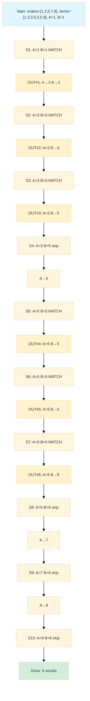
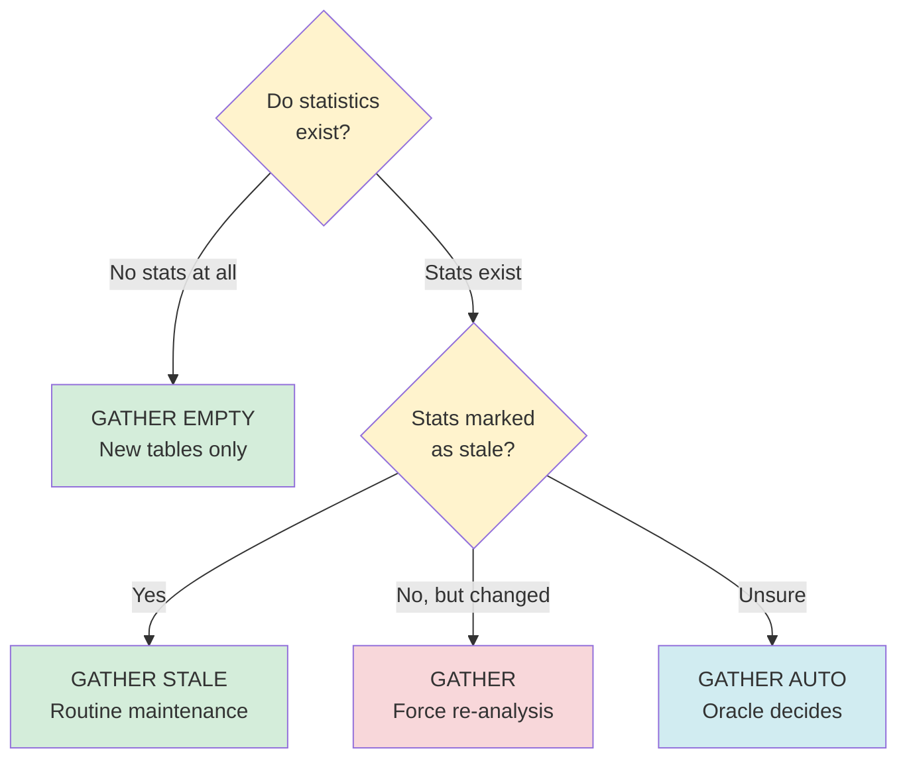
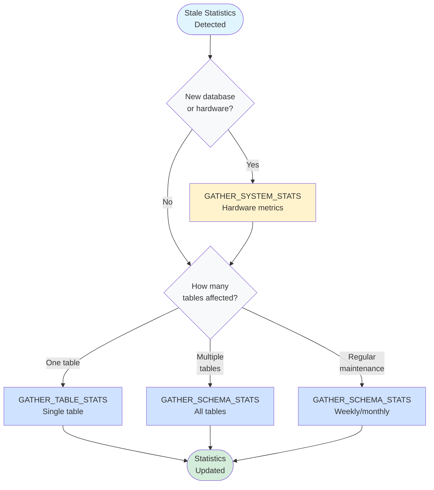

<style>
  video {
    border-radius: 4px;
    max-width: 660px;
  }
  img {
    max-width: 660px !important;
  }
  table th:first-child,
  table td:first-child {
    min-width: 200px;
  }
</style>

### What Are Database Statistics

Database statistics are metadata that the query optimizer uses to estimate the cost of different execution plans. These statistics include.

- Row counts in tables
- Distribution of values in columns
- Index cardinality
- Data density and selectivity
- NULL value frequencies

When these statistics become outdated (stale), the optimizer makes suboptimal decisions, leading to poor query performance.

### Join Algorithms

Before diving into stale statistics, we need to understand the join algorithms that database optimizers choose between. These algorithms are fundamental to how databases combine data from multiple tables.

#### Nested Loop Join

**How it works.**
- For each row in the outer table, scan the entire inner table looking for matches
- Similar to nested for-loops in programming

**Example.**
```text
For each row in Table A (outer table):
    For each row in Table B (inner table):
        If A.key = B.key:
            Output joined row
```

**Why is it called "outer" and "inner"?**

The terminology comes from nested loop structure in programming.
- The **outer table** (Table A) is like the **outer loop** - it's processed first and runs fewer times (once through the entire table)
- The **inner table** (Table B) is like the **inner loop** - it's nested inside and runs many times (once for each row in the outer table)

Just like in nested loops where the outer loop variable changes slowly and the inner loop variable changes rapidly, the outer table is scanned once while the inner table is scanned repeatedly.

In this example, Table A is the **outer table** (scanned once) and Table B is the **inner table** (scanned repeatedly for each row in A).

**When it's used.**
- Small outer table with indexed inner table
- Selective `WHERE` clauses (few matching rows)

**Performance.**
- Time complexity: $O(n \cdot m)$ where $n$ = outer rows, $m$ = inner rows
- Best when outer table is small (Table A) and inner table has an index (Table B)

**Example scenario.**
```sql
SELECT * FROM customers c
JOIN orders o ON c.id = o.customer_id
WHERE c.state = 'CA';
```

**Execution order.**
- **Step 1.** Apply `WHERE` clause - filter customers by state (returns 5 customers from 10 total)
- **Step 2.** For each of those 5 customers, use index to find their orders

Good choice: only 5 CA customers after filtering. The `customers` (outer table) is small after `WHERE` clause, and `orders` (inner table) is large (1M rows) but has index on `customer_id`. Result: Only 5 index lookups - very fast!

#### Hash Join

**How it works.**
- Build phase. Create hash table from smaller table
- Probe phase. Scan larger table, probe hash table for matches

**Example.**
```text
1. Build hash table from Table A (smaller table) on join key
2. For each row in Table B (larger table):
    - Hash the join key
    - Look up in hash table
    - Output matches
```

In this example, Table A is the **build input** (smaller table, used to create hash table) and Table B is the **probe input** (larger table, scanned to find matches).

**When it's used.**
- Large tables where indexes don't exist or wouldn't be efficient (both Table A and B can be large, but algorithm works best when at least one is significantly smaller)
- Equality joins only (=)
- Sufficient memory available to hold the hash table

**Why choose hash join over nested loop (even when indexes exist).**
- Hash join ignores indexes but doesn't require their absence
- **Optimizer chooses hash join based on cost**, which can be lower than nested loop even with indexes when.
  - Both tables return many rows (poor selectivity) - repeatedly using an index becomes expensive
  - Full table scans + hash join is faster than many index lookups
  - The `WHERE` clause filters result in large intermediate result sets
- Example. If our `WHERE` clause returns 50,000 customers, doing 50,000 index lookups on orders is slower than scanning both tables and hashing

**Performance.**
- Time complexity: $O(n + m)$ - linear
- Space complexity: $O(\text{smaller table size})$
- Fast for large datasets


##### Example 1. No indexes
```sql
SELECT * FROM orders o
JOIN order_items oi ON o.id = oi.order_id;
```

Hash join builds hash table on smaller table (`orders` as build input), then probes with larger table (`order_items` as probe input).

##### Example 2. Indexes exist, but hash join is still chosen
```sql
SELECT * FROM orders o
JOIN order_items oi ON o.id = oi.order_id
WHERE o.order_date >= '2025-01-01';
```

**Execution order.**
- **Step 1.** Apply `WHERE` clause - filter orders by date (returns 100k orders)
- **Step 2.** Now need to join these 100k orders with `order_items`

Even with index on `order_id`, if `WHERE` returns 100k orders.
- **Nested loop.** 100k index lookups on `order_items` (expensive!)
- **Hash join.** Scan filtered orders + scan `order_items` = faster!

The `WHERE` clause is applied FIRST, creating a large intermediate result. Then the join algorithm is chosen based on that filtered row count. Optimizer chooses hash join based on cost estimates.

#### Merge Join (Sort-Merge Join)

**How it works.**
- **1st Phase (Sort).** Sort both tables by join key (if not already sorted)
- **2nd Phase (Merge).** Scan both sorted tables simultaneously with two pointers, matching rows as we go

**Why is it called "Sort-Merge"?**

The algorithm has two distinct phases.
- The **sort phase** ensures both inputs are ordered by the join key
- The **merge phase** walks through both sorted lists simultaneously, similar to the merge step in merge sort algorithm

**Detailed merge process.**



Each pointer advances monotonically through its table - we never go backwards. When we find order 3 with 2 items, we scan through both items for order 3, then move on. We don't need to rescan because both tables are sorted.

**Advantage.** Each table is scanned only once during the merge phase, making it very efficient for large datasets that are already sorted.

**When it is used.**
- Both inputs already sorted (indexes on join columns) - avoids expensive sort phase
- Non-equality joins ($<$, $>$, BETWEEN) - unlike hash join which only works with $=$
- Large sorted datasets where hash join would require too much memory
- Range joins where we need to match ranges of values

**Performance.**
- Time complexity: $O(n \log n + m \log m)$ if sorting needed, $O(n + m)$ if pre-sorted
- Space complexity: $O(1)$ if data already sorted (no buffering needed)
- Efficient for sorted data - single pass through each table during merge


##### Example 1. Pre-sorted data (optimal case)
```sql
SELECT * FROM customers c
JOIN orders o ON c.id = o.customer_id
ORDER BY c.id;
```

**Execution order.**
- **Step 1.** Both tables have clustered indexes on their join columns, so they're already sorted
- **Step 2.** Merge phase only - scan both tables once with two pointers
- **Step 3.** Output is already sorted (bonus)

***Result.*** $O(n + m)$ - single scan of each table.

##### Example 2. Range joins
```sql
SELECT * FROM sales s
JOIN promotions p ON s.sale_date BETWEEN p.start_date AND p.end_date;
```

**Why merge join?**
- Hash join doesn't work with BETWEEN (non-equality)
- Nested loop would be $O(n \cdot m)$ - checking every sale against every promotion
- Merge join. Sort both by date, then efficiently match ranges in $O(n + m)$ after sorting

##### Example 3. When might merge join be chosen despite sorting cost?
```sql
SELECT * FROM employees e
JOIN departments d ON e.dept_id = d.id
WHERE e.salary > 50000
ORDER BY e.dept_id;
```

**Key question.** If no indexes exist on `dept_id`, why not use hash join instead of merge join?

**Answer.** Hash join is typically better! But merge join might be chosen when.

**Case A. Result needs sorting (`ORDER BY` clause present)**
- **Step 1.** Apply `WHERE` clause - filter employees by salary
- **Step 2 (Hash join).** Build hash on departments, probe with employees → unsorted result
- **Step 3 (Sort result).** by `dept_id` for `ORDER BY`, costing $O(N\log N)$, where $N$ = number of results

vs.

- **Step 1.** Apply `WHERE` clause - filter employees by salary  
- **Step 2 (Merge join approach).** Sort employees by dept_id: $O(n \log n)$
- **Step 3.** Sort departments by id: $O(m \log m)$
- **Step 4.** Merge (output is already sorted!) → $O(n + m)$

If the result set is large, sorting it after hash join is expensive. Merge join produces pre-sorted output, saving the final sort step.

**Case B. Limited memory (hash table would not fit)**
```sql
SELECT * FROM huge_orders o
JOIN massive_items i ON o.category_id = i.category_id;
```

If both tables are massive and hash table won't fit in available memory.
- **Hash join.** Build hash table on smaller table → might exceed `work_mem`, spill to disk (very slow!)
- **Merge join.** External sort both tables using disk-based sort → $O(n \log n + m \log m)$ disk I/O, then merge

Merge join's external sort is more efficient than hash join's disk spilling.

**Case C. Statistics-driven decision**

**The optimizer considers.**
- Table sizes ($n$ and $m$)
- Available memory (`work_mem` in PostgreSQL)
- Expected result size
- Presence of `ORDER BY` clause

**Cost comparison.**
- **Hash join cost.** $O(n + m)$ + potential sort cost if we are using `ORDER BY`
- **Merge join cost.** $O(n \log n + m \log m)$ + $O(n + m)$ merge

  <Example>

  **Remark.** It is easy to show that when $N = \max\{n,m\}$, then 
  $$
  O(n \log n + m \log m) + O(n + m) = O(N\log N + N)
  $$

  </Example>

**Decision.** It depends on statistics! If:
- Small tables → nested loop or hash join
- Large tables + sufficient memory + no `ORDER BY` → hash join  
- Large tables + limited memory → merge join
- Any size + `ORDER BY` on join key → merge join
- Pre-sorted data (indexes) → merge join (no sort needed!)

**Typical scenario.** For Example 3 without `ORDER BY`, **hash join would be preferred**. Merge join is chosen when there's a good reason (sorting needed, memory constraints, or data already sorted).

**Comparison with other joins.**

| Scenario | Nested Loop | Hash Join | Merge Join |
|----------|-------------|-----------|------------|
| Small outer + indexed inner | Best | Too slow | Overkill |
| Large tables, unsorted | Terrible | Best | Good if sorted |
| Pre-sorted data | Slow | Wastes sort | Best |
| Range joins (BETWEEN) | Slow | Can't use | Best |
| Limited memory | OK | Needs RAM | Best |

#### Comparison Summary

| Feature | Nested Loop | Hash Join | Merge Join |
|---------|-------------|-----------|------------|
| **Best for** | Small outer table | Large tables | Pre-sorted data |
| **Memory** | Low | High | Medium |
| **Complexity** | $O(n*m)$ | $O(n+m)$ | $O(n+m)$ sorted |
| **Index helps?** | Yes (inner) | No | Yes (both) |
| **Join types** | All | Equality only | All |
| **Parallelizable** | Limited | Easy | Medium |

#### Simple Case Study for Different Joins

Given tables:
- `customers` - 1,000 rows
- `orders` - 1,000,000 rows

```sql
SELECT c.name, o.total
FROM customers c
JOIN orders o ON c.id = o.customer_id
WHERE c.country = 'USA';
```

**Scenario 1.** USA has 5 customers, `orders.customer_id` indexed
- **Best choice.** Nested Loop (5 index lookups)

**Scenario 2.** USA has 900 customers, no indexes, plenty of RAM
- **Best choice.** Hash Join (build hash on customers, probe orders)

**Scenario 3.** Both tables ordered by ID, limited RAM
- **Best choice.** Merge Join (both already sorted, no memory needed)

The database optimizer chooses the appropriate algorithm based on statistics, available indexes, and system resources. This is why stale statistics can make huge negative impact on query performance that involve joins.

### Stale Statistics in PostgreSQL

#### How Statistics Affect Execution Plans

PostgreSQL's query planner uses statistics from the `pg_statistic` table to create efficient execution plans. When statistics are stale, the planner may.

- Choose nested loop join when hash join would be better
- Estimate far fewer rows than actually returned
- Use wrong index or no index at all
- Allocate insufficient memory for operations

#### Detecting Stale Statistics

##### Check the `pg_stat_all_tables` view

```sql
SELECT 
  schemaname,
  relname,
  n_live_tup,
  n_dead_tup,
  n_mod_since_analyze,
  last_autoanalyze,
  last_analyze
FROM pg_stat_all_tables
WHERE schemaname NOT IN ('pg_catalog', 'information_schema')
  AND n_mod_since_analyze > 0.1 * n_live_tup  -- More than 10% rows modified
ORDER BY n_mod_since_analyze DESC;
```

**Key indicators.**
- **`n_mod_since_analyze`** - rows modified since last analysis
- **`n_live_tup`** - current live row count
- **Large `n_dead_tup`** combined with no recent `VACUUM` suggests stale stats

**When to worry.**
- `n_mod_since_analyze` > 10% of `n_live_tup` (indicates significant data changes)
- `last_analyze` is days or weeks old on frequently modified tables
- Query performance suddenly degrades without code changes

#### Interpret Real Statistic Results

Consider this output.

```sql
 schemaname | relname    | n_live_tup | n_dead_tup | n_mod_since_analyze | last_autoanalyze      | last_analyze
------------+------------+------------+------------+---------------------+-----------------------+-------------
 public     | orders     |  1000000   |    50000   |      300000         | 2026-01-01 08:00:00   | NULL
 public     | customers  |    10000   |      100   |         50          | 2026-02-20 10:30:00   | NULL
```

**Analysis.**

**orders table (PROBLEM).**
- 1M live rows, 300K modifications since last analyze (30% changed!)
- 50K dead rows (needs VACUUM)
- Last analyzed over a month ago
- **Action needed.** Run `ANALYZE orders;` immediately

**customers table (OK).**
- 10K live rows, only 50 modifications (0.5% changed)
- Last analyzed recently (4 days ago)
- **No action needed**

#### Compare execution plan with actual stats

```sql
-- Get execution plan estimate
EXPLAIN SELECT * FROM orders WHERE status = 'shipped';
-- Output shows: "Seq Scan on orders (cost=0.00..18334.00 rows=500 ...)"

-- Get actual row count
SELECT COUNT(*) FROM orders WHERE status = 'shipped';
-- Returns: 50000
```

**Problem.** Planner estimated 500 rows but actual is 50,000 (100x off!)

**Why.** Statistics are stale - the distribution of `status` values has changed significantly since last `ANALYZE`.

**Impact.**
- Planner might choose nested loop join expecting small result set
- Allocated memory might be insufficient
- Query takes 10x longer than it should

**Solution.** 
```sql
ANALYZE orders;
```

After running `ANALYZE`, check the plan again.
```sql
EXPLAIN SELECT * FROM orders WHERE status = 'shipped';
-- Now shows: "Seq Scan on orders (cost=0.00..18334.00 rows=48500 ...)"
```

Much better! The estimate is now close to the actual count (48,500 vs 50,000).

#### Solutions in PostgreSQL

##### Manual ANALYZE
```sql
-- Analyze specific table
ANALYZE orders;

-- Analyze specific column (faster for large tables)
ANALYZE orders (status, customer_id);

-- Analyze all tables in database
ANALYZE;

-- Verbose mode to see what's happening
ANALYZE VERBOSE orders;
```

##### Configure Autovacuum
```sql
-- Per-table autovacuum settings
ALTER TABLE orders SET (
  autovacuum_analyze_scale_factor = 0.05,  -- Analyze after 5% of rows change
  autovacuum_analyze_threshold = 1000      -- Minimum 1000 rows before analyzing
);

-- Check current autovacuum settings
SELECT 
  relname,
  reloptions
FROM pg_class
WHERE relname = 'orders';
```

**Recommended settings for high-traffic tables.**
- `autovacuum_analyze_scale_factor = 0.05` (5% threshold instead of default 10%)
- `autovacuum_analyze_threshold = 500` (lower threshold for more frequent updates)

### Stale Statistics in Oracle Database

#### How Statistics Affect Execution Plans

Oracle's Cost-Based Optimizer (CBO) relies on statistics stored in the data dictionary. Stale statistics can lead to.

- Wrong join order selection
- Incorrect decision between index scan and full table scan
- Poor cardinality estimates
- Suboptimal partition pruning

#### Detecting Stale Statistics

##### Check DBA_TAB_STATISTICS

```sql
SELECT 
  owner,
  table_name,
  num_rows,
  last_analyzed,
  stale_stats
FROM dba_tab_statistics
WHERE owner NOT IN ('SYS', 'SYSTEM')
  AND stale_stats = 'YES'
ORDER BY last_analyzed;
```

**Key indicators.**
- **`stale_stats = 'YES'`** - Oracle automatically marks statistics as stale when > 10% of rows change
- **`last_analyzed`** shows when statistics were last gathered
- **`num_rows = NULL`** means statistics have never been gathered

##### Query execution plan analysis

```sql
-- Get execution plan with cost estimates
EXPLAIN PLAN FOR
SELECT * FROM orders WHERE customer_id = 12345;

-- View the plan
SELECT * FROM TABLE(DBMS_XPLAN.DISPLAY);
```

Look for.
- Large discrepancy between estimated rows (E-Rows) and actual rows (A-Rows)
- Full table scans where index scans should be used
- Hash joins where nested loops would be better (or vice versa)

#### Solutions in Oracle Database

##### Understanding Oracle's Schema Ownership Model

In Oracle, each user IS a schema. This is fundamentally different from SQL Server where schemas are separate containers.

**Oracle model.**
```sql
-- When we create a user, a schema with the same name is automatically created
CREATE USER sales_user IDENTIFIED BY password;
-- This creates:
-- - User: sales_user (can login)
-- - Schema: sales_user (namespace for objects)

-- When sales_user creates a table, it's in their own schema
CONNECT sales_user/password;
CREATE TABLE orders (...);  -- Creates sales_user.orders

-- The user owns ALL objects in their schema
-- Schema name = User name (always)
```

**SQL Server model (for comparison).**
```sql
-- In SQL Server, schemas are separate from users
CREATE LOGIN sales_user WITH PASSWORD = 'password';
CREATE USER sales_user FOR LOGIN sales_user;

-- Schemas are independent containers
CREATE SCHEMA sales_schema;
CREATE SCHEMA inventory_schema;

-- One user can own objects in multiple schemas
CREATE TABLE sales_schema.orders (...);      -- Owned by sales_schema
CREATE TABLE inventory_schema.products (...); -- Owned by inventory_schema

-- Schema ≠ User  (separate concepts)
```

**Key differences.**

| Aspect | Oracle | SQL Server |
|--------|--------|------------|
| **Schema creation** | Automatic (when user created) | Explicit (`CREATE SCHEMA`) |
| **Schema ownership** | Each schema owned by one user | User can own multiple schemas |
| **Naming** | Schema name = User name | Schema names independent |
| **Schema vs User** | Same entity | Different entities |
| **Cross-schema access** | Grant to other users | User can have access to multiple schemas |

**Oracle Statistics Collection Context.**

When we use `DBMS_STATS.GATHER_SCHEMA_STATS`:

```sql
-- Gather stats for sales_user schema
BEGIN
  DBMS_STATS.GATHER_SCHEMA_STATS(
    ownname => 'SALES_USER',  -- This is both the schema AND the owner
    estimate_percent => DBMS_STATS.AUTO_SAMPLE_SIZE,
    cascade => TRUE
  );
END;
/
```

**What `ownname` really means in Oracle:**
- `ownname` = Schema name = Owner name (all the same thing!)
- It's not asking "who owns the tables" (the schema always owns its own tables)
- It's asking "which schema (user's namespace) should we analyze?"

**Example with multiple users/schemas:**

```sql
-- Create three users (three schemas automatically created)
CREATE USER sales_user IDENTIFIED BY pass1;
CREATE USER inventory_user IDENTIFIED BY pass2;
CREATE USER hr_user IDENTIFIED BY pass3;

-- Each user creates tables in their own schema
CONNECT sales_user/pass1;
CREATE TABLE orders (...);      -- Creates sales_user.orders

CONNECT inventory_user/pass2;
CREATE TABLE products (...);    -- Creates inventory_user.products

CONNECT hr_user/pass3;
CREATE TABLE employees (...);   -- Creates hr_user.employees

-- To gather statistics for each schema:
CONNECT system/system_password;

-- Gather stats for sales_user's schema
EXEC DBMS_STATS.GATHER_SCHEMA_STATS('SALES_USER');

-- Gather stats for inventory_user's schema
EXEC DBMS_STATS.GATHER_SCHEMA_STATS('INVENTORY_USER');

-- Gather stats for hr_user's schema
EXEC DBMS_STATS.GATHER_SCHEMA_STATS('HR_USER');
```

**Why the parameter is called `ownname`:**
Historical naming - in Oracle's implementation, the "owner" of all objects in a schema is the user that the schema belongs to. Since schema = user in Oracle, the parameter name `ownname` essentially means "which user's schema".

**SQL Server equivalent (for comparison).**

```sql
-- In SQL Server, we'd separately update statistics per schema
USE MyDatabase;

-- Update stats for tables in sales_schema
UPDATE STATISTICS sales_schema.orders;
UPDATE STATISTICS sales_schema.order_items;

-- Update stats for tables in inventory_schema
UPDATE STATISTICS inventory_schema.products;
UPDATE STATISTICS inventory_schema.stock;

-- Or update all tables in database
EXEC sp_updatestats;
```

**Summary.**
- In Oracle:  `ownname` = schema name = user name (all same)
- In SQL Server:  user ≠ schema (can update stats by schema)
- Oracle's `DBMS_STATS.GATHER_SCHEMA_STATS('SALES_USER')` means "gather stats for all tables in the SALES_USER schema"
- The user SALES_USER automatically owns all objects in the SALES_USER schema

##### Manual Statistics Gathering

```sql
-- Gather statistics for a table
BEGIN
  DBMS_STATS.GATHER_TABLE_STATS(
    ownname => 'HR',
    tabname => 'EMPLOYEES',
    estimate_percent => DBMS_STATS.AUTO_SAMPLE_SIZE,
    cascade => TRUE,  -- Include indexes
    degree => 4       -- Parallel processing
  );
END;
/

-- Gather statistics for entire schema
BEGIN
  DBMS_STATS.GATHER_SCHEMA_STATS(
    ownname => 'HR',
    estimate_percent => DBMS_STATS.AUTO_SAMPLE_SIZE,
    cascade => TRUE
  );
END;
/

-- Gather statistics for all stale tables only
BEGIN
  DBMS_STATS.GATHER_DATABASE_STATS(
    options => 'GATHER STALE',
    estimate_percent => DBMS_STATS.AUTO_SAMPLE_SIZE
  );
END;
/
```

##### Understanding GATHER Command Options

Oracle provides different gathering strategies through the `options` parameter.

**Available options.**
```sql
BEGIN
  DBMS_STATS.GATHER_SCHEMA_STATS(
    ownname => 'HR',
    options => 'GATHER STALE',  -- Only gather stale statistics
    estimate_percent => DBMS_STATS.AUTO_SAMPLE_SIZE
  );
END;
/
```

**Option values.**

| Option | Description | When to Use |
|--------|-------------|-------------|
| `GATHER` | Gather stats even if not stale | After major data changes |
| `GATHER STALE` | Only gather if marked stale | Regular maintenance |
| `GATHER EMPTY` | Only gather if no stats exist | New tables only |
| `GATHER AUTO` | Oracle decides based on staleness | Recommended default |

Decision guide for choosing the right option:



##### Understand the different `GATHER` commands

Three `GATHER` commands serve different purposes:

| Command | Description |
|---------|-------------|
| `GATHER_TABLE_STATS` | **Purpose.** Update statistics for one specific table<br/><br/>**When to use.** One table has stale statistics, after large data changes to a single table, quick targeted fix<br/><br/>**Duration.** Seconds to minutes (one table only) |
| `GATHER_SCHEMA_STATS` | **Purpose.** Update statistics for all tables in a schema at once<br/><br/>**When to use.** Multiple tables are stale, after bulk data load affecting many tables, regular maintenance<br/><br/>**Duration.** Minutes to hours (depends on schema size)<br/><br/>**Note.** Automatically gathers stats for all tables, so we don't need individual `GATHER_TABLE_STATS` for each table |
| `GATHER_SYSTEM_STATS` | **Purpose.** Collects hardware performance metrics (CPU speed, I/O throughput, disk latency)<br/><br/>**When to use.** Once after hardware changes or database migration, helps optimizer understand system capabilities<br/><br/>**Duration.** Hours (needs workload sampling)<br/><br/>**Note.** This is NOT about table statistics - it's about hardware performance characteristics |





**Examples for different scenarios.**

```sql
-- Scenario 1: Just loaded 1M rows into orders table
BEGIN
  DBMS_STATS.GATHER_TABLE_STATS(
    ownname => 'SALES',
    tabname => 'ORDERS',
    options => 'GATHER',  -- Force gather even if not marked stale
    cascade => TRUE
  );
END;
/

-- Scenario 2: Daily maintenance job
BEGIN
  DBMS_STATS.GATHER_SCHEMA_STATS(
    ownname => 'SALES',
    options => 'GATHER STALE',  -- Only tables that changed >10%
    estimate_percent => DBMS_STATS.AUTO_SAMPLE_SIZE
  );
END;
/

-- Scenario 3: New database setup
BEGIN
  DBMS_STATS.GATHER_DATABASE_STATS(
    options => 'GATHER EMPTY',  -- Only tables with no stats
    estimate_percent => 100  -- Analyze all rows for accuracy
  );
END;
/

-- Scenario 4: Unsure what's needed
BEGIN
  DBMS_STATS.GATHER_DATABASE_STATS(
    options => 'GATHER AUTO',  -- Let Oracle decide
    estimate_percent => DBMS_STATS.AUTO_SAMPLE_SIZE
  );
END;
/
```

##### Configure Automatic Statistics Collection

Oracle automatically gathers statistics during maintenance windows. Check and configure.

```sql
-- Check automatic statistics collection settings
SELECT 
  client_name,
  status
FROM dba_autotask_client
WHERE client_name = 'auto optimizer stats collection';

-- Enable automatic stats collection (if disabled)
BEGIN
  DBMS_AUTO_TASK_ADMIN.ENABLE(
    client_name => 'auto optimizer stats collection',
    operation => NULL,
    window_name => NULL
  );
END;
/

-- Check maintenance window schedule
SELECT 
  window_name,
  enabled,
  next_start_date,
  duration
FROM dba_scheduler_windows;
```

##### Lock Statistics (for stable data)

```sql
-- Lock statistics on a table that rarely changes
BEGIN
  DBMS_STATS.LOCK_TABLE_STATS('HR', 'EMPLOYEES');
END;
/

-- Unlock when needed
BEGIN
  DBMS_STATS.UNLOCK_TABLE_STATS('HR', 'EMPLOYEES');
END;
/
```

##### Monitor Statistics History

```sql
-- Query historical statistics
SELECT 
  table_name,
  num_rows,
  blocks,
  avg_row_len,
  last_analyzed
FROM dba_tab_stats_history
WHERE owner = 'HR'
  AND table_name = 'EMPLOYEES'
ORDER BY last_analyzed DESC;
```

### Common Practices Across All Databases

#### Regular Maintenance Schedule

- **PostgreSQL.** Enable autovacuum and schedule periodic manual ANALYZE during maintenance windows
- **Oracle.** Use automatic statistics collection and supplement with manual gathering after large data changes

#### Monitor After Bulk Operations

All databases require statistics updates after.
- Large `INSERT`/`UPDATE`/`DELETE` operations
- Data imports or migrations
- Index creation or modification
- Schema changes

#### Test Query Plans

Always verify execution plans in development before deploying.

```sql
-- PostgreSQL
EXPLAIN ANALYZE SELECT ...;

-- Oracle
EXPLAIN PLAN FOR SELECT ...;
SELECT * FROM TABLE(DBMS_XPLAN.DISPLAY);
```

#### Set Up Alerts

Monitor for performance degradation that might indicate stale statistics:
- Sudden increases in query execution time
- Changes in execution plan choices
- Resource utilization spikes

##### PostgreSQL alert setup
```sql
-- Using pg_stat_statements extension
CREATE EXTENSION IF NOT EXISTS pg_stat_statements;

-- Query to find slow queries (run periodically via monitoring tool)
SELECT 
  query,
  calls,
  mean_exec_time,
  stddev_exec_time,
  (total_exec_time / 1000 / 60) as total_minutes
FROM pg_stat_statements
WHERE mean_exec_time > 1000  -- Alert if mean time > 1 second
ORDER BY mean_exec_time DESC
LIMIT 20;

-- Set up alert via cron + monitoring system (e.g., Prometheus, Grafana)
-- Or use PostgreSQL log_min_duration_statement
ALTER SYSTEM SET log_min_duration_statement = 1000;  -- Log queries > 1s
SELECT pg_reload_conf();
```

##### Oracle alert setup
```sql
-- Using Oracle Enterprise Manager or custom monitoring
-- Create alert for SQL execution time variance

-- 1. Baseline query performance
BEGIN
  DBMS_WORKLOAD_REPOSITORY.CREATE_BASELINE(
    start_snap_id => 1000,
    end_snap_id   => 1100,
    baseline_name => 'NORMAL_WORKLOAD',
    expiration    => NULL
  );
END;
/

-- 2. Monitor for queries exceeding baseline by threshold
SELECT 
  sql_id,
  executions,
  elapsed_time/1000000 as elapsed_seconds,
  cpu_time/1000000 as cpu_seconds,
  buffer_gets,
  disk_reads
FROM v$sql
WHERE elapsed_time/executions > 1000000  -- > 1 second average
  AND executions > 10
ORDER BY elapsed_time DESC;

-- 3. Set up alert via DBMS_SERVER_ALERT
BEGIN
  DBMS_SERVER_ALERT.SET_THRESHOLD(
    metrics_id              => DBMS_SERVER_ALERT.SQL_ELAPSED_TIME,
    warning_operator        => DBMS_SERVER_ALERT.OPERATOR_GT,
    warning_value           => '5000',  -- 5 seconds
    critical_operator       => DBMS_SERVER_ALERT.OPERATOR_GT,
    critical_value          => '10000', -- 10 seconds
    observation_period      => 1,
    consecutive_occurrences => 1,
    instance_name           => NULL,
    object_type             => NULL,
    object_name             => NULL
  );
END;
/
```

**Generic monitoring approach (all databases):**
```bash
# Prometheus/Grafana alert rule example
groups:
  - name: database_performance
    interval: 1m
    rules:
      - alert: SlowQueryDetected
        expr: database_query_duration_seconds > 1
        for: 5m
        labels:
          severity: warning
        annotations:
          summary: "Slow query detected ({{ $value }}s)"
          
      - alert: HighScanRatio
        expr: database_rows_examined / database_rows_returned > 100
        for: 2m
        labels:
          severity: critical
        annotations:
          summary: "Poor query efficiency: {{ $value }}x scan ratio"
```
