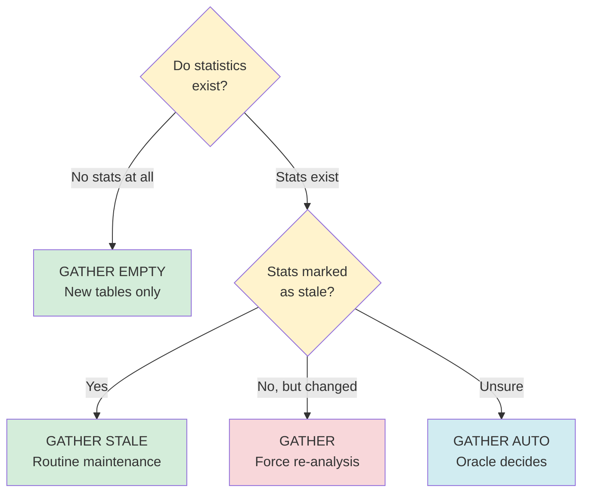
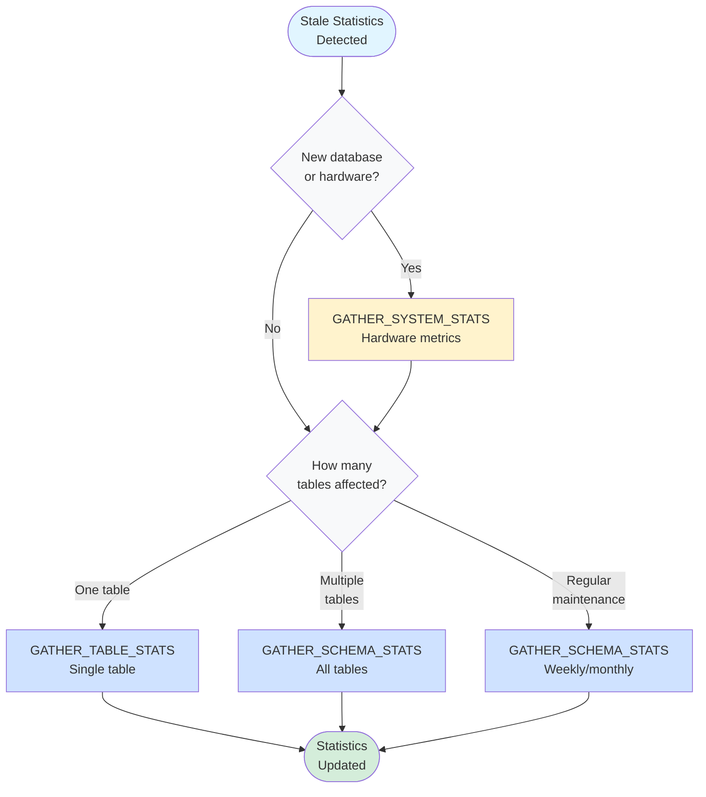

<style>
  video {
    border-radius: 4px;
    max-width: 660px;
  }
  img {
    max-width: 660px !important;
  }
  table th:first-child,
  table td:first-child {
    min-width: 200px;
  }
</style>

### What Are Database Statistics

Database statistics are metadata that the query optimizer uses to estimate the cost of different execution plans. These statistics include.

- Row counts in tables
- Distribution of values in columns
- Index cardinality
- Data density and selectivity
- NULL value frequencies

When these statistics become outdated (stale), the optimizer makes suboptimal decisions, leading to poor query performance.


### Stale Statistics in PostgreSQL

#### How Statistics Affect Execution Plans

PostgreSQL's query planner uses statistics from the `pg_statistic` table to create efficient execution plans. When statistics are stale, the planner may.

- Choose nested loop join when hash join would be better
- Estimate far fewer rows than actually returned
- Use wrong index or no index at all
- Allocate insufficient memory for operations

#### Detect Stale Statistics

##### Check the `pg_stat_all_tables` view

```sql
SELECT 
  schemaname,
  relname,
  n_live_tup,
  n_dead_tup,
  n_mod_since_analyze,
  last_autoanalyze,
  last_analyze
FROM pg_stat_all_tables
WHERE schemaname NOT IN ('pg_catalog', 'information_schema')
  AND n_mod_since_analyze > 0.1 * n_live_tup  -- More than 10% rows modified
ORDER BY n_mod_since_analyze DESC;
```

<proof qed='false'>

**Key indicators.**
- **`n_mod_since_analyze`** - rows modified since last analysis

- **`n_live_tup`** - current live row count
- **Large `n_dead_tup`** combined with no recent `VACUUM` suggests stale stats


**When to worry.**
- `n_mod_since_analyze` > 10% of `n_live_tup` (indicates significant data changes)

- `last_analyze` is days or weeks old on frequently modified tables
- Query performance suddenly degrades without code changes


##### Compare execution plan with actual stats

```sql
-- Get execution plan estimate
EXPLAIN SELECT * FROM "Session" WHERE "userId" = 'abc123';
-- Output shows: "Seq Scan on Session (cost=0.00..2834.00 rows=50 ...)"

-- Get actual row count
SELECT COUNT(*) FROM "Session" WHERE "userId" = 'abc123';
-- Returns: 350
```

**Problem.** Planner ***estimated*** 50 rows but ***actually*** there are 350 rows.

**Why.** Statistics are stale, the `Session` table has 2,770 modifications since last analyze (44 days ago). User session distribution has changed significantly since last `ANALYZE`.

**Impact.**
- Planner might choose nested loop join expecting small result set
- Allocated memory might be insufficient
- Query takes significantly longer than it should
- If this query is used in joins, the entire execution plan could be suboptimal

**Solution.** 
```sql
ANALYZE "Session";
```

After running `ANALYZE`, check the plan again.
```sql
EXPLAIN SELECT * FROM "Session" WHERE "userId" = 'abc123';
-- Now shows: "Seq Scan on Session (cost=0.00..2834.00 rows=345 ...)"
```

Much better! The estimate is now close to the actual count (345 vs 350).

#### Common Solutions in PostgreSQL

##### Manual ANALYZE
```sql
-- Analyze specific table
ANALYZE "Session";

-- Analyze specific column (faster for large tables)
ANALYZE "Notification_Logging" ("userId", "createdAt");

-- Analyze all tables in database
ANALYZE;

-- Verbose mode to see what's happening
ANALYZE VERBOSE "Session";
```

##### Configure Autovacuum
```sql
-- Per-table autovacuum settings
ALTER TABLE "Notification_Logging" SET (
  autovacuum_analyze_scale_factor = 0.05,  -- Analyze after 5% of rows change
  autovacuum_analyze_threshold = 1000      -- Minimum 1000 rows before analyzing
);

-- Check current autovacuum settings
SELECT 
  relname,
  reloptions
FROM pg_class
WHERE relname = 'Notification_Logging';
```

Recommended settings for high-traffic tables:

- `autovacuum_analyze_scale_factor = 0.05` (5% threshold instead of default 10%)

- `autovacuum_analyze_threshold = 500` (lower threshold for more frequent updates)


#### Interpret Real Statistic Results


The analysis is as follows:

`Notification_Logging`
- 6,723 modifications since last analyze (most active table)
- Last analyzed 27 days ago (2026-01-30)
- **Action needed.** Run `ANALYZE Notification_Logging;` - high write activity suggests stale distribution statistics

`Session`
- 2,770 modifications since last analyze
- Last analyzed 44 days ago (2026-01-13)
- **Consider action.** Depending on table size, this could be significant (e.g., if table has only 5,000 rows, this is 55% changed!)

`Tagging_Rel_Team_tag` ***(Stale)***
- 2,498 modifications since last analyze
- Last analyzed 93 days ago (2025-11-25) - over 3 months!
- **Action needed.** Run `ANALYZE Tagging_Rel_Team_tag;` - statistics are definitely stale

`Rel_Issue_Message` ***(Very Stale)***
- 2,404 modifications since last analyze
- Last analyzed 101 days ago (2025-11-17) - over 3 months!
- **Action needed.** Run `ANALYZE Rel_Issue_Message;` immediately

`Tagging_Tag` ***(Extremely Stale)***
- 2,116 modifications since last analyze
- Last analyzed 112 days ago (2025-11-06) - nearly 4 months!
- **Action needed.** Run `ANALYZE Tagging_Tag;` immediately - optimizer likely making poor decisions

`Message` ***(Moderately Stale)***
- 1,386 modifications since last analyze
- Last analyzed 73 days ago (2025-12-15) - over 2 months
- **Action recommended.** Run `ANALYZE Message;` - statistics likely outdated

Overall assessment:
- All tables show modifications without recent manual analysis (`last_analyze` is NULL)
- Autovacuum has run, but may not be frequent enough
- The oldest statistics (Tagging_Tag, Rel_Issue_Message) are 3-4 months old
- **Immediate action:** Run `ANALYZE` on all tables, especially the older ones
- **Long-term fix:** Adjust autovacuum settings to analyze more frequently


### Stale Statistics in Oracle Database

#### How Statistics Affect Execution Plans

Oracle's Cost-Based Optimizer (CBO) relies on statistics stored in the data dictionary. Stale statistics can lead to.

- Wrong join order selection
- Incorrect decision between index scan and full table scan
- Poor cardinality estimates
- Suboptimal partition pruning

#### Detecting Stale Statistics

##### Check DBA_TAB_STATISTICS

```sql
SELECT 
  owner,
  table_name,
  num_rows,
  last_analyzed,
  stale_stats
FROM dba_tab_statistics
WHERE owner NOT IN ('SYS', 'SYSTEM')
  AND stale_stats = 'YES'
ORDER BY last_analyzed;
```

**Key indicators.**
- `stale_stats = 'YES'` - Oracle automatically marks statistics as stale when > 10% of rows change
- `last_analyzed` shows when statistics were last gathered
- `num_rows = NULL` means statistics have never been gathered

##### Query execution plan analysis

```sql
-- Get execution plan with cost estimates
EXPLAIN PLAN FOR
SELECT * FROM orders WHERE customer_id = 12345;

-- View the plan
SELECT * FROM TABLE(DBMS_XPLAN.DISPLAY);
```

Look for:
- Large discrepancy between ***estimated*** rows and ***actual*** rows
- Full table scans where index scans should be used
- Hash joins where nested loops would be better (or vice versa)

#### Solutions in Oracle Database

##### Oracle's Schema Ownership Model

In oracle we are also able to update the statistic, but to understand the parameters used in that SQL command, we need to understand the models in Oracle database.

In Oracle, each user ***is*** also a schema.

**Oracle model.**
```sql
-- When we create a user, a schema with the same name is automatically created
CREATE USER sales_user IDENTIFIED BY password;
-- This creates:
-- - User: sales_user (can login)
-- - Schema: sales_user (namespace for objects)

-- When sales_user creates a table, it's in their own schema
CONNECT sales_user/password;
CREATE TABLE orders (...);  -- Creates sales_user.orders

-- The user owns ALL objects in their schema
-- Schema name = User name (always)
```

**PostgreSQL model (for comparison).**
```sql
-- In PostgreSQL, schemas are separate from users
CREATE USER sales_user WITH PASSWORD 'password';
CREATE USER inventory_user WITH PASSWORD 'password';

-- Schemas are independent containers
CREATE SCHEMA sales_schema;
CREATE SCHEMA inventory_schema;

-- Different users can own objects in the same schema
CREATE TABLE sales_schema.orders (...);  -- Can be owned by sales_user
ALTER TABLE sales_schema.orders OWNER TO sales_user;

CREATE TABLE sales_schema.customers (...);  -- Can be owned by inventory_user  
ALTER TABLE sales_schema.customers OWNER TO inventory_user;

-- Schema ≠ User  (separate concepts)
```

**Key differences.**

| Aspect | Oracle | PostgreSQL |
|--------|--------|------------|
| **Schema creation** | Automatic (when user created) | Explicit (`CREATE SCHEMA`) |
| **Schema ownership** | One schema = one user owns ALL objects in it | Multiple users can own different tables in the same schema |
| **Naming** | Schema name = User name | Schema names independent of users |
| **Schema vs User** | Same entity (1-to-1) | Different entities (many-to-many) |
| **Object ownership** | All objects in schema owned by schema's user | Different users can own different objects in same schema |


Simply put:

- In oracle ***all tables*** belong to the schema = user. 

- While in other database such as PostgreSQL, tables still belong to ***one*** schema, but ***different*** users can own different tables in that schema 

  Therefore before we can remove a user, we need to transfer the owner of that table to other user first, usually the `pgadmin` user (again, in pgsql, role = user)).

**Oracle Statistics Collection Context.**

When we use `DBMS_STATS.GATHER_SCHEMA_STATS`:

```sql
-- Gather stats for sales_user schema
BEGIN
  DBMS_STATS.GATHER_SCHEMA_STATS(
    ownname => 'SALES_USER',  -- This is both the schema AND the owner
    estimate_percent => DBMS_STATS.AUTO_SAMPLE_SIZE,
    cascade => TRUE
  );
END;
/
```

What `ownname` really means in Oracle:
- `ownname` = Schema name = Owner name (all the same thing!)
- It's not asking "who owns the tables" (the schema always owns its own tables)
- It's asking "which schema (user's namespace) should we analyze?"

Example with multiple users/schemas:

```sql
-- Create three users (three schemas automatically created)
CREATE USER sales_user IDENTIFIED BY pass1;
CREATE USER inventory_user IDENTIFIED BY pass2;
CREATE USER hr_user IDENTIFIED BY pass3;

-- Each user creates tables in their own schema
CONNECT sales_user/pass1;
CREATE TABLE orders (...);      -- Creates sales_user.orders

CONNECT inventory_user/pass2;
CREATE TABLE products (...);    -- Creates inventory_user.products

CONNECT hr_user/pass3;
CREATE TABLE employees (...);   -- Creates hr_user.employees

-- To gather statistics for each schema:
CONNECT system/system_password;

-- Gather stats for sales_user's schema
EXEC DBMS_STATS.GATHER_SCHEMA_STATS('SALES_USER');

-- Gather stats for inventory_user's schema
EXEC DBMS_STATS.GATHER_SCHEMA_STATS('INVENTORY_USER');

-- Gather stats for hr_user's schema
EXEC DBMS_STATS.GATHER_SCHEMA_STATS('HR_USER');
```

> **Question.** Why the parameter is called `ownname`?

Historical naming - in Oracle's implementation, the "owner" of all objects in a schema is the user that the schema belongs to. Since schema = user in Oracle, the parameter name `ownname` essentially means "which user's schema".

**PostgreSQL equivalent (for comparison).**

```sql
-- In PostgreSQL, schemas are separate from users
-- Multiple users can own tables in the same schema

-- Analyze specific tables in a schema
ANALYZE sales_schema.orders;
ANALYZE sales_schema.order_items;

-- Analyze all tables in a specific schema
ANALYZE sales_schema;

-- Analyze all tables owned by a specific user across multiple schemas
DO $$
DECLARE
  tbl record;
BEGIN
  FOR tbl IN 
    SELECT schemaname, tablename 
    FROM pg_tables 
    WHERE tableowner = 'sales_user'
  LOOP
    EXECUTE format('ANALYZE %I.%I', tbl.schemaname, tbl.tablename);
  END LOOP;
END $$;
```

**Summary.**
- In Oracle:  `ownname` = schema name = user name (all same)
- In PostgreSQL:  user ≠ schema (different users can own tables in same schema)
- Oracle's `DBMS_STATS.GATHER_SCHEMA_STATS('SALES_USER')` means "gather stats for all tables in the SALES_USER schema"
- PostgreSQL's `ANALYZE sales_schema` updates stats for all tables in that schema, regardless of who owns them

##### Manual Statistics Gathering

```sql
-- Gather statistics for a table
BEGIN
  DBMS_STATS.GATHER_TABLE_STATS(
    ownname => 'HR',
    tabname => 'EMPLOYEES',
    estimate_percent => DBMS_STATS.AUTO_SAMPLE_SIZE,
    cascade => TRUE,  -- Include indexes
    degree => 4       -- Parallel processing
  );
END;
/

-- Gather statistics for entire schema
BEGIN
  DBMS_STATS.GATHER_SCHEMA_STATS(
    ownname => 'HR',
    estimate_percent => DBMS_STATS.AUTO_SAMPLE_SIZE,
    cascade => TRUE
  );
END;
/

-- Gather statistics for all stale tables only
BEGIN
  DBMS_STATS.GATHER_DATABASE_STATS(
    options => 'GATHER STALE',
    estimate_percent => DBMS_STATS.AUTO_SAMPLE_SIZE
  );
END;
/
```

##### Understanding GATHER Command Options

Oracle provides different gathering strategies through the `options` parameter.

**Available options.**
```sql
BEGIN
  DBMS_STATS.GATHER_SCHEMA_STATS(
    ownname => 'HR',
    options => 'GATHER STALE',  -- Only gather stale statistics
    estimate_percent => DBMS_STATS.AUTO_SAMPLE_SIZE
  );
END;
/
```

**Option values.**

| Option | Description | When to Use |
|--------|-------------|-------------|
| `GATHER` | Gather stats even if not stale | After major data changes |
| `GATHER STALE` | Only gather if marked stale | Regular maintenance |
| `GATHER EMPTY` | Only gather if no stats exist | New tables only |
| `GATHER AUTO` | Oracle decides based on staleness | Recommended default |

Decision guide for choosing the right option:



##### Understand the different `GATHER` commands

Three `GATHER` commands serve different purposes:

| Command | Description |
|---------|-------------|
| `GATHER_TABLE_STATS` | **Purpose.** Update statistics for one specific table<br/><br/>**When to use.** One table has stale statistics, after large data changes to a single table, quick targeted fix<br/><br/>**Duration.** Seconds to minutes (one table only) |
| `GATHER_SCHEMA_STATS` | **Purpose.** Update statistics for all tables in a schema at once<br/><br/>**When to use.** Multiple tables are stale, after bulk data load affecting many tables, regular maintenance<br/><br/>**Duration.** Minutes to hours (depends on schema size)<br/><br/>**Note.** Automatically gathers stats for all tables, so we don't need individual `GATHER_TABLE_STATS` for each table |
| `GATHER_SYSTEM_STATS` | **Purpose.** Collects hardware performance metrics (CPU speed, I/O throughput, disk latency)<br/><br/>**When to use.** Once after hardware changes or database migration, helps optimizer understand system capabilities<br/><br/>**Duration.** Hours (needs workload sampling)<br/><br/>**Note.** This is NOT about table statistics - it's about hardware performance characteristics |





**Examples for different scenarios.**

```sql
-- Scenario 1: Just loaded 1M rows into orders table
BEGIN
  DBMS_STATS.GATHER_TABLE_STATS(
    ownname => 'SALES',
    tabname => 'ORDERS',
    options => 'GATHER',  -- Force gather even if not marked stale
    cascade => TRUE
  );
END;
/

-- Scenario 2: Daily maintenance job
BEGIN
  DBMS_STATS.GATHER_SCHEMA_STATS(
    ownname => 'SALES',
    options => 'GATHER STALE',  -- Only tables that changed >10%
    estimate_percent => DBMS_STATS.AUTO_SAMPLE_SIZE
  );
END;
/

-- Scenario 3: New database setup
BEGIN
  DBMS_STATS.GATHER_DATABASE_STATS(
    options => 'GATHER EMPTY',  -- Only tables with no stats
    estimate_percent => 100  -- Analyze all rows for accuracy
  );
END;
/

-- Scenario 4: Unsure what's needed
BEGIN
  DBMS_STATS.GATHER_DATABASE_STATS(
    options => 'GATHER AUTO',  -- Let Oracle decide
    estimate_percent => DBMS_STATS.AUTO_SAMPLE_SIZE
  );
END;
/
```

##### Configure Automatic Statistics Collection

Oracle automatically gathers statistics during maintenance windows. We can check and configure.

```sql
-- Check automatic statistics collection settings
SELECT 
  client_name,
  status
FROM dba_autotask_client
WHERE client_name = 'auto optimizer stats collection';

-- Enable automatic stats collection (if disabled)
BEGIN
  DBMS_AUTO_TASK_ADMIN.ENABLE(
    client_name => 'auto optimizer stats collection',
    operation => NULL,
    window_name => NULL
  );
END;
/

-- Check maintenance window schedule
SELECT 
  window_name,
  enabled,
  next_start_date,
  duration
FROM dba_scheduler_windows;
```


##### Monitor Statistics History

```sql
-- Query historical statistics
SELECT 
  table_name,
  num_rows,
  blocks,
  avg_row_len,
  last_analyzed
FROM dba_tab_stats_history
WHERE owner = 'HR'
  AND table_name = 'EMPLOYEES'
ORDER BY last_analyzed DESC;
```

### Common Practices Across All Databases

#### Regular Maintenance Schedule

- **PostgreSQL.** Enable autovacuum and schedule periodic manual ANALYZE during maintenance windows
- **Oracle.** Use automatic statistics collection and supplement with manual gathering after large data changes

#### Monitor After Bulk Operations

All databases require statistics updates after.
- Large `INSERT`/`UPDATE`/`DELETE` operations
- Data imports or migrations
- Index creation or modification
- Schema changes

#### Test Query Plans

Always verify execution plans in development before deploying.

```sql
-- PostgreSQL
EXPLAIN ANALYZE SELECT ...;

-- Oracle
EXPLAIN PLAN FOR SELECT ...;
SELECT * FROM TABLE(DBMS_XPLAN.DISPLAY);
```

#### Set Up Alerts

Monitor for performance degradation that might indicate stale statistics:
- Sudden increases in query execution time
- Changes in execution plan choices
- Resource utilization spikes

##### PostgreSQL alert setup
```sql
-- Using pg_stat_statements extension
CREATE EXTENSION IF NOT EXISTS pg_stat_statements;

-- Query to find slow queries (run periodically via monitoring tool)
SELECT 
  query,
  calls,
  mean_exec_time,
  stddev_exec_time,
  (total_exec_time / 1000 / 60) as total_minutes
FROM pg_stat_statements
WHERE mean_exec_time > 1000  -- Alert if mean time > 1 second
ORDER BY mean_exec_time DESC
LIMIT 20;

-- Set up alert via cron + monitoring system (e.g., Prometheus, Grafana)
-- Or use PostgreSQL log_min_duration_statement
ALTER SYSTEM SET log_min_duration_statement = 1000;  -- Log queries > 1s
SELECT pg_reload_conf();
```

##### Oracle alert setup
```sql
-- Using Oracle Enterprise Manager or custom monitoring
-- Create alert for SQL execution time variance

-- 1. Baseline query performance
BEGIN
  DBMS_WORKLOAD_REPOSITORY.CREATE_BASELINE(
    start_snap_id => 1000,
    end_snap_id   => 1100,
    baseline_name => 'NORMAL_WORKLOAD',
    expiration    => NULL
  );
END;
/

-- 2. Monitor for queries exceeding baseline by threshold
SELECT 
  sql_id,
  executions,
  elapsed_time/1000000 as elapsed_seconds,
  cpu_time/1000000 as cpu_seconds,
  buffer_gets,
  disk_reads
FROM v$sql
WHERE elapsed_time/executions > 1000000  -- > 1 second average
  AND executions > 10
ORDER BY elapsed_time DESC;

-- 3. Set up alert via DBMS_SERVER_ALERT
BEGIN
  DBMS_SERVER_ALERT.SET_THRESHOLD(
    metrics_id              => DBMS_SERVER_ALERT.SQL_ELAPSED_TIME,
    warning_operator        => DBMS_SERVER_ALERT.OPERATOR_GT,
    warning_value           => '5000',  -- 5 seconds
    critical_operator       => DBMS_SERVER_ALERT.OPERATOR_GT,
    critical_value          => '10000', -- 10 seconds
    observation_period      => 1,
    consecutive_occurrences => 1,
    instance_name           => NULL,
    object_type             => NULL,
    object_name             => NULL
  );
END;
/
```

**Generic monitoring approach (all databases):**
```bash
# Prometheus/Grafana alert rule example
groups:
  - name: database_performance
    interval: 1m
    rules:
      - alert: SlowQueryDetected
        expr: database_query_duration_seconds > 1
        for: 5m
        labels:
          severity: warning
        annotations:
          summary: "Slow query detected ({{ $value }}s)"
          
      - alert: HighScanRatio
        expr: database_rows_examined / database_rows_returned > 100
        for: 2m
        labels:
          severity: critical
        annotations:
          summary: "Poor query efficiency: {{ $value }}x scan ratio"
```
