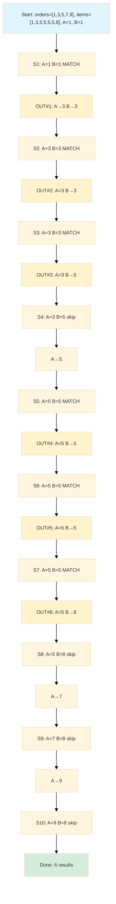

<style>
  video {
    border-radius: 4px;
    max-width: 660px;
  }
  img {
    max-width: 660px !important;
  }
  table th:first-child,
  table td:first-child {
    min-width: 200px;
  }
</style>


### Nested Loop Join

**How it works.**
- For each row in the outer table, scan the entire inner table looking for matches
- Similar to nested for-loops in programming

**Example.**
```text
For each row in Table A (outer table):
    For each row in Table B (inner table):
        If A.key = B.key:
            Output joined row
```

**Why is it called "outer" and "inner"?**

The terminology comes from nested loop structure in programming.
- The **outer table** (Table A) is like the **outer loop** - it's processed first and runs fewer times (once through the entire table)
- The **inner table** (Table B) is like the **inner loop** - it's nested inside and runs many times (once for each row in the outer table)

Just like in nested loops where the outer loop variable changes slowly and the inner loop variable changes rapidly, the outer table is scanned once while the inner table is scanned repeatedly.

In this example, Table A is the **outer table** (scanned once) and Table B is the **inner table** (scanned repeatedly for each row in A).

**When it's used.**
- Small outer table with indexed inner table
- Selective `WHERE` clauses (few matching rows)

**Performance.**
- Time complexity: $O(n \cdot m)$ where $n$ = outer rows, $m$ = inner rows
- Best when outer table is small (Table A) and inner table has an index (Table B)

**Example scenario.**
```sql
SELECT * FROM customers c
JOIN orders o ON c.id = o.customer_id
WHERE c.state = 'CA';
```

**Execution order.**
- **Step 1.** Apply `WHERE` clause - filter customers by state (returns 5 customers from 10 total)
- **Step 2.** For each of those 5 customers, use index to find their orders

Good choice: only 5 CA customers after filtering. The `customers` (outer table) is small after `WHERE` clause, and `orders` (inner table) is large (1M rows) but has index on `customer_id`. Result: Only 5 index lookups - very fast!

### Hash Join

**How it works.**
- Build phase. Create hash table from smaller table
- Probe phase. Scan larger table, probe hash table for matches

**Example.**
```text
1. Build hash table from Table A (smaller table) on join key
2. For each row in Table B (larger table):
    - Hash the join key
    - Look up in hash table
    - Output matches
```

In this example, Table A is the **build input** (smaller table, used to create hash table) and Table B is the **probe input** (larger table, scanned to find matches).

**When it's used.**
- Large tables where indexes don't exist or wouldn't be efficient (both Table A and B can be large, but algorithm works best when at least one is significantly smaller)
- Equality joins only (=)
- Sufficient memory available to hold the hash table

**Why choose hash join over nested loop (even when indexes exist).**
- Hash join ignores indexes but doesn't require their absence
- **Optimizer chooses hash join based on cost**, which can be lower than nested loop even with indexes when.
  - Both tables return many rows (poor selectivity) - repeatedly using an index becomes expensive
  - Full table scans + hash join is faster than many index lookups
  - The `WHERE` clause filters result in large intermediate result sets
- Example. If our `WHERE` clause returns 50,000 customers, doing 50,000 index lookups on orders is slower than scanning both tables and hashing

**Performance.**
- Time complexity: $O(n + m)$ - linear
- Space complexity: $O(\text{smaller table size})$
- Fast for large datasets


#### Example 1. No indexes
```sql
SELECT * FROM orders o
JOIN order_items oi ON o.id = oi.order_id;
```

Hash join builds hash table on smaller table (`orders` as build input), then probes with larger table (`order_items` as probe input).

#### Example 2. Indexes exist, but hash join is still chosen
```sql
SELECT * FROM orders o
JOIN order_items oi ON o.id = oi.order_id
WHERE o.order_date >= '2025-01-01';
```

**Execution order.**
- **Step 1.** Apply `WHERE` clause - filter orders by date (returns 100k orders)
- **Step 2.** Now need to join these 100k orders with `order_items`

Even with index on `order_id`, if `WHERE` returns 100k orders.
- **Nested loop.** 100k index lookups on `order_items` (expensive!)
- **Hash join.** Scan filtered orders + scan `order_items` = faster!

The `WHERE` clause is applied FIRST, creating a large intermediate result. Then the join algorithm is chosen based on that filtered row count. Optimizer chooses hash join based on cost estimates.

### Merge Join (Sort-Merge Join)

**How it works.**
- **1st Phase (Sort).** Sort both tables by join key (if not already sorted)
- **2nd Phase (Merge).** Scan both sorted tables simultaneously with two pointers, matching rows as we go

**Why is it called "Sort-Merge"?** The algorithm has two distinct phases:
- The **sort phase** ensures both inputs are ordered by the join key
- The **merge phase** walks through both sorted lists simultaneously, similar to the merge step in merge sort algorithm

**Detailed merge process.**



Each pointer advances monotonically through its table - we never go backwards. When we find order 3 with 2 items, we scan through both items for order 3, then move on. We don't need to rescan because both tables are sorted.

**Advantage.** Each table is scanned only once during the merge phase, making it very efficient for large datasets that are already sorted.

**When it is used.**
- Both inputs already sorted (indexes on join columns) - avoids expensive sort phase
- Non-equality joins ($<$, $>$, BETWEEN) - unlike hash join which only works with $=$
- Large sorted datasets where hash join would require too much memory
- Range joins where we need to match ranges of values

**Performance.**
- Time complexity: $O(n \log n + m \log m)$ if sorting needed, $O(n + m)$ if pre-sorted
- Space complexity: $O(1)$ if data already sorted (no buffering needed)
- Efficient for sorted data - single pass through each table during merge


#### Example 1. Pre-sorted data (optimal case)
```sql
SELECT * FROM customers c
JOIN orders o ON c.id = o.customer_id
ORDER BY c.id;
```

**Execution order.**
- **Step 1.** Both tables have clustered indexes on their join columns, so they're already sorted
- **Step 2.** Merge phase only - scan both tables once with two pointers
- **Step 3.** Output is already sorted (bonus)

***Result.*** $O(n + m)$ - single scan of each table.

#### Example 2. Range joins
```sql
SELECT * FROM sales s
JOIN promotions p ON s.sale_date BETWEEN p.start_date AND p.end_date;
```

**Why merge join?**
- Hash join doesn't work with `BETWEEN` (non-equality)
- Nested loop would be $O(n \cdot m)$ - checking every sale against every promotion
- Merge join. Sort both by date, then efficiently match ranges in $O(n + m)$ after sorting

#### Example 3. When might merge join be chosen despite sorting cost?
```sql
SELECT * FROM employees e
JOIN departments d ON e.dept_id = d.id
WHERE e.salary > 50000
ORDER BY e.dept_id;
```

> **Question.** If ***no indexes*** exist on `dept_id`, why not use hash join instead of merge join?

Hash join is typically better, but merge join might be chosen when ***the result set is large***,

**Case A. Result needs sorting (`ORDER BY` clause present)**


1. By hash join we need:

    - **Step 1.** Apply `WHERE` clause - filter employees by salary
    - **Step 2 (Hash join).** Build hash on departments, probe with employees → unsorted result
    - **Step 3 (Sort result).** by `dept_id` for `ORDER BY`, costing $O(N\log N)$, where $N$ = number of results

2. On the other hand, by sort-merge we need:

    - **Step 1.** Apply `WHERE` clause - filter employees by salary  
    - **Step 2 (Merge join approach).** Sort employees by dept_id: $O(n \log n)$
    - **Step 3.** Sort departments by id: $O(m \log m)$
    - **Step 4.** Merge (output is already sorted!) → $O(n + m)$


**Case B. Limited memory (hash table would not fit)**
```sql
SELECT * FROM huge_orders o
JOIN massive_items i ON o.category_id = i.category_id;
```

If both tables are massive and hash table won't fit in available memory.
- **Hash join.** Build hash table on smaller table → might exceed `work_mem`, spill to disk (very slow!)
- **Merge join.** External sort both tables using disk-based sort → $O(n \log n + m \log m)$ disk I/O, then merge

Merge join's external sort is more efficient than hash join's disk spilling.

**Case C. Statistics-driven decision**

**The optimizer considers.**
- Table sizes ($n$ and $m$)
- Available memory (`work_mem` in PostgreSQL)
- Expected result size
- Presence of `ORDER BY` clause

**Cost comparison.**
- **Hash join cost.** $O(n + m)$ + potential sort cost if we are using `ORDER BY`
- **Merge join cost.** $O(n \log n + m \log m)$ + $O(n + m)$ merge

  <Example>

  **Remark.** It is easy to show that when $N = \max\{n,m\}$, then 
  $$
  O(n \log n + m \log m) + O(n + m) = O(N\log N + N)
  $$

  </Example>

**Decision.** It depends on statistics! If:
- Small tables → nested loop or hash join
- Large tables + sufficient memory + no `ORDER BY` → hash join  
- Large tables + limited memory → merge join
- Any size + `ORDER BY` on join key → merge join
- Pre-sorted data (indexes) → merge join (no sort needed!)

**Typical scenario.** For Example 3 without `ORDER BY`, **hash join would be preferred**. Merge join is chosen when there's a good reason (sorting needed, memory constraints, or data already sorted).

**Comparison with other joins.**

| Scenario | Nested Loop | Hash Join | Merge Join |
|----------|-------------|-----------|------------|
| Small outer + indexed inner | Best | Too slow | Overkill |
| Large tables, unsorted | Terrible | Best | Good if sorted |
| Pre-sorted data | Slow | Wastes sort | Best |
| Range joins (BETWEEN) | Slow | Can't use | Best |
| Limited memory | OK | Needs RAM | Best |

#### Comparison Summary

| Feature | Nested Loop | Hash Join | Merge Join |
|---------|-------------|-----------|------------|
| **Best for** | Small outer table | Large tables | Pre-sorted data |
| **Memory** | Low | High | Medium |
| **Complexity** | $O(n*m)$ | $O(n+m)$ | $O(n+m)$ sorted |
| **Index helps?** | Yes (inner) | No | Yes (both) |
| **Join types** | All | Equality only | All |
| **Parallelizable** | Limited | Easy | Medium |

### Simple Case Study for Different Joins

Given tables:
- `customers` - 1,000 rows
- `orders` - 1,000,000 rows

```sql
SELECT c.name, o.total
FROM customers c
JOIN orders o ON c.id = o.customer_id
WHERE c.country = 'USA';
```

#### Scenario 1: USA has 5 customers, `orders.customer_id` indexed
**Winning choice.** Nested Loop (5 index lookups)

#### Scenario 2: USA has 900 customers, no indexes, plenty of RAM
**Winning choice.** Hash Join (build hash on customers, probe orders)

#### Scenario 3: Both tables ordered by ID, limited RAM
**Winning choice.** Merge Join (both already sorted, no memory needed)
