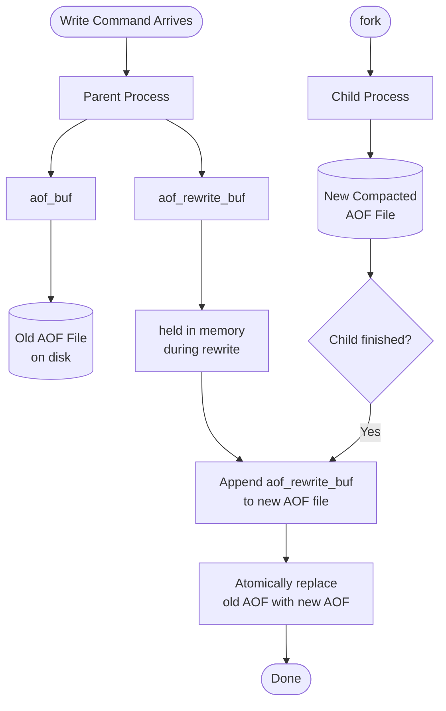
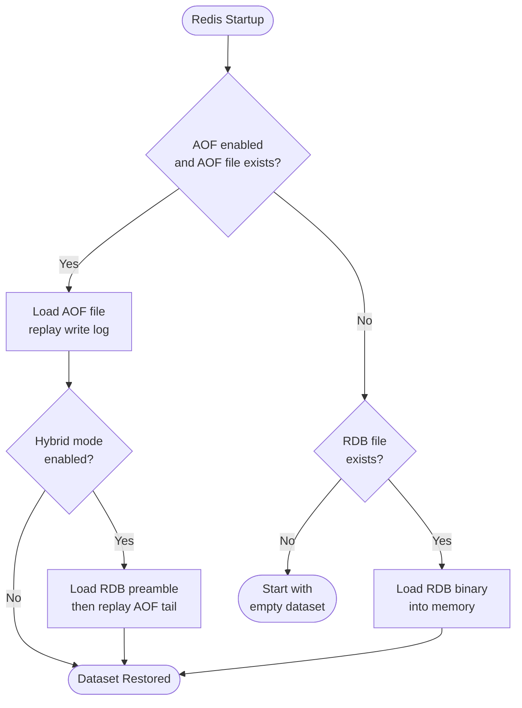

<style>
  video {
    border-radius: 4px;
    max-width: 660px;
  }
  img {
    max-width: 660px !important;
  }
</style>


### Overview

Redis provides two complementary data persistence mechanisms to survive restarts and failures: ***RDB snapshots*** and ***AOF*** (Append Only File). Thus far we have learnt many features in Redis that are helpful in building performant services, but our service would easily break down without data persistence.

Understanding how each works and how they combine is helpful for building a highly available Redis deployment.

### RDB Snapshot

An RDB file is a compact, point-in-time binary snapshot of the entire dataset. Redis can create RDB files either manually or automatically by two commands:

#### Manual Trigger: `SAVE` and `BGSAVE`
 
<item>

**`SAVE`** The `SAVE` command performs a synchronous snapshot. While the RDB file is being written, Redis ***blocks*** all client request, no reads or writes are served until the file is complete. This makes `SAVE` unsuitable for production use.

</item>

<item>


**`BGSAVE`** The `BGSAVE` command is the production-safe alternative. When being invoked, Redis calls the `fork()` system function from `glibc` to create a child process. The child process takes ownership of the snapshot operation and writes the RDB file to disk, while the parent process continues to serve client requests ***without interruption***.

</item>

<item>

**`fork()`** The `fork()` call itself is extremely fast,  typically measured in milliseconds, so the blocking window for the main thread is negligible. All the time-consuming I/O work happens in the child process.

</item>

#### Auto Trigger: Four Occasions that Invoke `BGSAVE`

Redis can be configured to trigger `BGSAVE` automatically under the following four conditions:

1. `save m n` in `redis.conf` — when within `m` seconds at least `n` keys get modified, `BGSAVE` is triggered automatically. For example, `save 900 1` means: trigger a snapshot if at least 1 key changes within 900 seconds.

2. Replication — when a replica (slave) requests a full `resync` from the master, the master executes `BGSAVE` to generate an RDB file and sends it to the replica.

3. `DEBUG RELOAD` — this command instructs Redis to reload its dataset from disk, and it triggers `BGSAVE` ***beforehand*** to ensure the on-disk snapshot is current.

4. `SHUTDOWN` without AOF — when Redis receives a `SHUTDOWN` command and AOF persistence is disabled, Redis automatically calls `BGSAVE` to preserve the current state ***before*** shutting down.

To ***disable*** RDB snapshots entirely, set the following in `redis.conf`:

```text
save ""
```

#### RDB Configuration Options

<table>
  <colgroup><col style="width:280px"/><col/></colgroup>
  <thead><tr><th>Config Key</th><th>Purpose</th></tr></thead>
  <tbody>
    <tr><td><code>dbfilename dump.rdb</code></td><td>Sets the filename of the RDB snapshot file</td></tr>
    <tr><td><code>dir /var/lib/redis</code></td><td>Sets the directory where the RDB file is stored</td></tr>
    <tr><td><code>stop-writes-on-bgsave-error yes</code></td><td>If <code>BGSAVE</code> fails, Redis stops accepting write commands to signal the problem. Set to <code>no</code> to allow writes regardless of snapshot failures</td></tr>
    <tr><td><code>rdbcompression yes</code></td><td>Compresses string values in the RDB file using LZF compression, reducing file size at the cost of some CPU</td></tr>
    <tr><td><code>rdbchecksum yes</code></td><td>Appends a CRC64 checksum to the RDB file. Redis verifies this on load to detect file corruption, at a ~10% performance cost</td></tr>
  </tbody>
</table>

#### Copy-On-Write (COW)

After `fork()`, both the parent and child processes initially share the same physical memory pages. No data is duplicated at this point. When the parent process handles a write request that modifies a memory page, the operating system makes a private copy of that page for the parent — the child retains the original. This is the Copy-On-Write mechanism.

The practical consequence is that the child process sees a consistent, frozen snapshot of the data at the time of the fork, even as the parent continues serving writes. Redis does not need to lock or pause its dataset to achieve this consistency.

#### Advantages and Limitations of RDB

RDB is compact and fast to restore — Redis simply loads the binary file into memory on startup, which is much faster than replaying a log. RDB also produces small files that are easy to transfer or back up.

However, RDB is not suitable for real-time data persistence. Because snapshots are taken at intervals, any writes that occur after the last `BGSAVE` and before a crash are permanently lost. The gap can range from seconds to minutes depending on configuration.

---

### AOF (Append Only File)

AOF addresses the persistence gap left by RDB. Instead of snapshotting the dataset, Redis records every write command as it is executed by appending it to the AOF log file. On restart, Redis replays the log from the beginning to reconstruct the dataset.

AOF is disabled by default. To enable it, set the following in `redis.conf`:

```text
appendonly yes
appendfilename "appendonly.aof"
```

#### `appendfsync` — Controlling Flush Frequency

The `appendfsync` option in `redis.conf` controls how often Redis flushes the in-memory AOF buffer to disk:

<table>
  <colgroup><col style="width:120px"/><col/></colgroup>
  <thead><tr><th>Option</th><th>Behaviour</th></tr></thead>
  <tbody>
    <tr><td><code>always</code></td><td>Flushes to disk after every write command. Maximum durability, but lowest throughput</td></tr>
    <tr><td><code>everysec</code></td><td>Flushes to disk once per second (default). At most one second of data can be lost on crash</td></tr>
    <tr><td><code>no</code></td><td>Delegates flushing to the OS. Highest throughput, but data loss window is entirely OS-controlled</td></tr>
  </tbody>
</table>

For most deployments, `everysec` offers the best balance between safety and performance.

#### AOF Rewrite: Compactifying the Log

Over time, the AOF file grows without bound. Many commands in the log may become redundant — for instance, setting the same key a hundred times only requires the final state to restore correctly.

AOF-rewrite ***compatifies*** the file by scanning the current in-memory dataset and writing the minimal set of commands needed to reproduce the same result from scratch. This is triggered either manually or automatically.

To trigger it manually:

```text
BGREWRITEAOF
```

To configure automatic AOF-rewriting in `redis.conf`:

```text
auto-aof-rewrite-percentage 100
auto-aof-rewrite-min-size 64mb
```

- `auto-aof-rewrite-percentage 100` means: trigger a rewrite when the AOF file has ***grown*** by 100% relative to its size at the last rewrite (i.e., doubled in size).

- `auto-aof-rewrite-min-size 64mb` ensures the rewrite only triggers once the AOF file is at least 64 MB, preventing frequent rewrites on small datasets.

The rewrite is handled by a child process spawned via `fork()`. The only moment the main thread is blocked is during the fork itself — which, as noted for `BGSAVE`, is negligible. All subsequent rewrite I/O happens in the child.

#### The Two-Buffer Problem During Rewrite

While the child process rewrites the AOF in the background, the parent continues to accept write commands. There are now two AOF files in play:

- The ***old AOF file*** (still on disk, being actively appended to) and
- The ***new compacted AOF file*** the child is in the process of building. 

These incoming write commands must not be lost, but they cannot go into the new compacted AOF file — because the child started from a frozen snapshot of memory at the moment of `fork()`, and its output file is meant to faithfully represent exactly that snapshot. Mixing in new writes would break that consistency.

To handle this, Redis maintains two buffers simultaneously during a rewrite:

- `aof_buf` — the regular AOF buffer, which continues flushing to the current (old) AOF file as usual. Every incoming write still flows through here normally.

- `aof_rewrite_buf` — a secondary buffer. ***Every incoming write is also mirrored here*** so that no commands are lost after the child's snapshot point.

When the child finishes writing the new compacted AOF file, the parent appends the contents of `aof_rewrite_buf` to it, then atomically replaces the old AOF file. This ensures no writes are lost, but it also means every write during the rewrite period is written to _two_ buffers.



#### Multi-Part AOF in Redis 7.0

The two-buffer approach above introduces a ***dual-write overhead***: every write command that arrives while a rewrite is in progress must be written twice:
- Once into `aof_buf` (flushed to the old AOF file) and 
- Once into `aof_rewrite_buf` (held in memory). 

This doubles the write amplification for every incoming command during the rewrite window, increasing both memory usage and CPU cost.

Redis 7.0 introduced Multi-Part AOF to eliminate this overhead. The AOF is split into three logical components:

- **Base AOF.** A single file representing the compacted baseline state, equivalent to the output of a rewrite.
- **Incr AOF.** Receives all new write commands appended incrementally since the last rewrite.
- **History AOF.** Old base and incr files from previous rewrite cycles, kept briefly before being cleaned up.

During a rewrite, the child writes a new Base AOF. Meanwhile, new writes from the parent go only into a fresh Incr AOF — there is no secondary rewrite buffer. Once the child finishes, the new Base AOF and the current Incr AOF together represent the complete dataset. This eliminates the need to write incoming commands to two buffers, reducing both memory pressure and I/O overhead.

#### Advantages and Disadvantages of AOF

Advantages:
- Much lower data loss risk — at most one second of commands (with `everysec`), or none (with `always`).
- The log is human-readable and can be manually inspected or edited to recover from accidental operations.

Disadvantages:
- AOF files are larger than RDB files for the same dataset.
- Restart recovery by replaying the log is slower than loading an RDB binary.
- Write throughput can be lower, particularly with `always` mode.

---

### Hybrid Persistence (Redis 4.0+)

From Redis 4.0 onwards, it is possible to combine both mechanisms. When AOF rewrite runs with hybrid persistence enabled, the child process writes the current dataset as a compact RDB snapshot into the beginning of the new AOF file, followed by any incremental AOF commands appended after the snapshot. The result is a single file that starts with an RDB block and ends with an AOF log.

To enable hybrid persistence:

```text
aof-use-rdb-preamble yes
```

Note that the default value of `aof-use-rdb-preamble` differs by version: it defaults to `no` in Redis 4.0 and must be set explicitly, while from ***Redis 5.0*** onwards ***it defaults to*** `yes`. Since AOF itself (`appendonly`) is still disabled by default in all versions, on Redis 5.0+ we only need to turn AOF on — hybrid persistence comes along automatically without any extra configuration.

On restart, Redis detects the RDB preamble and loads it rapidly into memory (benefiting from RDB's fast restore), then replays only the AOF tail to apply commands that arrived after the last snapshot. This gives the best of both worlds: fast startup from the RDB portion and minimal data loss from the AOF portion.

The recovery priority on startup is:

1. If AOF is enabled and the AOF file exists, Redis uses it (with the RDB preamble if hybrid mode is on).
2. If AOF is disabled but an RDB file exists, Redis loads the RDB file.
3. If neither file exists, Redis starts with an empty dataset.




