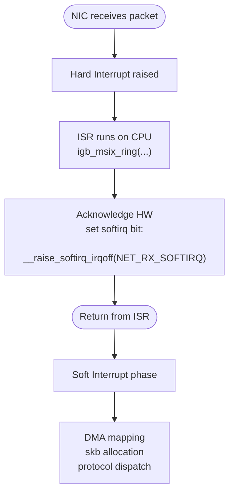
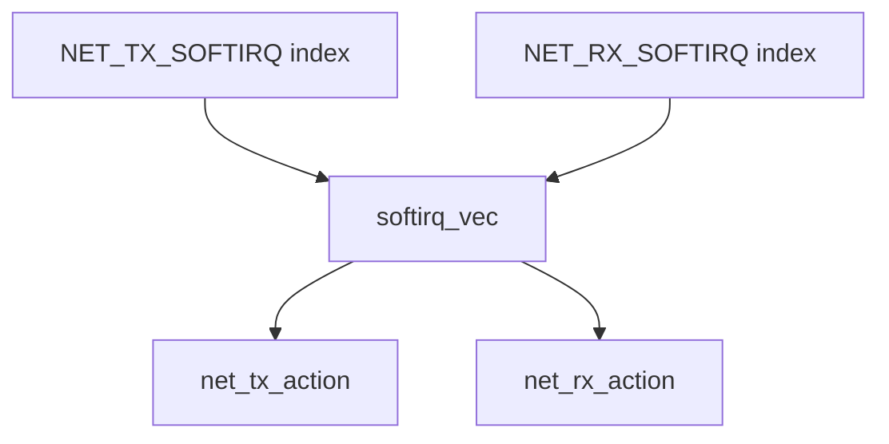
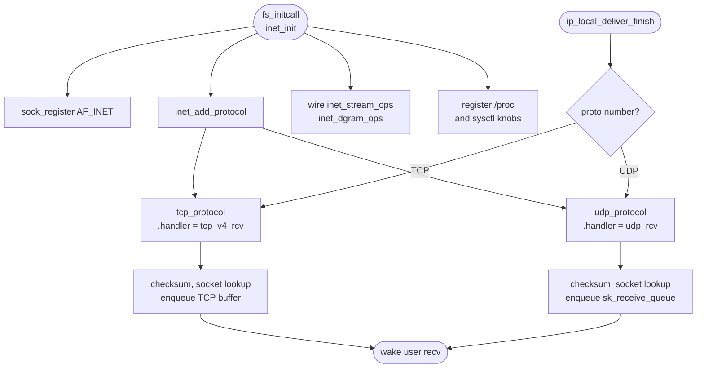
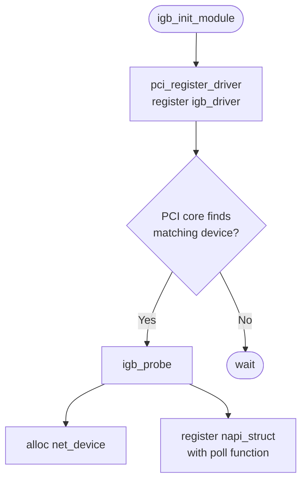
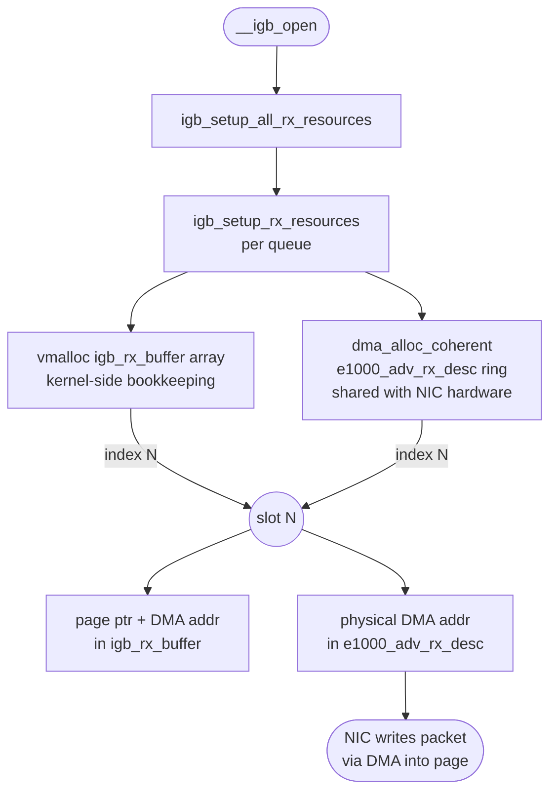

<style>
  video {
    border-radius: 4px;
    max-width: 660px;
  }
  img {
    max-width: 660px !important;
  }
</style>

### Overview

When a network packet arrives at a machine, the Linux kernel does not process it all in one shot. Instead it splits the work across two distinct phases:
1. A ***hard interrupt*** that signals the CPU as fast as possible, and;
2. A deferred ***soft interrupt*** that does the heavier lifting without blocking the CPU from other tasks. 

Understanding these two phases and the subsystems that wire them together is the foundation for understanding how Linux networking works at a kernel level.


### Hard Interrupts and Soft Interrupts

#### NIC — Network Interface Card

An NIC (Network Interface Card) is the hardware component that connects a machine to a network.

- It has a MAC address identifying it on the local network
- It receives raw electrical or optical signals and 
- It converts them into bytes, and writes those bytes directly into kernel memory via **DMA** (Direct Memory Access). 

When filling DMA into the kernel, the CPU is not involved in the data copy. When a frame is fully received, the NIC raises a hardware interrupt to notify the CPU.

In modern servers the NIC is often a PCIe add-in card or an on-board controller. The `igb` driver discussed later in this article targets the Intel 82575/82576 family of Gigabit Ethernet NICs.

#### ISR — Interrupt Service Routine

When an NIC receives a packet, it raises a ***hard interrupt***:
1. CPU stops what it is doing
2. NIC issues a PCIe write: "write value `33` to address `0xFEE00000`", where `0xFEE00000` is the local APIC's interrupt command register
3. CPU reads the index `33` from its local APIC
4. CPU consults the interrupt vector table to find the registered handler  (named ISR)


For the `igb` driver the ISR is a handling function (registered for hard interrupt) named `igb_msix_ring`:

```c
// file: drivers/net/ethernet/intel/igb/igb_main.c
static irqreturn_t igb_msix_ring(int irq, void *data){
    struct igb_q-vector *q_vector = data;

    // Write the ITR value calculated from the previsou interrupt.
    igb_write_itr(q_vector);

    napi_schedule(&q_vector->napi);

    return IRQ_HANDLED;
}

//file: net/core/dev.c
static inline void __napi_schedule(struct softnet_data *sd,
                                    struct napi_struct *napi)
{
    list_add_tail(&napi->poll_list, &sd->poll_list);
    __raise_softirq_irqoff(NET_RX_SOFTIRQ);
}
```


It must run in the shortest time possible because while the ISR executes, all other interrupts on that CPU core are blocked. Its only jobs are:

1. Acknowledge the interrupt to the NIC hardware so it stops asserting the line.
2. Call `napi_schedule` to queue the heavier processing work.
3. Return immediately, restoring the CPU to what it was doing.

All actual packet work — DMA mapping, `sk_buff` allocation, protocol dispatch — is ***deferred*** to a ***soft interrupt*** (`softirq`). 

A `softirq` runs after the hard interrupt handler returns, in a context that still cannot be preempted by user processes but can be preempted by other hard interrupts. This two-phase design lets the kernel acknowledge the hardware quickly and get out of the way, while actual packet processing happens in the softer deferred phase.



#### The Socket Buffer — `sk_buff` (aka `skb`)

`skb` is shorthand for `struct sk_buff`, the central data structure that represents a network packet as it travels through the kernel networking stack. When the NAPI poll function drains the hardware ring buffer, it wraps each received page in an `sk_buff` so that every layer above — IP, TCP, UDP — can work with a uniform interface.

An `sk_buff` carries:

- **Data pointers** — `head`, `data`, `tail`, and `end` delimit the packet payload and the headroom/tailroom reserved for headers. Each layer peels or pushes headers by adjusting `data` and `tail` without copying bytes.

- **Protocol metadata** — offsets to the MAC, network, and transport headers, plus the protocol identifier.
- **Device reference** — a pointer to the `net_device` the packet arrived on.
- **Checksum and timestamp fields** — used by the checksum offload engine and packet timestamping subsystem.

The reason `skb` allocation is listed alongside DMA mapping in the softirq phase — rather than the hard interrupt phase — is deliberate. Allocating memory (`kmem_cache_alloc` from the `skbuff_head_cache` slab) and filling in metadata takes non-trivial time. Doing it inside a hard interrupt would block all other interrupts on that CPU core. Deferring it to the softirq phase keeps the ISR minimal and the system responsive.

### Initialising the Network Subsystem 

#### `net_dev_init`

The network device subsystem is initialised via:

```c
subsys_initcall(net_dev_init);
```

This macro registers `net_dev_init` to run during the `subsys` phase of kernel boot, before any device drivers load. Inside `net_dev_init`, two things happen that matter for packet reception.

First, a `struct softnet_data` is allocated for every CPU:

```c
struct softnet_data {
    struct list_head    poll_list;
    ...
};
```

Second, the `softirq` handlers for networking are registered:

```c
open_softirq(NET_TX_SOFTIRQ, net_tx_action);
open_softirq(NET_RX_SOFTIRQ, net_rx_action);
```

This records `net_rx_action` and `net_tx_action` in `softirq_vec` at the `NET_RX_SOFTIRQ` and `NET_TX_SOFTIRQ` indices respectively. 

From this point on, whenever an NIC raises a hard interrupt and sets the `NET_RX_SOFTIRQ` bit, `ksoftirqd` (or the `__do_softirq` path) will eventually call `net_rx_action`.

#### NAPI

NAPI (New API) is the interrupt-mitigation mechanism introduced in Linux 2.6 to handle high-throughput NICs without drowning the CPU in hardware interrupts.

The problem it solves: at 10 Gbps line rate an NIC can raise tens of millions of hard interrupts per second — one per packet. Each interrupt preempts whatever the CPU was doing, saves and restores context, and runs the ISR. At high packet rates this overhead alone consumes the entire CPU, leaving no time for actual processing.

NAPI's solution is to switch from interrupt-driven reception to a polling loop once traffic exceeds a threshold:

1. The first packet on a queue triggers a normal hard interrupt.

2. The ISR calls `napi_schedule` (via `igb_msix_ring`), which adds the queue's `napi_struct` to `softnet_data.poll_list` and **disables further interrupts for that queue**.
3. `ksoftirqd` (via `net_rx_action`) then calls the driver's registered `poll` callback in a loop, processing up to a `budget` number of packets per invocation without any further interrupts.
4. Once the ring is empty (or the budget is exhausted), interrupts are re-enabled and polling stops.

This converts a storm of interrupts into a single interrupt followed by a bounded polling loop, which drastically reduces interrupt overhead under load while still being responsive at low traffic rates.

Each NIC queue is represented by an `napi_struct`:

```c
struct napi_struct {
    struct list_head    poll_list;   /* link into softnet_data.poll_list */
    int                 (*poll)(struct napi_struct *, int); /* driver poll fn */
    int                 weight;      /* max packets per poll call (budget) */
    ...
};
```

The driver registers its `poll` function and a `weight` (typically 64) during `igb_probe`. When traffic arrives, NAPI orchestrates everything through this struct.

### Soft Interrupt Types

All softirq types are enumerated in `include/linux/interrupt.h`:

```c
enum
{
    HI_SOFTIRQ=0,
    TIMER_SOFTIRQ,
    NET_TX_SOFTIRQ,
    NET_RX_SOFTIRQ,
    BLOCK_SOFTIRQ,
    IRQ_POLL_SOFTIRQ,
    TASKLET_SOFTIRQ,
    SCHED_SOFTIRQ,
    HRTIMER_SOFTIRQ,
    RCU_SOFTIRQ,
    NR_SOFTIRQS
};
```

The two entries relevant to networking are `NET_TX_SOFTIRQ` (outgoing packet processing) and `NET_RX_SOFTIRQ` (incoming packet processing). 

Each value is simply an index into `softirq_vec`, an array of `struct softirq_action` that maps each index to its handler function. When a hard interrupt sets a bit in the pending mask, `__do_softirq` picks it up and calls the corresponding entry.




### Initialising the Protocol Stack — `inet_init`

Layer-3 and layer-4 protocol's support are brought in by:

```c
fs_initcall(inet_init);
```

`fs_initcall` runs slightly later than `subsys_initcall`, after filesystems are ready. `inet_init` lives in `net/ipv4/af_inet.c` and orchestrates several things:

1. The `AF_INET` address family is registered with the socket layer via `sock_register`.
2. Core protocol handlers are added to the IP layer's protocol table via `inet_add_protocol`. This is where `tcp_protocol` and `udp_protocol` are inserted:

```c
static struct net_protocol tcp_protocol = {
    .handler     = tcp_v4_rcv,
    .err_handler = tcp_v4_err,
    ...
};

static struct net_protocol udp_protocol = {
    .handler     = udp_rcv,
    .err_handler = udp_err,
    ...
};
```

3. The per-protocol socket operations structs `inet_stream_ops`, `inet_dgram_ops` are wired up.
4. `/proc` entries and sysctl knobs are registered.

#### `udp_rcv` and `tcp_v4_rcv`

Both functions are the entry point for IP packets that have been demultiplexed by the IP layer. When `ip_local_deliver_finish` pulls a packet off the IP queue, it looks up the transport protocol number in the protocol table and calls the matching `.handler`. For TCP that is `tcp_v4_rcv`; for UDP that is `udp_rcv`.

At this point the kernel has already verified the IP header and confirmed the packet is destined for this host. `tcp_v4_rcv` and `udp_rcv` then perform transport-layer processing: 
- Checksum Verification
- Socket Lookup
- Queue Insertion (into `sk->sk_receive_queue` for UDP, or into the TCP receive buffer machinery) and finally
- Waking any Blocked `recv()` Call in user space. 

These functions are executed in the context of the `net_rx_action` softirq, driven by `ksoftirqd`.




### The NIC Driver — `igb_init_module` and `pci_register_driver`

The Intel Gigabit Ethernet driver (`igb`) registers itself at module init time:

```c
static int __init igb_init_module(void)
{
    ...
    return pci_register_driver(&igb_driver);
}
module_init(igb_init_module);
```

`pci_register_driver` does not immediately bind to any hardware. It tells the kernel's PCI subsystem that the `igb` driver exists, along with the `igb_driver` struct which carries:

- The `id_table`: a list of PCI vendor/device IDs this driver handles.
- The `probe` function pointer (`igb_probe`): called by the PCI core whenever a matching device is found.

When the PCI core enumerates the bus and finds a device whose ID matches the `id_table`, it calls `igb_probe`. At that point the driver interrogates the hardware, allocates resources, and registers a `net_device`. 

The driver also registers an NAPI `poll` function here — this is the function that will be placed on `poll_list` and called from `net_rx_action` to drain received packets from hardware.




### Activating the Network Card — Ring Buffer and Queues

When an interface is brought up (e.g. `ip link set eth0 up`), the kernel calls through `net_device_ops.ndo_open`, which for `igb` is `igb_open`. The call order is:

```text
__igb_open
  -> igb_setup_all_rx_resources
  -> igb_setup_all_tx_resources
  -> igb_request_irq
```

`igb_setup_all_rx_resources` creates one Rx queue per CPU (or as many as configured). For each queue it calls `igb_setup_rx_resources`:

```c
int igb_setup_rx_resources(struct igb_ring *rx_ring)
{
    int size = sizeof(struct igb_rx_buffer) * rx_ring->count;
    rx_ring->rx_buffer_info = vmalloc(size);

    rx_ring->desc = dma_alloc_coherent(
        dev, rx_ring->size,
        &rx_ring->dma, GFP_KERNEL);
    ...
}
```

#### Two Parallel Arrays: the Ring Buffer

Two parallel arrays are allocated for each queue:

- `igb_rx_buffer[]` — a kernel-side software array, one entry per descriptor slot. Each entry holds the `struct page` pointer and the DMA address of the memory page allocated for that slot.

- `e1000_adv_rx_desc[]` — the hardware descriptor ring itself, allocated in DMA-coherent memory shared with the NIC. Each entry is a small structure containing a physical (DMA) buffer address the NIC writes packet data into when it deposits a packet.

These two arrays together form the ***ring buffer***. The NIC walks the descriptor ring in hardware, writing packet data directly into the kernel ***pages*** pointed to by each `e1000_adv_rx_desc` entry via DMA, in which the CPU is not involved in the copy. 

When a descriptor is filled, the NIC raises a hard interrupt. The driver's ISR then hands control off to NAPI, which calls the registered `poll` function inside `net_rx_action`. The poll function walks the ring from the last-known head, reads each completed `e1000_adv_rx_desc`, retrieves the matching page from `igb_rx_buffer`, constructs an `sk_buff`, and passes it up through the network stack.

The reason for having two separate arrays is that the NIC only understands physical (DMA) addresses, not kernel virtual addresses or `struct page` pointers. The software-side `igb_rx_buffer` keeps all the bookkeeping that only the CPU needs, while the hardware-side `e1000_adv_rx_desc` is the minimal shared interface with the NIC.

#### When Data Arrive: Zero-Copy, Same Physical Memory, Two Views

A critical point is that **no copy ever happens**. The DMA address stored in `e1000_adv_rx_desc[i]` and the `struct page*` stored in `igb_rx_buffer[i]` refer to the ***exact same*** physical RAM page, just from two different angles:

```text
igb_rx_buffer[i].page  ──► struct page 
                       ──► physical RAM at 0xABC000
e1000_adv_rx_desc[i].addr ───────────────► 0xABC000  (identical bytes)
```

`struct page` is the kernel's bookkeeping descriptor for one physical memory page (typically 4 KB). It is a small struct that records ownership, reference count, and flags, and from which `page_address()` can derive the virtual address. 

The 4 KB of packet data live directly in physical RAM; `struct page` is just the library card for that memory.

The full lifecycle of a single slot is:

1. **Setup** (`igb_setup_rx_resources`) — `alloc_page()` allocates a physical page, its `struct page*` is stored in `igb_rx_buffer[i]`, and `dma_map_page()` maps it to a DMA address that is written into `e1000_adv_rx_desc[i].addr`.

2. **Packet arrives** — the NIC DMA-writes packet bytes directly into the physical page at `0xABC000`. The CPU is not involved; no copy occurs.

3. **Hard interrupt fires** — `igb_msix_ring` calls `napi_schedule` and returns immediately.

4. **Soft interrupt** (`net_rx_action` → `igb_poll` → `igb_clean_rx_irq`) — reads `e1000_adv_rx_desc[i]` for packet length and status, looks up `igb_rx_buffer[i]` for the `struct page*` of the memory the NIC already wrote into, and builds an `sk_buff` that **points into that page** — still no copy.

5. **Refill** — a new page is allocated and its DMA address is written back into `e1000_adv_rx_desc[i]`, making the slot ready for the next packet.




### Registering Interrupt Handlers — `igb_request_irq`

After the ring buffers are set up, `__igb_open` calls `igb_request_irq` to wire the hardware interrupts to their handlers:

```c
static int igb_request_irq(struct igb_adapter *adapter)
{
    if (adapter->msix_entries) {
        err = igb_request_msix(adapter);
        ...
    }
    ...
}
```

Modern Intel NICs support MSI-X (Message Signalled Interrupts Extended), which allows each Rx/Tx queue to raise a distinct interrupt vector, each of which can be affined to a specific CPU core. `igb_request_msix` registers one handler per vector:

```c
static int igb_request_msix(struct igb_adapter *adapter)
{
    for (i = 0; i < adapter->num_q_vectors; i++) {
        struct igb_q_vector *q_vector = adapter->q_vector[i];
        ...
        err = request_irq(
            adapter->msix_entries[vector].vector,
            igb_msix_ring,
            0,
            q_vector->name,
            q_vector);
        ...
    }

    err = request_irq(
        adapter->msix_entries[vector].vector,
        igb_msix_other,
        0,
        netdev->name,
        adapter);
}
```


### References

- 張彥飛, *深入理解 Linux 網絡*, Broadview