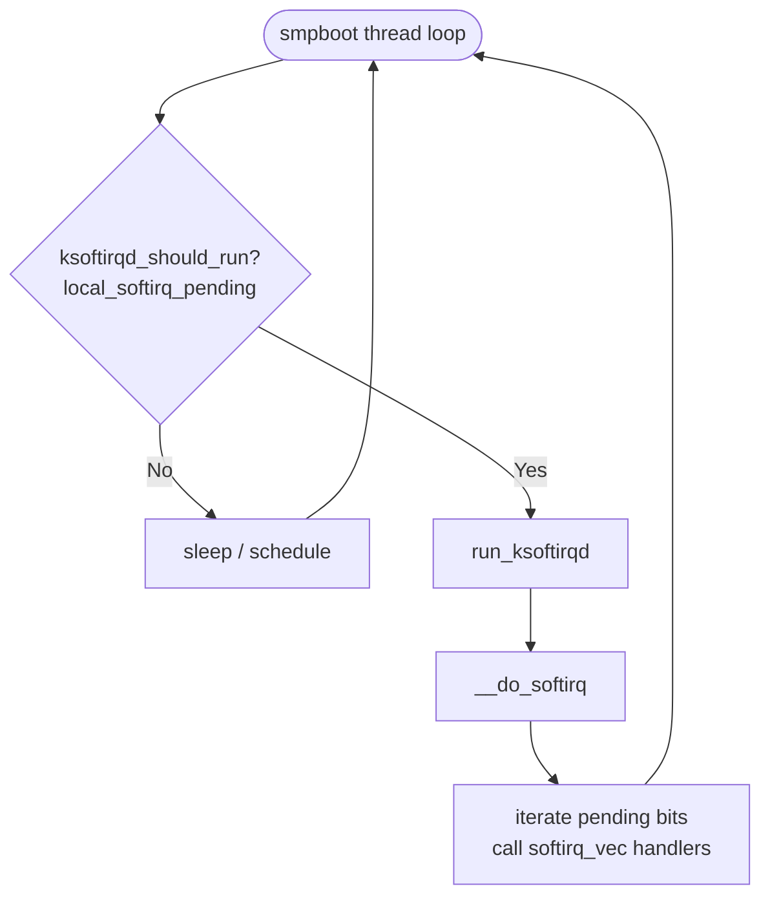
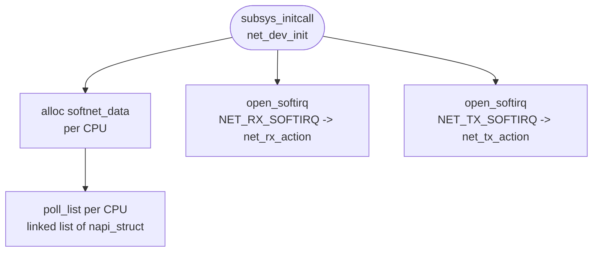
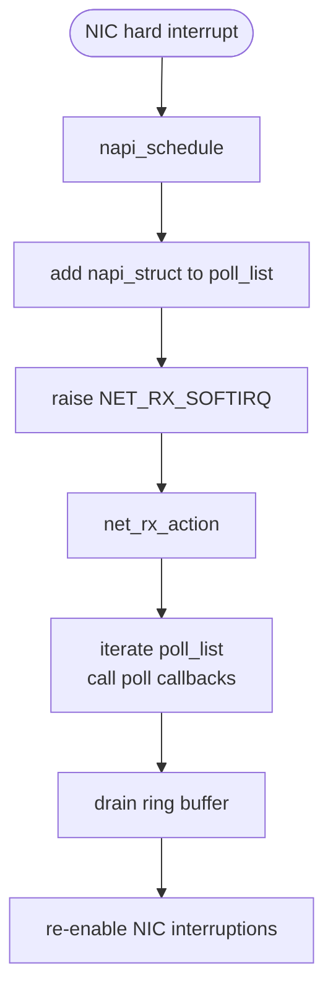
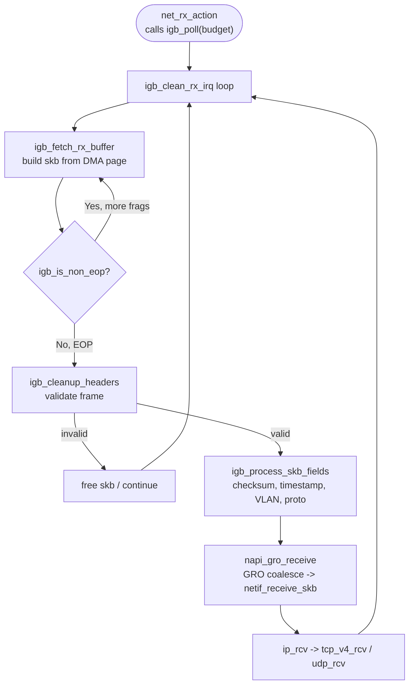
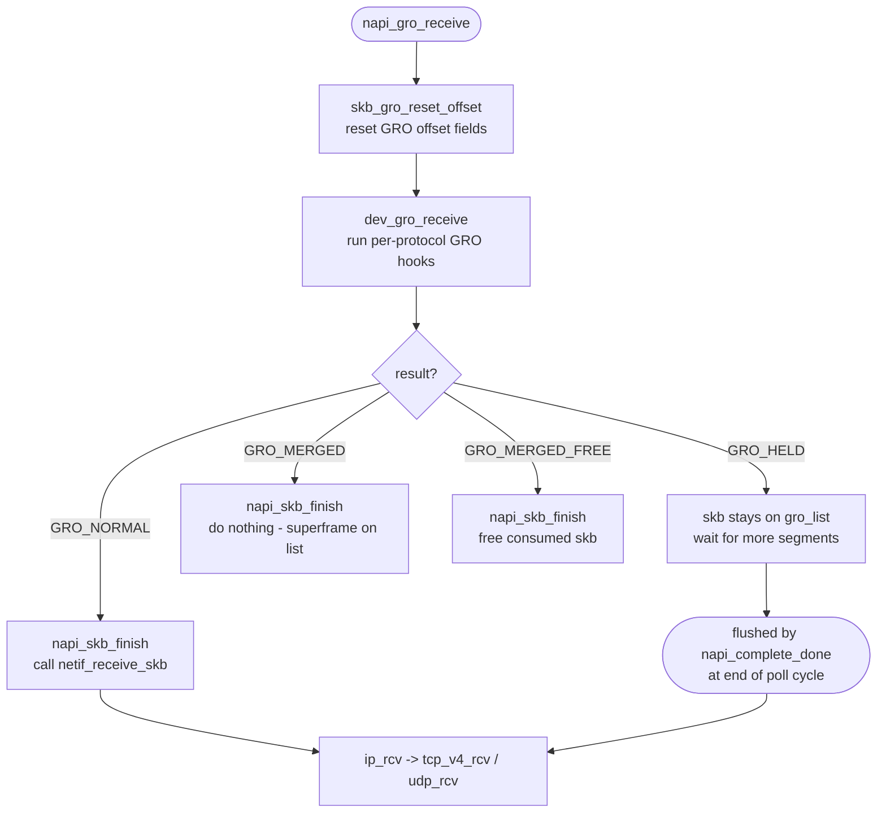
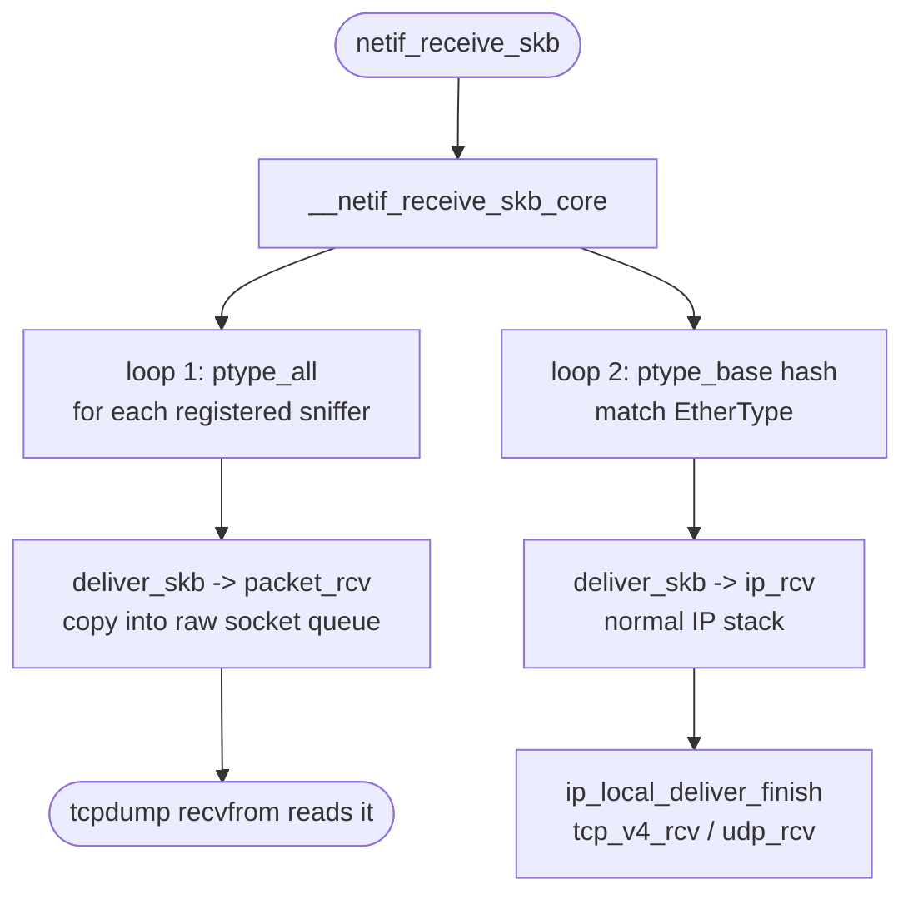
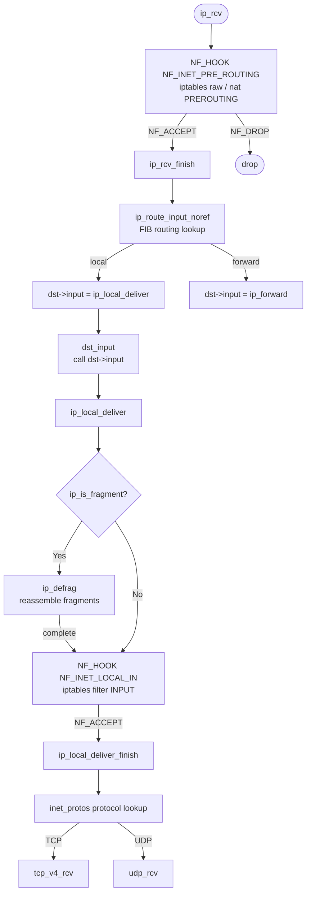

<style>
  video {
    border-radius: 4px;
    max-width: 660px;
  }
  img {
    max-width: 660px !important;
  }
</style>


### `ksoftirqd` and `ksoftirqd_should_run`

Each CPU core has a dedicated kernel thread called `ksoftirqd/N` (where `N` is the CPU index). It is created at boot time via `smpboot_register_percpu_thread`. 

Once created, the thread enters a loop managed by the `smpboot` infrastructure: it repeatedly calls `ksoftirqd_should_run` to decide whether there is pending `softirq` work, then calls `run_ksoftirqd` to process it.

`ksoftirqd_should_run` is not an explicit `while` loop in user-visible code — the looping is done by `smpboot`'s thread function. Internally `ksoftirqd_should_run` simply checks whether any `softirq` is pending:

```c
static int ksoftirqd_should_run(unsigned int cpu)
{
    return local_softirq_pending();
}
```

If `local_softirq_pending()` returns non-zero — meaning at least one `softirq` bit is set for this CPU — the thread wakes up and calls `run_ksoftirqd`, which in turn calls `__do_softirq`.

`__softirq_pending` is a **per-CPU bitmask** — one bit per softirq type. `local_softirq_pending()` simply reads it:

```c
#define local_softirq_pending() \
    (raw_cpu_read_4(__softirq_pending))
```

This is the **exact same variable** that `__raise_softirq_irqoff` writes to inside the ISR:

```c
void __raise_softirq_irqoff(unsigned int nr)
{
    or_softirq_pending(1UL << nr);   /* sets bit nr in __softirq_pending */
}
```

So the full round-trip is: `igb_msix_ring` (ISR) calls 

- `__raise_softirq_irqoff(NET_RX_SOFTIRQ)` 
- $\to$ sets bit 3 of `__softirq_pending` for this CPU
- $\to$ `ksoftirqd_should_run` calls `local_softirq_pending()`
- $\to$ reads that same bit
- $\to$ returns non-zero
- $\to$ `ksoftirqd` wakes. 

The ISR sets the bit; `ksoftirqd` wakes because it reads it. That function iterates over the pending `softirq` bits and invokes the registered handler for each one. After draining the queue, the thread goes back to sleep. 

The result is a recurring, CPU-affine loop that processes soft interrupts without starving user-space.




### The Role of `poll_list`

`poll_list` is a linked list of `napi_struct` instances. When a NIC's hard interrupt is fired, the **NIC driver** (i.e. `igb` in this article — the kernel module that knows how to talk to this specific piece of hardware) adds its `napi_struct` to the current CPU's `softnet_data.poll_list` and then disables further NIC interruptions for that queue. Then, during `net_rx_action`, the kernel iterates over `poll_list`, calling each registered `poll` function to drain the hardware ring buffer. 

After the ring is empty the NIC's interrupttion is re-enabled. `poll_list` is therefore the central handoff point between the hard-interrupt world and the softirq world. 








### NAPI — Polling Phase

#### What `napi_struct` Is {#napi_struct}

`napi_struct` is a **pure software scheduling handle**. It carries no packet payload and touches no DMA memory. The three distinct things involved are:

| Thing | What it is | Where it lives |
|---|---|---|
| `e1000_adv_rx_desc[]` | Hardware descriptor ring — physical DMA addresses the NIC writes packet bytes into | DMA-coherent memory, shared with NIC hardware |
| `igb_rx_buffer[]` | Kernel-side mirror — `struct page*` and virtual addresses matching each descriptor slot | Normal kernel memory (`vmalloc`) |
| `napi_struct` | Scheduling handle — tells NAPI *"queue N exists, here is its poll function, here is its budget"* | Embedded inside `igb_q_vector`, normal kernel memory |


So when `igb_msix_ring` calls `napi_schedule(&q_vector->napi)`, it is not touching any packet data or DMA memory at all. It is simply putting the `napi_struct` onto `softnet_data.poll_list` — saying *"please call my `poll` function soon"*. 

The `poll` function (`igb_poll`) is what later actually touches the `e1000_adv_rx_desc[]` ring to read packet data:

```text
napi_struct  →  schedules  →  igb_poll()
                                  ↓
                          reads e1000_adv_rx_desc[]  ← DMA data written by NIC
                          looks up igb_rx_buffer[]   ← finds the matching page
                          builds sk_buff             ← wraps the page for the stack
```


#### Inside `igb_poll` and `igb_clean_rx_irq`

`igb_poll` is the NAPI poll callback registered during `igb_probe`. It is called by `net_rx_action` with a `budget` — the maximum number of packets it is allowed to process in this invocation. It delegates the actual per-packet work to `igb_clean_rx_irq`, which walks the hardware descriptor ring:

```c
// file: drivers/net/ethernet/intel/igb/igb_main.c
static bool igb_clean_rx_irq(struct igb_q_vector *q_vector, const int budget)
{
    ...

    do {
        /* retrieve a buffer from the ring */
        skb = igb_fetch_rx_buffer(rx_ring, rx_desc, skb);

        /* fetch next buffer in frame if non-eop */
        if (igb_is_non_eop(rx_ring, rx_desc))
            continue;

        /* verify the packet layout is correct */
        if (igb_cleanup_headers(rx_ring, rx_desc, skb)) {
            skb = NULL;
            continue;
        }

        /* populate checksum, timestamp, VLAN, and protocol */
        igb_process_skb_fields(rx_ring, rx_desc, skb);

        napi_gro_receive(&q_vector->napi, skb);

        ...

    } while (likely(total_packets < budget));
}
```

The four key functions inside the loop:

- **`igb_fetch_rx_buffer`** — locates the `igb_rx_buffer` entry matching the current descriptor, maps the DMA page into a `struct sk_buff`, and returns it. For multi-fragment frames it accumulates fragments into the same `skb` across iterations.

- **`igb_is_non_eop`** — checks the EOP (End-Of-Packet) bit in the descriptor status. If the bit is clear, the current descriptor is only part of a larger frame; the function advances the ring head and returns `true` so the loop continues gathering the remaining fragments before any further processing.

- **`igb_cleanup_headers`** — validates the completed frame: checks for DMA errors, bad length, and malformed Ethernet/IP headers reported by hardware. If the frame is unusable it frees the `skb` and returns `true`, causing the loop to discard it and move on.

- **`igb_process_skb_fields`** — fills in software metadata that upper layers depend on: checksum offload result, hardware timestamp, VLAN tag, and the `protocol` field that tells the network stack which L3 handler to invoke.

- **`napi_gro_receive`** — passes the completed, validated `skb` to the GRO (Generic Receive Offload) layer. Internally it resets the GRO offset, runs the coalescing logic, and then finalises the result.




#### Inside `napi_gro_receive`

```c
// file: net/core/dev.c
gro_result_t napi_gro_receive(struct napi_struct *napi, struct sk_buff *skb)
{
    skb_gro_reset_offset(skb);
    return napi_skb_finish(dev_gro_receive(napi, skb), skb);
}
```

Three things happen in sequence:

- **`skb_gro_reset_offset`** — initialises the GRO bookkeeping fields inside the `skb`. Specifically it sets `skb->data_offset` to zero and `skb->len` to the total data length, establishing a clean baseline so that `dev_gro_receive` can walk the packet headers from the start. Without this reset, stale offsets from previous use of the `skb` slab object could cause the GRO engine to misparse the headers.

- **`dev_gro_receive`** — the core coalescing logic. It iterates over the NAPI instance's GRO list (`napi->gro_list`), which holds `skb`s that are waiting to be merged. For each candidate it calls the registered GRO receive hooks (one per protocol layer — Ethernet, VLAN, IP, TCP) to decide whether the incoming `skb` can be appended to an existing entry. If a match is found, the payload is merged and the return value is `GRO_MERGED` or `GRO_MERGED_FREE`. If no match is found, the `skb` is added to `gro_list` as a new candidate and `GRO_HELD` is returned. If GRO decides coalescing is impossible or undesirable (e.g. non-TCP, fragmented IP), it returns `GRO_NORMAL`, meaning the `skb` should go straight up the stack.

- **`napi_skb_finish`** — acts on the result code from `dev_gro_receive`:
  - ***`GRO_NORMAL`*** — calls `netif_receive_skb` immediately, sending the `skb` up through `ip_rcv` to the transport layer.
  - `GRO_HELD` — does nothing; the `skb` stays on `gro_list` waiting for more segments.
  - `GRO_MERGED_FREE` — frees the now-consumed `skb` (its data was appended to an existing GRO entry).
  - `GRO_MERGED` — does nothing extra; the merged superframe remains on `gro_list`.

  When `igb_poll` calls `napi_complete_done` at the end of a polling cycle, any `skb`s still sitting on `gro_list` are flushed via `napi_gro_flush`, which calls `netif_receive_skb` for each one, ensuring no data is stranded indefinitely.




### `netif_receive_skb` — Protocol Dispatch

This is what `netif_receive_skb` doing:


```c
//file: net/core/dev.c
int netif_receive_skb(struct sk_buff *skb)
{
    // RPS处理逻辑，先忽略
    ......
    
    return __netif_receive_skb(skb);
}

static int __netif_receive_skb(struct sk_buff *skb)
{
    ......
    ret = __netif_receive_skb_core(skb, false);
}

static int __netif_receive_skb_core(struct sk_buff *skb, bool pfmemalloc)
{
    ......
    // pcap逻辑，这里会将数据送入抓包点。tcpdump就是从这个入口获取包的
    list_for_each_entry_rcu(ptype, &ptype_all, list) {
        if (!ptype->dev || ptype->dev == skb->dev) {
            if (pt_prev)
                ret = deliver_skb(skb, pt_prev, orig_dev);
            pt_prev = ptype;

        }
    }

    ......
    list_for_each_entry_rcu(ptype,
                &ptype_base[ntohs(type) & PTYPE_HASH_MASK], list) {
        if (ptype->type == type &&
            (ptype->dev == null_or_dev || ptype->dev == skb->dev ||
             ptype->dev == orig_dev)) {
            if (pt_prev)
                ret = deliver_skb(skb, pt_prev, orig_dev);
            pt_prev = ptype;
        }
    }
}
```

#### How `tcpdump` hooks in — `packet_create` and `register_prot_hook`

When we run `tcpdump`, it opens a raw packet socket:

```c
// user-space (simplified)
int fd = socket(AF_PACKET, SOCK_RAW, htons(ETH_P_ALL));
```

The kernel handles this via `packet_create` (in `net/packet/af_packet.c`):

```c
// file: net/packet/af_packet.c
static int packet_create(struct net *net, struct socket *sock,
                         int protocol, int kern)
{
    struct sock *sk;
    struct packet_sock *po;
    __be16 proto = (__force __be16)protocol;

    sk = sk_alloc(net, PF_PACKET, GFP_KERNEL, &packet_proto);
    ...
    po = pkt_sk(sk);
    po->prot_hook.func = packet_rcv;        /* the delivery callback   */
    po->prot_hook.af_packet_priv = sk;
    po->prot_hook.type = proto;             /* ETH_P_ALL = 0x0003      */

    if (proto) {
        po->prot_hook.type = proto;
        register_prot_hook(sk);             /* wire it into the kernel */
    }
    ...
}
```

`packet_create` allocates a `packet_sock`, fills in a `packet_type` struct embedded inside it, and then calls `register_prot_hook`.

#### `register_prot_hook` — why `ETH_P_ALL` goes to `ptype_all`

```c
// file: net/packet/af_packet.c
static void register_prot_hook(struct sock *sk)
{
    struct packet_sock *po = pkt_sk(sk);
    if (!po->running) {
        if (po->prot_hook.type == htons(ETH_P_ALL))
            dev_add_pack(&po->prot_hook);   /* adds to ptype_all  */
        else
            __dev_add_pack(&po->prot_hook); /* adds to ptype_base */
        po->running = 1;
    }
}
```

`dev_add_pack` inspects `pt->type`. If it equals `htons(ETH_P_ALL)` (value `0x0003`), the `packet_type` is inserted into the global `ptype_all` list. Any other protocol value goes into the hash table `ptype_base`, keyed by protocol number.

This split is the entire reason `tcpdump` sees every packet. `ptype_all` is walked **before** protocol demultiplexing happens in `__netif_receive_skb_core`, so every `skb` — IP, ARP, IPv6, anything — passes through it unconditionally, regardless of its EtherType.

#### `deliver_skb` — handing the packet to the hook

```c
// file: net/core/dev.c
static inline int deliver_skb(struct sk_buff *skb,
                               struct packet_type *pt_prev,
                               struct net_device *orig_dev)
{
    if (unlikely(skb_orphan_frags_rx(skb, GFP_ATOMIC)))
        return -ENOMEM;
    refcount_inc(&skb->users);
    return pt_prev->func(skb, skb->dev, pt_prev, orig_dev);
}
```

`deliver_skb` does two things:

1. **Increments `skb->users`** — takes a reference on the `skb` so the packet is not freed while the hook is still reading it. This is safe because the kernel uses a "lazy" delivery pattern: it remembers the *previous* `packet_type` (`pt_prev`) and only delivers it when it moves on to the next one, so there is always one outstanding reference at the boundary.

2. **Calls `pt_prev->func`** — for a raw socket registered by tcpdump, this is `packet_rcv`. That function copies the packet data into the socket's receive queue (`sk->sk_receive_queue`) so the userspace process can retrieve it with `recvfrom` or `read`. The original `skb` continues up the normal stack unaffected.

#### Two loops in `__netif_receive_skb_core`

The function deliberately runs two separate loops:

| Loop | List | Who registers here | What it does |
|---|---|---|---|
| First | `ptype_all` | tcpdump (`ETH_P_ALL`), other promiscuous sniffers | Delivers to every registered sniffer **before** any protocol decision |
| Second | `ptype_base[hash]` | IP (`ETH_P_IP`), ARP (`ETH_P_ARP`), IPv6 (`ETH_P_IPV6`), … | Delivers to exactly the handler matching the frame's EtherType |

The first loop runs unconditionally on every packet, giving sniffers a copy of the raw frame. The second loop delivers the packet to the correct L3 handler — `ip_rcv` for IPv4, and so on — which is the normal receive path.




### The IP Layer — `ip_rcv` to `ip_local_deliver_finish`

Once `netif_receive_skb` dispatches the `skb` through `ptype_base` to `ip_rcv`, the kernel is now inside the IP layer. The job here is threefold: run Netfilter hooks, perform routing, and hand the packet off to the correct transport-layer handler.

#### `ip_rcv` — the entry point and the first Netfilter hook

```c
// file: net/ipv4/ip_input.c
int ip_rcv(struct sk_buff *skb, ...)
{
    ......
    return NF_HOOK(NFPROTO_IPV4, NF_INET_PRE_ROUTING, skb, dev, NULL,
                   ip_rcv_finish);
}
```

`ip_rcv` performs basic sanity checks on the IP header (version, header length, checksum, total length). If anything looks wrong the packet is dropped immediately. If it passes, rather than calling `ip_rcv_finish` directly, it goes through `NF_HOOK`.

`NF_HOOK` is the Netfilter hook mechanism. It traverses all rules registered at the `NF_INET_PRE_ROUTING` hook point — this is where `iptables -t raw` and `iptables -t nat PREROUTING` rules live. Each registered hook function can return one of: `NF_ACCEPT` (continue), `NF_DROP` (discard), or `NF_STOLEN` (hook takes ownership). Only if the final verdict is `NF_ACCEPT` does `NF_HOOK` call the continuation function, `ip_rcv_finish`.

#### `ip_rcv_finish` — routing decision

```c
// file: net/ipv4/ip_input.c
static int ip_rcv_finish(struct sk_buff *skb)
{
    ......
    if (!skb_dst(skb)) {
        int err = ip_route_input_noref(skb, iph->daddr, iph->saddr,
                                       iph->tos, skb->dev);
        ...
    }
    ......
    return dst_input(skb);
}
```

`ip_rcv_finish` does the routing lookup. `skb_dst(skb)` checks whether a destination cache entry (`dst_entry`) is already attached to this `skb` — for example by a previous early-demux shortcut. If not, `ip_route_input_noref` is called to perform a full FIB (Forwarding Information Base) lookup.

The lookup determines one of three outcomes:
- The packet is **for this host** (`RT_SCOPE_HOST`) — `dst->input` is set to `ip_local_deliver`.
- The packet must be **forwarded** — `dst->input` is set to `ip_forward`.
- The packet is for a **multicast** group we are subscribed to — handled by `ip_route_input_mc`, which also sets `dst->input = ip_local_deliver` when `our = 1`.

```c
// file: net/ipv4/route.c
static int ip_route_input_mc(struct sk_buff *skb, __be32 daddr, __be32 saddr,
                              u8 tos, struct net_device *dev, int our)
{
    if (our) {
        rth->dst.input = ip_local_deliver;
        rth->rt_flags |= RTCF_LOCAL;
    }
}
```

After the routing decision is recorded in the `dst_entry`, `ip_rcv_finish` calls `dst_input`:

```c
// file: include/net/dst.h
static inline int dst_input(struct sk_buff *skb)
{
    return skb_dst(skb)->input(skb);
}
```

This is an indirect call through the function pointer stored in `dst->input`. For locally-destined packets that pointer is `ip_local_deliver`.

#### `ip_local_deliver` — reassembly and the second Netfilter hook

```c
// file: net/ipv4/ip_input.c
int ip_local_deliver(struct sk_buff *skb)
{
    if (ip_is_fragment(ip_hdr(skb))) {
        if (ip_defrag(skb, IP_DEFRAG_LOCAL_DELIVER))
            return 0;
    }

    return NF_HOOK(NFPROTO_IPV4, NF_INET_LOCAL_IN, skb, skb->dev, NULL,
                   ip_local_deliver_finish);
}
```

Two things happen here:

1. **Fragment reassembly** — `ip_is_fragment` checks the MF (More Fragments) flag and the fragment offset in the IP header. If set, the packet is a fragment. `ip_defrag` stores it in the fragment queue and returns non-zero until the last fragment arrives and the full datagram can be reassembled into a single `skb`. Only then does execution continue past this block.

2. **`NF_INET_LOCAL_IN` hook** — a second Netfilter traversal. This is where `iptables -t filter INPUT` rules are evaluated. If all rules accept the packet, `ip_local_deliver_finish` is called.

#### `ip_local_deliver_finish` — protocol demultiplexing

```c
// file: net/ipv4/ip_input.c
static int ip_local_deliver_finish(struct sk_buff *skb)
{
    ......
    int protocol = ip_hdr(skb)->protocol;
    const struct net_protocol *ipprot;

    ipprot = rcu_dereference(inet_protos[protocol]);
    if (ipprot != NULL) {
        ret = ipprot->handler(skb);
    }
}
```

`ip_local_deliver_finish` reads the `protocol` field from the IP header (e.g. `IPPROTO_TCP = 6`, `IPPROTO_UDP = 17`) and uses it as an index into `inet_protos[]`, a global array of `struct net_protocol` pointers populated during `inet_init` (via `inet_add_protocol`). It then calls `ipprot->handler(skb)`, which for TCP is `tcp_v4_rcv` and for UDP is `udp_rcv`.

This is the hand-off point between the IP layer and the transport layer.




### Full Call Chain

The full path from packet arrival to user-space delivery is:

```text
NIC DMA write → hard interrupt (igb_msix_ring)
  → napi_schedule → poll_list + NET_RX_SOFTIRQ bit set
  → ksoftirqd wakes → net_rx_action
  → igb_poll (drains ring) → igb_clean_rx_irq
  → napi_gro_receive → netif_receive_skb
  → ip_rcv → ip_local_deliver_finish
  → tcp_v4_rcv / udp_rcv
  → enqueue to socket buffer → wake user-space recv()
```

### References

- 張彥飛, *深入理解 Linux 網絡*, Broadview