<style>
  video {
    border-radius: 4px;
    max-width: 660px;
  }
  img {
    max-width: 660px !important;
  }
</style>

### Overview

When a network packet arrives at a machine, the Linux kernel does not process it all in one shot. Instead it splits the work across two distinct phases: a hard interrupt that signals the CPU as fast as possible, and a deferred soft interrupt that does the heavier lifting without blocking the CPU from other tasks. 

Understanding these two phases and the subsystems that wire them together is the foundation for understanding how Linux networking works at a kernel level.


### Hard Interrupts and Soft Interrupts

#### NIC — Network Interface Card

A NIC (Network Interface Card) is the hardware component that connects a machine to a network. It has a MAC address identifying it on the local network, receives raw electrical or optical signals and converts them into bytes, and writes those bytes directly into kernel memory via **DMA** (Direct Memory Access) — the CPU is not involved in the data copy. When a frame is fully received, the NIC raises a hardware interrupt to notify the CPU.

In modern servers the NIC is often a PCIe add-in card or an on-board controller. The `igb` driver discussed later in this article targets the Intel 82575/82576 family of Gigabit Ethernet NICs.

#### ISR — Interrupt Service Routine

When a NIC receives a packet, it raises a ***hard interrupt***. The CPU stops what it is doing, saves registers, consults the interrupt vector table to find the registered handler for that interrupt vector, and jumps to it — the ISR (Interrupt Service Routine).

For the `igb` driver the ISR is a handling function (registered for hard interrupt) named `igb_msix_ring`.

```c
// file: drivers/net/ethernet/intel/igb/igb_main.c
static irqreturn_t igb_msix_ring(int irq, void *data){
    struct igb_q-vector *q_vector = data;

    // Write the ITR value calculated from the previsou interrupt.
    igb_write_itr(q_vector);

    napi_schedule(&q_vector->napi);

    return IRQ_HANDLED;
}

//file: net/core/dev.c
static inline void __napi_schedule(struct softnet_data *sd,
                                    struct napi_struct *napi)
{
    list_add_tail(&napi->poll_list, &sd->poll_list);
    __raise_softirq_irqoff(NET_RX_SOFTIRQ);
}
```


It must run in the shortest time possible because while the ISR executes, all other interrupts on that CPU core are blocked. Its only jobs are:

1. Acknowledge the interrupt to the NIC hardware so it stops asserting the line.

2. Call `napi_schedule` to queue the heavier processing work.
3. Return immediately, restoring the CPU to what it was doing.

All actual packet work — DMA mapping, `sk_buff` allocation, protocol dispatch — is ***deferred*** to a ***soft interrupt*** (`softirq`). 

A `softirq` runs after the hard interrupt handler returns, in a context that still cannot be preempted by user processes but can be preempted by other hard interrupts. This two-phase design lets the kernel acknowledge the hardware quickly and get out of the way, while actual packet processing happens in the softer deferred phase.

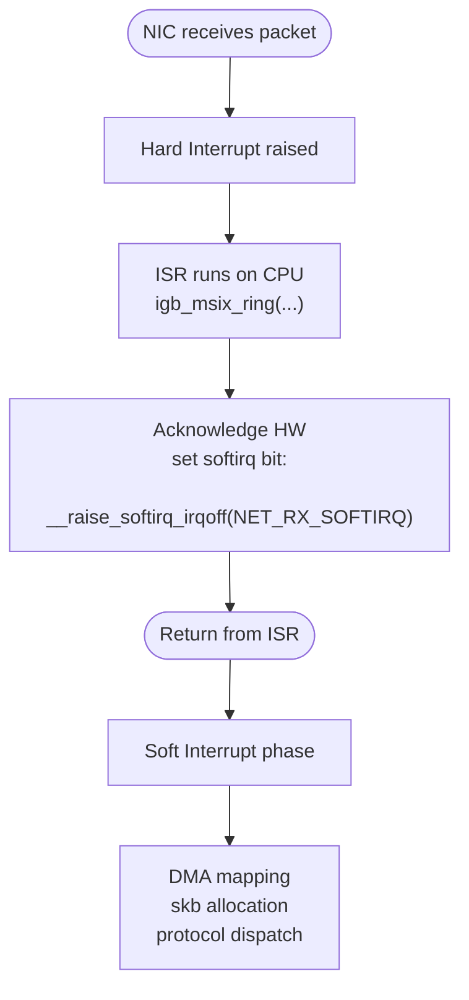

#### The Socket Buffer — `sk_buff` (aka `skb`)

`skb` is shorthand for `struct sk_buff`, the central data structure that represents a network packet as it travels through the kernel networking stack. When the NAPI poll function drains the hardware ring buffer, it wraps each received page in an `sk_buff` so that every layer above — IP, TCP, UDP — can work with a uniform interface.

An `sk_buff` carries:

- **Data pointers** — `head`, `data`, `tail`, and `end` delimit the packet payload and the headroom/tailroom reserved for headers. Each layer peels or pushes headers by adjusting `data` and `tail` without copying bytes.

- **Protocol metadata** — offsets to the MAC, network, and transport headers, plus the protocol identifier.
- **Device reference** — a pointer to the `net_device` the packet arrived on.
- **Checksum and timestamp fields** — used by the checksum offload engine and packet timestamping subsystem.

The reason `skb` allocation is listed alongside DMA mapping in the softirq phase — rather than the hard interrupt phase — is deliberate. Allocating memory (`kmem_cache_alloc` from the `skbuff_head_cache` slab) and filling in metadata takes non-trivial time. Doing it inside a hard interrupt would block all other interrupts on that CPU core. Deferring it to the softirq phase keeps the ISR minimal and the system responsive.

### Initialising the Network Subsystem 

#### `net_dev_init`

The network device subsystem is initialised via:

```c
subsys_initcall(net_dev_init);
```

This macro registers `net_dev_init` to run during the `subsys` phase of kernel boot, before any device drivers load. Inside `net_dev_init`, two things happen that matter for packet reception.

First, a `struct softnet_data` is allocated for every CPU:

```c
struct softnet_data {
    struct list_head    poll_list;
    ...
};
```

Second, the `softirq` handlers for networking are registered:

```c
open_softirq(NET_TX_SOFTIRQ, net_tx_action);
open_softirq(NET_RX_SOFTIRQ, net_rx_action);
```

This records `net_rx_action` and `net_tx_action` in `softirq_vec` at the `NET_RX_SOFTIRQ` and `NET_TX_SOFTIRQ` indices respectively. 

From this point on, whenever a NIC raises a hard interrupt and sets the `NET_RX_SOFTIRQ` bit, `ksoftirqd` (or the `__do_softirq` path) will eventually call `net_rx_action`.

#### NAPI

NAPI (New API) is the interrupt-mitigation mechanism introduced in Linux 2.6 to handle high-throughput NICs without drowning the CPU in hardware interrupts.

The problem it solves: at 10 Gbps line rate a NIC can raise tens of millions of hard interrupts per second — one per packet. Each interrupt preempts whatever the CPU was doing, saves and restores context, and runs the ISR. At high packet rates this overhead alone consumes the entire CPU, leaving no time for actual processing.

NAPI's solution is to switch from interrupt-driven reception to a polling loop once traffic exceeds a threshold:

1. The first packet on a queue triggers a normal hard interrupt.

2. The ISR calls `napi_schedule` (via `igb_msix_ring`), which adds the queue's `napi_struct` to `softnet_data.poll_list` and **disables further interrupts for that queue**.
3. `ksoftirqd` (via `net_rx_action`) then calls the driver's registered `poll` callback in a loop, processing up to a `budget` number of packets per invocation without any further interrupts.
4. Once the ring is empty (or the budget is exhausted), interrupts are re-enabled and polling stops.

This converts a storm of interrupts into a single interrupt followed by a bounded polling loop, which drastically reduces interrupt overhead under load while still being responsive at low traffic rates.

Each NIC queue is represented by a `napi_struct`:

```c
struct napi_struct {
    struct list_head    poll_list;   /* link into softnet_data.poll_list */
    int                 (*poll)(struct napi_struct *, int); /* driver poll fn */
    int                 weight;      /* max packets per poll call (budget) */
    ...
};
```

The driver registers its `poll` function and a `weight` (typically 64) during `igb_probe`. When traffic arrives, NAPI orchestrates everything through this struct.

### Soft Interrupt Types

All softirq types are enumerated in `include/linux/interrupt.h`:

```c
enum
{
    HI_SOFTIRQ=0,
    TIMER_SOFTIRQ,
    NET_TX_SOFTIRQ,
    NET_RX_SOFTIRQ,
    BLOCK_SOFTIRQ,
    IRQ_POLL_SOFTIRQ,
    TASKLET_SOFTIRQ,
    SCHED_SOFTIRQ,
    HRTIMER_SOFTIRQ,
    RCU_SOFTIRQ,
    NR_SOFTIRQS
};
```

The two entries relevant to networking are `NET_TX_SOFTIRQ` (outgoing packet processing) and `NET_RX_SOFTIRQ` (incoming packet processing). 

Each value is simply an index into `softirq_vec`, an array of `struct softirq_action` that maps each index to its handler function. When a hard interrupt sets a bit in the pending mask, `__do_softirq` picks it up and calls the corresponding entry.

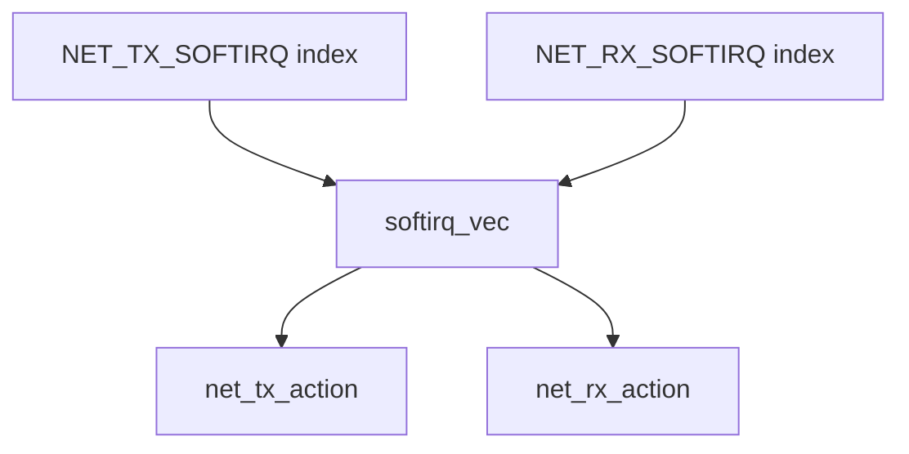


### Initialising the Protocol Stack — `inet_init`

Layer-3 and layer-4 protocol's support are brought in by:

```c
fs_initcall(inet_init);
```

`fs_initcall` runs slightly later than `subsys_initcall`, after filesystems are ready. `inet_init` lives in `net/ipv4/af_inet.c` and orchestrates several things:

1. The `AF_INET` address family is registered with the socket layer via `sock_register`.
2. Core protocol handlers are added to the IP layer's protocol table via `inet_add_protocol`. This is where `tcp_protocol` and `udp_protocol` are inserted:

```c
static struct net_protocol tcp_protocol = {
    .handler     = tcp_v4_rcv,
    .err_handler = tcp_v4_err,
    ...
};

static struct net_protocol udp_protocol = {
    .handler     = udp_rcv,
    .err_handler = udp_err,
    ...
};
```

3. The per-protocol socket operations structs `inet_stream_ops`, `inet_dgram_ops` are wired up.
4. `/proc` entries and sysctl knobs are registered.

#### `udp_rcv` and `tcp_v4_rcv`

Both functions are the entry point for IP packets that have been demultiplexed by the IP layer. When `ip_local_deliver_finish` pulls a packet off the IP queue, it looks up the transport protocol number in the protocol table and calls the matching `.handler`. For TCP that is `tcp_v4_rcv`; for UDP that is `udp_rcv`.

At this point the kernel has already verified the IP header and confirmed the packet is destined for this host. `tcp_v4_rcv` and `udp_rcv` then perform transport-layer processing: 
- Checksum Verification

- Socket Lookup
- Queue Insertion (into `sk->sk_receive_queue` for UDP, or into the TCP receive buffer machinery) and finally
- Waking any Blocked `recv()` Call in user space. 

These functions are executed in the context of the `net_rx_action` softirq, driven by `ksoftirqd`.

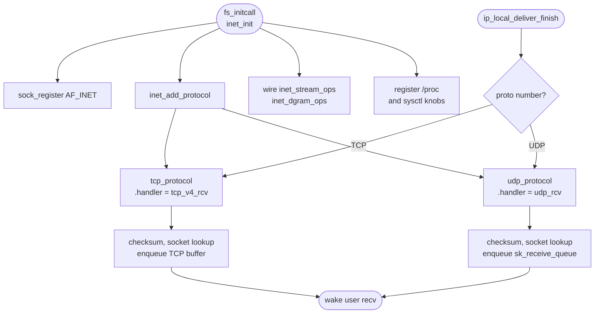


### The NIC Driver — `igb_init_module` and `pci_register_driver`

The Intel Gigabit Ethernet driver (`igb`) registers itself at module init time:

```c
static int __init igb_init_module(void)
{
    ...
    return pci_register_driver(&igb_driver);
}
module_init(igb_init_module);
```

`pci_register_driver` does not immediately bind to any hardware. It tells the kernel's PCI subsystem that the `igb` driver exists, along with the `igb_driver` struct which carries:

- The `id_table`: a list of PCI vendor/device IDs this driver handles.
- The `probe` function pointer (`igb_probe`): called by the PCI core whenever a matching device is found.

When the PCI core enumerates the bus and finds a device whose ID matches the `id_table`, it calls `igb_probe`. At that point the driver interrogates the hardware, allocates resources, and registers a `net_device`. The driver also registers a NAPI `poll` function here — this is the function that will be placed on `poll_list` and called from `net_rx_action` to drain received packets from hardware.

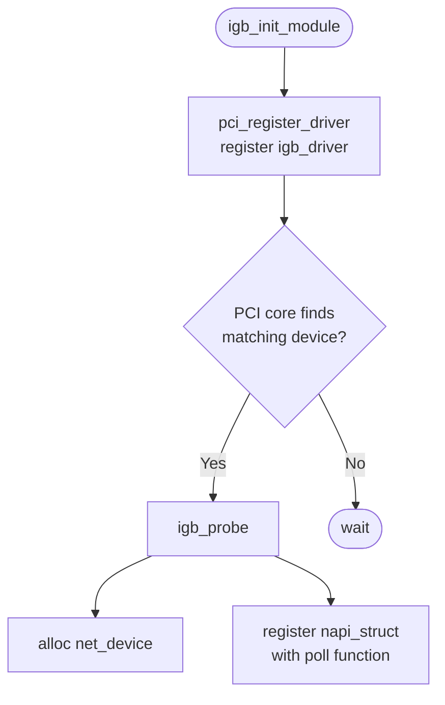


### Activating the Network Card — Ring Buffer and Queues

When an interface is brought up (e.g. `ip link set eth0 up`), the kernel calls through `net_device_ops.ndo_open`, which for `igb` is `igb_open`. The call order is:

```text
__igb_open
  -> igb_setup_all_rx_resources
  -> igb_setup_all_tx_resources
  -> igb_request_irq
```

`igb_setup_all_rx_resources` creates one Rx queue per CPU (or as many as configured). For each queue it calls `igb_setup_rx_resources`:

```c
int igb_setup_rx_resources(struct igb_ring *rx_ring)
{
    int size = sizeof(struct igb_rx_buffer) * rx_ring->count;
    rx_ring->rx_buffer_info = vmalloc(size);

    rx_ring->desc = dma_alloc_coherent(
        dev, rx_ring->size,
        &rx_ring->dma, GFP_KERNEL);
    ...
}
```

#### Two Parallel Arrays: the Ring Buffer

Two parallel arrays are allocated for each queue:

- `igb_rx_buffer[]` — a kernel-side software array, one entry per descriptor slot. Each entry holds the `struct page` pointer and the DMA address of the memory page allocated for that slot.

- `e1000_adv_rx_desc[]` — the hardware descriptor ring itself, allocated in DMA-coherent memory shared with the NIC. Each entry is a small structure containing a physical (DMA) buffer address the NIC writes packet data into when it deposits a packet.

These two arrays together form the ***ring buffer***. The NIC walks the descriptor ring in hardware, writing packet data directly into the kernel pages pointed to by each `e1000_adv_rx_desc` entry via DMA — the CPU is not involved in the copy. When a descriptor is filled, the NIC raises a hard interrupt. The driver's ISR then hands control off to NAPI, which calls the registered `poll` function inside `net_rx_action`. The poll function walks the ring from the last-known head, reads each completed `e1000_adv_rx_desc`, retrieves the matching page from `igb_rx_buffer`, constructs an `sk_buff`, and passes it up through the network stack.

The reason for having two separate arrays is that the NIC only understands physical (DMA) addresses, not kernel virtual addresses or `struct page` pointers. The software-side `igb_rx_buffer` keeps all the bookkeeping that only the CPU needs, while the hardware-side `e1000_adv_rx_desc` is the minimal shared interface with the NIC.

#### When Data Arrive: Zero-Copy, Same Physical Memory, Two Views

A critical point is that **no copy ever happens**. The DMA address stored in `e1000_adv_rx_desc[i]` and the `struct page*` stored in `igb_rx_buffer[i]` refer to the exact same physical RAM page — just from two different angles:

```text
igb_rx_buffer[i].page  ──► struct page 
                       ──► physical RAM at 0xABC000
e1000_adv_rx_desc[i].addr ───────────────► 0xABC000  (identical bytes)
```

`struct page` is the kernel's bookkeeping descriptor for one physical memory page (typically 4 KB). It is a small struct that records ownership, reference count, and flags, and from which `page_address()` can derive the virtual address. 

The 4 KB of packet data live directly in physical RAM; `struct page` is just the library card for that memory.

The full lifecycle of a single slot is:

1. **Setup** (`igb_setup_rx_resources`) — `alloc_page()` allocates a physical page, its `struct page*` is stored in `igb_rx_buffer[i]`, and `dma_map_page()` maps it to a DMA address that is written into `e1000_adv_rx_desc[i].addr`.

2. **Packet arrives** — the NIC DMA-writes packet bytes directly into the physical page at `0xABC000`. The CPU is not involved; no copy occurs.

3. **Hard interrupt fires** — `igb_msix_ring` calls `napi_schedule` and returns immediately.

4. **Soft interrupt** (`net_rx_action` → `igb_poll` → `igb_clean_rx_irq`) — reads `e1000_adv_rx_desc[i]` for packet length and status, looks up `igb_rx_buffer[i]` for the `struct page*` of the memory the NIC already wrote into, and builds an `sk_buff` that **points into that page** — still no copy.

5. **Refill** — a new page is allocated and its DMA address is written back into `e1000_adv_rx_desc[i]`, making the slot ready for the next packet.

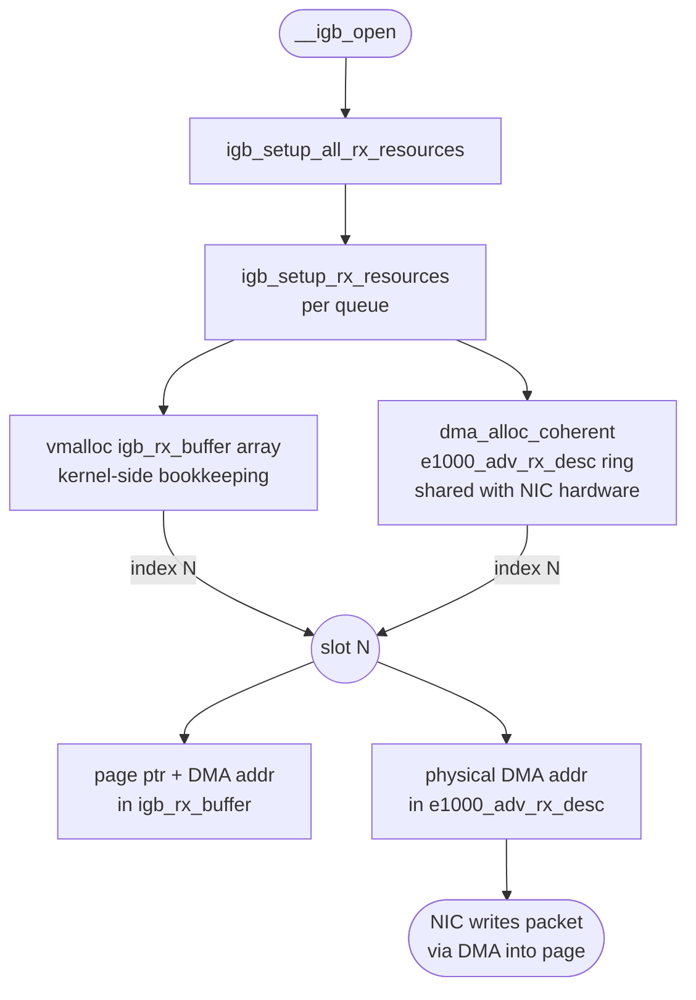


### Registering Interrupt Handlers — `igb_request_irq`

After the ring buffers are set up, `__igb_open` calls `igb_request_irq` to wire the hardware interrupts to their handlers:

```c
static int igb_request_irq(struct igb_adapter *adapter)
{
    if (adapter->msix_entries) {
        err = igb_request_msix(adapter);
        ...
    }
    ...
}
```

Modern Intel NICs support MSI-X (Message Signalled Interrupts Extended), which allows each Rx/Tx queue to raise a distinct interrupt vector, each of which can be affined to a specific CPU core. `igb_request_msix` registers one handler per vector:

```c
static int igb_request_msix(struct igb_adapter *adapter)
{
    for (i = 0; i < adapter->num_q_vectors; i++) {
        struct igb_q_vector *q_vector = adapter->q_vector[i];
        ...
        err = request_irq(
            adapter->msix_entries[vector].vector,
            igb_msix_ring,
            0,
            q_vector->name,
            q_vector);
        ...
    }

    err = request_irq(
        adapter->msix_entries[vector].vector,
        igb_msix_other,
        0,
        netdev->name,
        adapter);
}
```


### `ksoftirqd` and `ksoftirqd_should_run`

Each CPU core has a dedicated kernel thread called `ksoftirqd/N` (where `N` is the CPU index). It is created at boot time via `smpboot_register_percpu_thread`. 

Once created, the thread enters a loop managed by the `smpboot` infrastructure: it repeatedly calls `ksoftirqd_should_run` to decide whether there is pending `softirq` work, then calls `run_ksoftirqd` to process it.

`ksoftirqd_should_run` is not an explicit `while` loop in user-visible code — the looping is done by `smpboot`'s thread function. Internally `ksoftirqd_should_run` simply checks whether any `softirq` is pending:

```c
static int ksoftirqd_should_run(unsigned int cpu)
{
    return local_softirq_pending();
}
```

If `local_softirq_pending()` returns non-zero — meaning at least one `softirq` bit is set for this CPU — the thread wakes up and calls `run_ksoftirqd`, which in turn calls `__do_softirq`.

`__softirq_pending` is a **per-CPU bitmask** — one bit per softirq type. `local_softirq_pending()` simply reads it:

```c
#define local_softirq_pending() \
    (raw_cpu_read_4(__softirq_pending))
```

This is the **exact same variable** that `__raise_softirq_irqoff` writes to inside the ISR:

```c
void __raise_softirq_irqoff(unsigned int nr)
{
    or_softirq_pending(1UL << nr);   /* sets bit nr in __softirq_pending */
}
```

So the full round-trip is: `igb_msix_ring` (ISR) calls 

- `__raise_softirq_irqoff(NET_RX_SOFTIRQ)` 
- $\to$ sets bit 3 of `__softirq_pending` for this CPU
- $\to$ `ksoftirqd_should_run` calls `local_softirq_pending()`
- $\to$ reads that same bit
- $\to$ returns non-zero
- $\to$ `ksoftirqd` wakes. 

The ISR sets the bit; `ksoftirqd` wakes because it reads it. That function iterates over the pending `softirq` bits and invokes the registered handler for each one. After draining the queue, the thread goes back to sleep. 

The result is a recurring, CPU-affine loop that processes soft interrupts without starving user-space.

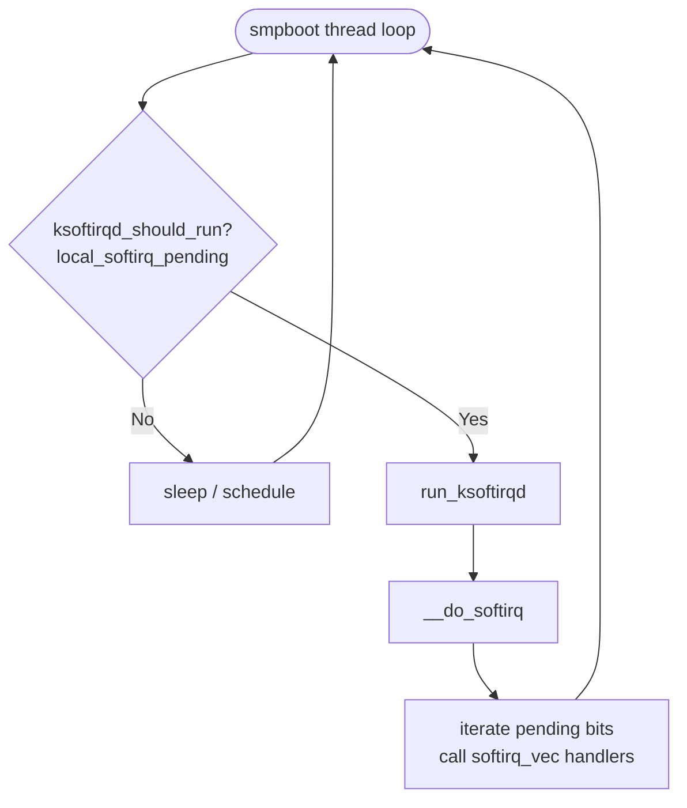


### The Role of `poll_list`

`poll_list` is a linked list of `napi_struct` instances. When a NIC's hard interrupt is fired, the **NIC driver** (i.e. `igb` in this article — the kernel module that knows how to talk to this specific piece of hardware) adds its `napi_struct` to the current CPU's `softnet_data.poll_list` and then disables further NIC interruptions for that queue. Then, during `net_rx_action`, the kernel iterates over `poll_list`, calling each registered `poll` function to drain the hardware ring buffer. 

After the ring is empty the NIC's interrupttion is re-enabled. `poll_list` is therefore the central handoff point between the hard-interrupt world and the softirq world. 


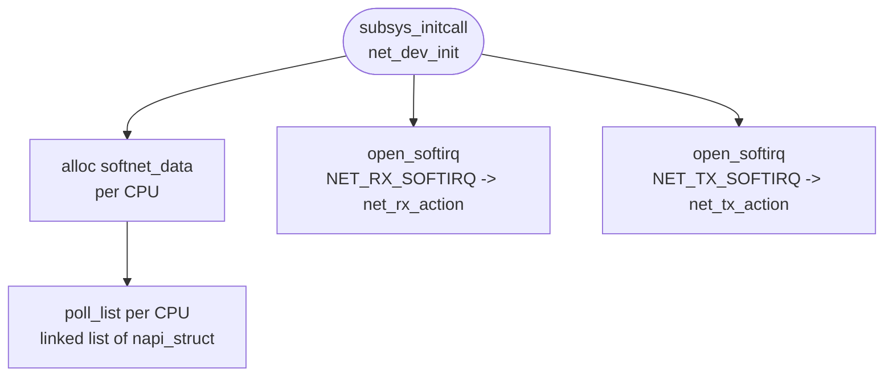


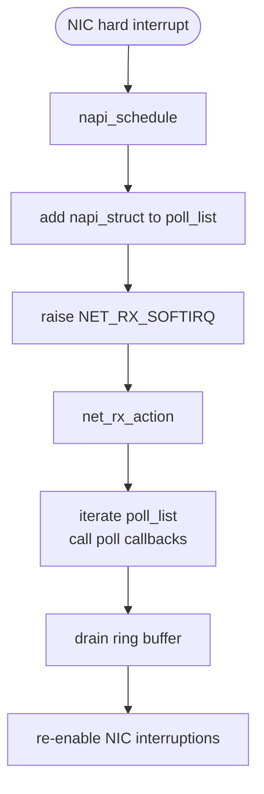


### NAPI — Polling Phase

#### What `napi_struct` Is {#napi_struct}

`napi_struct` is a **pure software scheduling handle**. It carries no packet payload and touches no DMA memory. The three distinct things involved are:

| Thing | What it is | Where it lives |
|---|---|---|
| `e1000_adv_rx_desc[]` | Hardware descriptor ring — physical DMA addresses the NIC writes packet bytes into | DMA-coherent memory, shared with NIC hardware |
| `igb_rx_buffer[]` | Kernel-side mirror — `struct page*` and virtual addresses matching each descriptor slot | Normal kernel memory (`vmalloc`) |
| `napi_struct` | Scheduling handle — tells NAPI *"queue N exists, here is its poll function, here is its budget"* | Embedded inside `igb_q_vector`, normal kernel memory |


So when `igb_msix_ring` calls `napi_schedule(&q_vector->napi)`, it is not touching any packet data or DMA memory at all. It is simply putting the `napi_struct` onto `softnet_data.poll_list` — saying *"please call my `poll` function soon"*. 

The `poll` function (`igb_poll`) is what later actually touches the `e1000_adv_rx_desc[]` ring to read packet data:

```text
napi_struct  →  schedules  →  igb_poll()
                                  ↓
                          reads e1000_adv_rx_desc[]  ← DMA data written by NIC
                          looks up igb_rx_buffer[]   ← finds the matching page
                          builds sk_buff             ← wraps the page for the stack
```


#### Inside `igb_poll` and `igb_clean_rx_irq`

`igb_poll` is the NAPI poll callback registered during `igb_probe`. It is called by `net_rx_action` with a `budget` — the maximum number of packets it is allowed to process in this invocation. It delegates the actual per-packet work to `igb_clean_rx_irq`, which walks the hardware descriptor ring:

```c
// file: drivers/net/ethernet/intel/igb/igb_main.c
static bool igb_clean_rx_irq(struct igb_q_vector *q_vector, const int budget)
{
    ...

    do {
        /* retrieve a buffer from the ring */
        skb = igb_fetch_rx_buffer(rx_ring, rx_desc, skb);

        /* fetch next buffer in frame if non-eop */
        if (igb_is_non_eop(rx_ring, rx_desc))
            continue;

        /* verify the packet layout is correct */
        if (igb_cleanup_headers(rx_ring, rx_desc, skb)) {
            skb = NULL;
            continue;
        }

        /* populate checksum, timestamp, VLAN, and protocol */
        igb_process_skb_fields(rx_ring, rx_desc, skb);

        napi_gro_receive(&q_vector->napi, skb);

        ...

    } while (likely(total_packets < budget));
}
```

The four key functions inside the loop:

- **`igb_fetch_rx_buffer`** — locates the `igb_rx_buffer` entry matching the current descriptor, maps the DMA page into a `struct sk_buff`, and returns it. For multi-fragment frames it accumulates fragments into the same `skb` across iterations.

- **`igb_is_non_eop`** — checks the EOP (End-Of-Packet) bit in the descriptor status. If the bit is clear, the current descriptor is only part of a larger frame; the function advances the ring head and returns `true` so the loop continues gathering the remaining fragments before any further processing.

- **`igb_cleanup_headers`** — validates the completed frame: checks for DMA errors, bad length, and malformed Ethernet/IP headers reported by hardware. If the frame is unusable it frees the `skb` and returns `true`, causing the loop to discard it and move on.

- **`igb_process_skb_fields`** — fills in software metadata that upper layers depend on: checksum offload result, hardware timestamp, VLAN tag, and the `protocol` field that tells the network stack which L3 handler to invoke.

- **`napi_gro_receive`** — passes the completed, validated `skb` to the GRO (Generic Receive Offload) layer. Internally it resets the GRO offset, runs the coalescing logic, and then finalises the result.

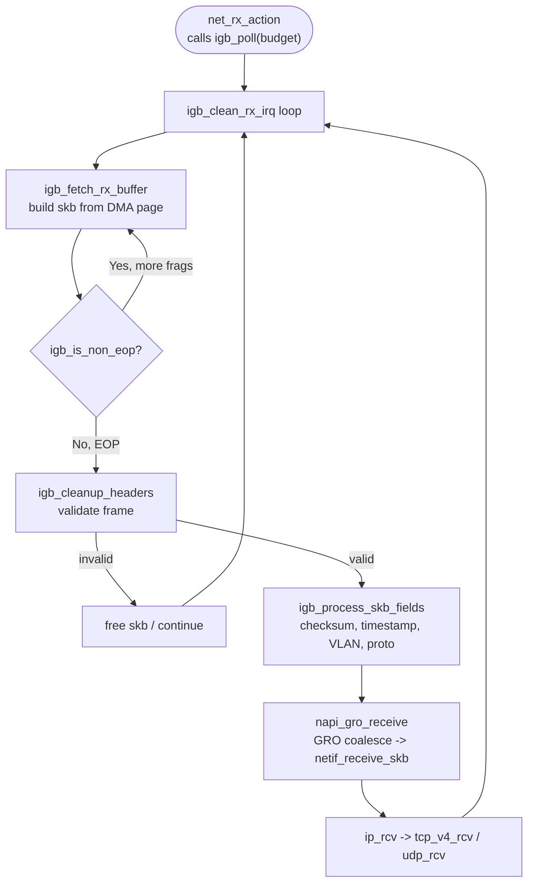


#### Inside `napi_gro_receive`

```c
// file: net/core/dev.c
gro_result_t napi_gro_receive(struct napi_struct *napi, struct sk_buff *skb)
{
    skb_gro_reset_offset(skb);
    return napi_skb_finish(dev_gro_receive(napi, skb), skb);
}
```

Three things happen in sequence:

- **`skb_gro_reset_offset`** — initialises the GRO bookkeeping fields inside the `skb`. Specifically it sets `skb->data_offset` to zero and `skb->len` to the total data length, establishing a clean baseline so that `dev_gro_receive` can walk the packet headers from the start. Without this reset, stale offsets from previous use of the `skb` slab object could cause the GRO engine to misparse the headers.

- **`dev_gro_receive`** — the core coalescing logic. It iterates over the NAPI instance's GRO list (`napi->gro_list`), which holds `skb`s that are waiting to be merged. For each candidate it calls the registered GRO receive hooks (one per protocol layer — Ethernet, VLAN, IP, TCP) to decide whether the incoming `skb` can be appended to an existing entry. If a match is found, the payload is merged and the return value is `GRO_MERGED` or `GRO_MERGED_FREE`. If no match is found, the `skb` is added to `gro_list` as a new candidate and `GRO_HELD` is returned. If GRO decides coalescing is impossible or undesirable (e.g. non-TCP, fragmented IP), it returns `GRO_NORMAL`, meaning the `skb` should go straight up the stack.

- **`napi_skb_finish`** — acts on the result code from `dev_gro_receive`:
  - ***`GRO_NORMAL`*** — calls `netif_receive_skb` immediately, sending the `skb` up through `ip_rcv` to the transport layer.
  - `GRO_HELD` — does nothing; the `skb` stays on `gro_list` waiting for more segments.
  - `GRO_MERGED_FREE` — frees the now-consumed `skb` (its data was appended to an existing GRO entry).
  - `GRO_MERGED` — does nothing extra; the merged superframe remains on `gro_list`.

  When `igb_poll` calls `napi_complete_done` at the end of a polling cycle, any `skb`s still sitting on `gro_list` are flushed via `napi_gro_flush`, which calls `netif_receive_skb` for each one, ensuring no data is stranded indefinitely.

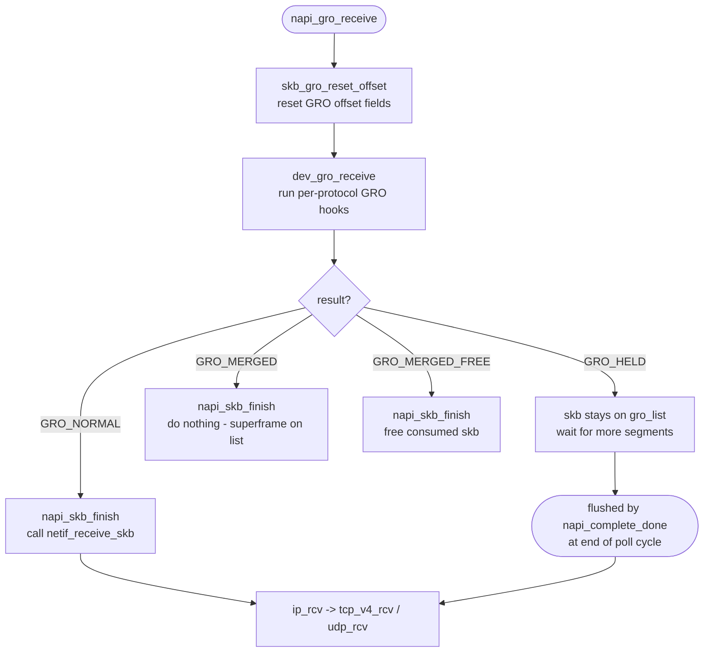


### `netif_receive_skb` — Protocol Dispatch

This is what `netif_receive_skb` doing:


```c
//file: net/core/dev.c
int netif_receive_skb(struct sk_buff *skb)
{
    // RPS处理逻辑，先忽略
    ......
    
    return __netif_receive_skb(skb);
}

static int __netif_receive_skb(struct sk_buff *skb)
{
    ......
    ret = __netif_receive_skb_core(skb, false);
}

static int __netif_receive_skb_core(struct sk_buff *skb, bool pfmemalloc)
{
    ......
    // pcap逻辑，这里会将数据送入抓包点。tcpdump就是从这个入口获取包的
    list_for_each_entry_rcu(ptype, &ptype_all, list) {
        if (!ptype->dev || ptype->dev == skb->dev) {
            if (pt_prev)
                ret = deliver_skb(skb, pt_prev, orig_dev);
            pt_prev = ptype;

        }
    }

    ......
    list_for_each_entry_rcu(ptype,
                &ptype_base[ntohs(type) & PTYPE_HASH_MASK], list) {
        if (ptype->type == type &&
            (ptype->dev == null_or_dev || ptype->dev == skb->dev ||
             ptype->dev == orig_dev)) {
            if (pt_prev)
                ret = deliver_skb(skb, pt_prev, orig_dev);
            pt_prev = ptype;
        }
    }
}
```

#### How `tcpdump` hooks in — `packet_create` and `register_prot_hook`

When we run `tcpdump`, it opens a raw packet socket:

```c
// user-space (simplified)
int fd = socket(AF_PACKET, SOCK_RAW, htons(ETH_P_ALL));
```

The kernel handles this via `packet_create` (in `net/packet/af_packet.c`):

```c
// file: net/packet/af_packet.c
static int packet_create(struct net *net, struct socket *sock,
                         int protocol, int kern)
{
    struct sock *sk;
    struct packet_sock *po;
    __be16 proto = (__force __be16)protocol;

    sk = sk_alloc(net, PF_PACKET, GFP_KERNEL, &packet_proto);
    ...
    po = pkt_sk(sk);
    po->prot_hook.func = packet_rcv;        /* the delivery callback   */
    po->prot_hook.af_packet_priv = sk;
    po->prot_hook.type = proto;             /* ETH_P_ALL = 0x0003      */

    if (proto) {
        po->prot_hook.type = proto;
        register_prot_hook(sk);             /* wire it into the kernel */
    }
    ...
}
```

`packet_create` allocates a `packet_sock`, fills in a `packet_type` struct embedded inside it, and then calls `register_prot_hook`.

#### `register_prot_hook` — why `ETH_P_ALL` goes to `ptype_all`

```c
// file: net/packet/af_packet.c
static void register_prot_hook(struct sock *sk)
{
    struct packet_sock *po = pkt_sk(sk);
    if (!po->running) {
        if (po->prot_hook.type == htons(ETH_P_ALL))
            dev_add_pack(&po->prot_hook);   /* adds to ptype_all  */
        else
            __dev_add_pack(&po->prot_hook); /* adds to ptype_base */
        po->running = 1;
    }
}
```

`dev_add_pack` inspects `pt->type`. If it equals `htons(ETH_P_ALL)` (value `0x0003`), the `packet_type` is inserted into the global `ptype_all` list. Any other protocol value goes into the hash table `ptype_base`, keyed by protocol number.

This split is the entire reason `tcpdump` sees every packet. `ptype_all` is walked **before** protocol demultiplexing happens in `__netif_receive_skb_core`, so every `skb` — IP, ARP, IPv6, anything — passes through it unconditionally, regardless of its EtherType.

#### `deliver_skb` — handing the packet to the hook

```c
// file: net/core/dev.c
static inline int deliver_skb(struct sk_buff *skb,
                               struct packet_type *pt_prev,
                               struct net_device *orig_dev)
{
    if (unlikely(skb_orphan_frags_rx(skb, GFP_ATOMIC)))
        return -ENOMEM;
    refcount_inc(&skb->users);
    return pt_prev->func(skb, skb->dev, pt_prev, orig_dev);
}
```

`deliver_skb` does two things:

1. **Increments `skb->users`** — takes a reference on the `skb` so the packet is not freed while the hook is still reading it. This is safe because the kernel uses a "lazy" delivery pattern: it remembers the *previous* `packet_type` (`pt_prev`) and only delivers it when it moves on to the next one, so there is always one outstanding reference at the boundary.

2. **Calls `pt_prev->func`** — for a raw socket registered by tcpdump, this is `packet_rcv`. That function copies the packet data into the socket's receive queue (`sk->sk_receive_queue`) so the userspace process can retrieve it with `recvfrom` or `read`. The original `skb` continues up the normal stack unaffected.

#### Two loops in `__netif_receive_skb_core`

The function deliberately runs two separate loops:

| Loop | List | Who registers here | What it does |
|---|---|---|---|
| First | `ptype_all` | tcpdump (`ETH_P_ALL`), other promiscuous sniffers | Delivers to every registered sniffer **before** any protocol decision |
| Second | `ptype_base[hash]` | IP (`ETH_P_IP`), ARP (`ETH_P_ARP`), IPv6 (`ETH_P_IPV6`), … | Delivers to exactly the handler matching the frame's EtherType |

The first loop runs unconditionally on every packet, giving sniffers a copy of the raw frame. The second loop delivers the packet to the correct L3 handler — `ip_rcv` for IPv4, and so on — which is the normal receive path.

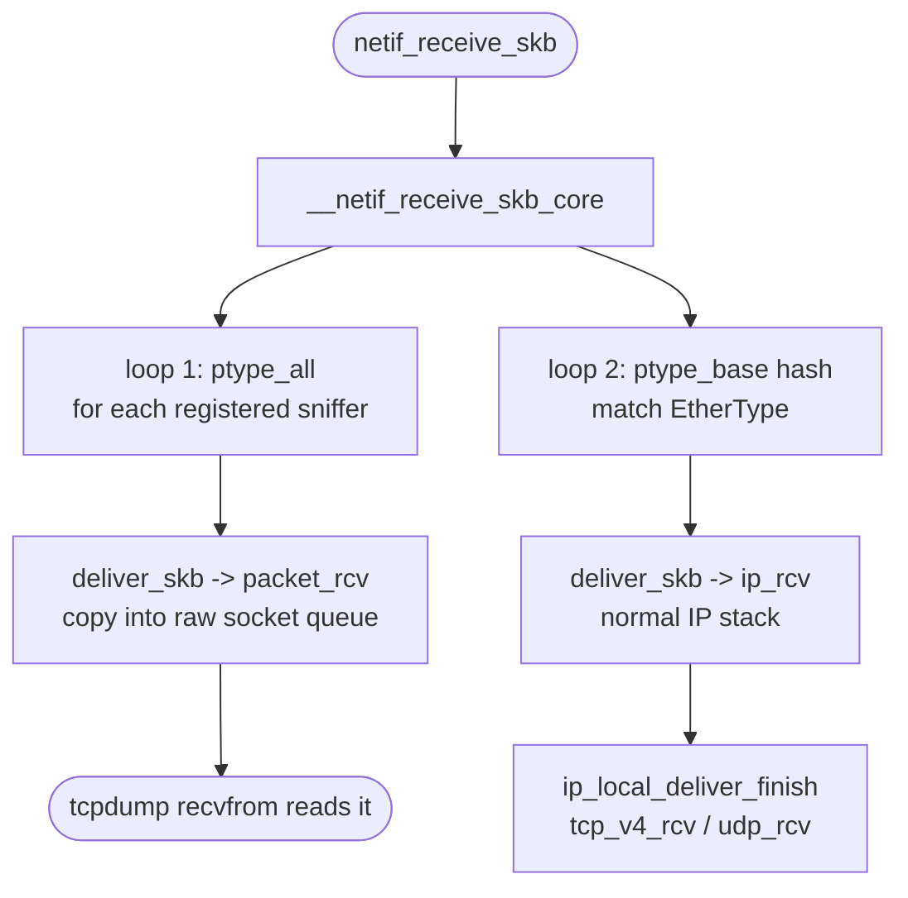


### The IP Layer — `ip_rcv` to `ip_local_deliver_finish`

Once `netif_receive_skb` dispatches the `skb` through `ptype_base` to `ip_rcv`, the kernel is now inside the IP layer. The job here is threefold: run Netfilter hooks, perform routing, and hand the packet off to the correct transport-layer handler.

#### `ip_rcv` — the entry point and the first Netfilter hook

```c
// file: net/ipv4/ip_input.c
int ip_rcv(struct sk_buff *skb, ...)
{
    ......
    return NF_HOOK(NFPROTO_IPV4, NF_INET_PRE_ROUTING, skb, dev, NULL,
                   ip_rcv_finish);
}
```

`ip_rcv` performs basic sanity checks on the IP header (version, header length, checksum, total length). If anything looks wrong the packet is dropped immediately. If it passes, rather than calling `ip_rcv_finish` directly, it goes through `NF_HOOK`.

`NF_HOOK` is the Netfilter hook mechanism. It traverses all rules registered at the `NF_INET_PRE_ROUTING` hook point — this is where `iptables -t raw` and `iptables -t nat PREROUTING` rules live. Each registered hook function can return one of: `NF_ACCEPT` (continue), `NF_DROP` (discard), or `NF_STOLEN` (hook takes ownership). Only if the final verdict is `NF_ACCEPT` does `NF_HOOK` call the continuation function, `ip_rcv_finish`.

#### `ip_rcv_finish` — routing decision

```c
// file: net/ipv4/ip_input.c
static int ip_rcv_finish(struct sk_buff *skb)
{
    ......
    if (!skb_dst(skb)) {
        int err = ip_route_input_noref(skb, iph->daddr, iph->saddr,
                                       iph->tos, skb->dev);
        ...
    }
    ......
    return dst_input(skb);
}
```

`ip_rcv_finish` does the routing lookup. `skb_dst(skb)` checks whether a destination cache entry (`dst_entry`) is already attached to this `skb` — for example by a previous early-demux shortcut. If not, `ip_route_input_noref` is called to perform a full FIB (Forwarding Information Base) lookup.

The lookup determines one of three outcomes:
- The packet is **for this host** (`RT_SCOPE_HOST`) — `dst->input` is set to `ip_local_deliver`.
- The packet must be **forwarded** — `dst->input` is set to `ip_forward`.
- The packet is for a **multicast** group we are subscribed to — handled by `ip_route_input_mc`, which also sets `dst->input = ip_local_deliver` when `our = 1`.

```c
// file: net/ipv4/route.c
static int ip_route_input_mc(struct sk_buff *skb, __be32 daddr, __be32 saddr,
                              u8 tos, struct net_device *dev, int our)
{
    if (our) {
        rth->dst.input = ip_local_deliver;
        rth->rt_flags |= RTCF_LOCAL;
    }
}
```

After the routing decision is recorded in the `dst_entry`, `ip_rcv_finish` calls `dst_input`:

```c
// file: include/net/dst.h
static inline int dst_input(struct sk_buff *skb)
{
    return skb_dst(skb)->input(skb);
}
```

This is an indirect call through the function pointer stored in `dst->input`. For locally-destined packets that pointer is `ip_local_deliver`.

#### `ip_local_deliver` — reassembly and the second Netfilter hook

```c
// file: net/ipv4/ip_input.c
int ip_local_deliver(struct sk_buff *skb)
{
    if (ip_is_fragment(ip_hdr(skb))) {
        if (ip_defrag(skb, IP_DEFRAG_LOCAL_DELIVER))
            return 0;
    }

    return NF_HOOK(NFPROTO_IPV4, NF_INET_LOCAL_IN, skb, skb->dev, NULL,
                   ip_local_deliver_finish);
}
```

Two things happen here:

1. **Fragment reassembly** — `ip_is_fragment` checks the MF (More Fragments) flag and the fragment offset in the IP header. If set, the packet is a fragment. `ip_defrag` stores it in the fragment queue and returns non-zero until the last fragment arrives and the full datagram can be reassembled into a single `skb`. Only then does execution continue past this block.

2. **`NF_INET_LOCAL_IN` hook** — a second Netfilter traversal. This is where `iptables -t filter INPUT` rules are evaluated. If all rules accept the packet, `ip_local_deliver_finish` is called.

#### `ip_local_deliver_finish` — protocol demultiplexing

```c
// file: net/ipv4/ip_input.c
static int ip_local_deliver_finish(struct sk_buff *skb)
{
    ......
    int protocol = ip_hdr(skb)->protocol;
    const struct net_protocol *ipprot;

    ipprot = rcu_dereference(inet_protos[protocol]);
    if (ipprot != NULL) {
        ret = ipprot->handler(skb);
    }
}
```

`ip_local_deliver_finish` reads the `protocol` field from the IP header (e.g. `IPPROTO_TCP = 6`, `IPPROTO_UDP = 17`) and uses it as an index into `inet_protos[]`, a global array of `struct net_protocol` pointers populated during `inet_init` (via `inet_add_protocol`). It then calls `ipprot->handler(skb)`, which for TCP is `tcp_v4_rcv` and for UDP is `udp_rcv`.

This is the hand-off point between the IP layer and the transport layer.

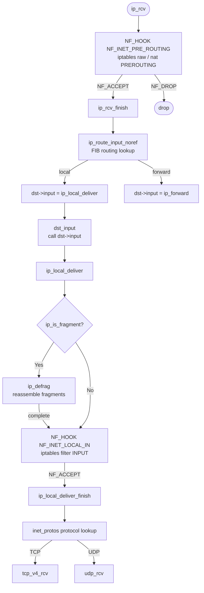


### Full Call Chain

The full path from packet arrival to user-space delivery is:

```text
NIC DMA write → hard interrupt (igb_msix_ring)
  → napi_schedule → poll_list + NET_RX_SOFTIRQ bit set
  → ksoftirqd wakes → net_rx_action
  → igb_poll (drains ring) → igb_clean_rx_irq
  → napi_gro_receive → netif_receive_skb
  → ip_rcv → ip_local_deliver_finish
  → tcp_v4_rcv / udp_rcv
  → enqueue to socket buffer → wake user-space recv()
```

### References

- 張彥飛, *深入理解 Linux 網絡*, Broadview