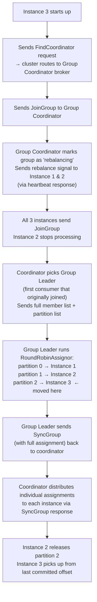

<style>
  video {
    border-radius: 4px;
    max-width: 660px;
  }
  img {
    max-width: 660px !important;
  }
  table td:first-child, table th:first-child {
    min-width: 120px;
  }
</style>


### Cluster


#### Docker-Compose File

```yml
version: "3.8"

services:
  kafka1:
    image: apache/kafka:latest
    container_name: kafka1
    hostname: kafka1
    ports:
      - "9092:29092"
    environment:
      KAFKA_NODE_ID: 1
      KAFKA_PROCESS_ROLES: broker,controller
      KAFKA_CONTROLLER_QUORUM_VOTERS: 1@kafka1:9093,2@kafka2:9093,3@kafka3:9093
      KAFKA_LISTENERS: PLAINTEXT://0.0.0.0:9092,CONTROLLER://0.0.0.0:9093,PLAINTEXT_HOST://0.0.0.0:29092
      KAFKA_ADVERTISED_LISTENERS: PLAINTEXT://kafka1:9092,PLAINTEXT_HOST://localhost:9092
      KAFKA_LISTENER_SECURITY_PROTOCOL_MAP: PLAINTEXT:PLAINTEXT,CONTROLLER:PLAINTEXT,PLAINTEXT_HOST:PLAINTEXT
      KAFKA_INTER_BROKER_LISTENER_NAME: PLAINTEXT
      KAFKA_CONTROLLER_LISTENER_NAMES: CONTROLLER
      KAFKA_LOG_DIRS: /tmp/kraft-combined-logs
      KAFKA_DEFAULT_REPLICATION_FACTOR: 3
      KAFKA_NUM_PARTITIONS: 1

  kafka2:
    image: apache/kafka:latest
    container_name: kafka2
    hostname: kafka2
    ports:
      - "9093:29093"
    environment:
      KAFKA_NODE_ID: 2
      KAFKA_PROCESS_ROLES: broker,controller
      KAFKA_CONTROLLER_QUORUM_VOTERS: 1@kafka1:9093,2@kafka2:9093,3@kafka3:9093
      KAFKA_LISTENERS: PLAINTEXT://0.0.0.0:9092,CONTROLLER://0.0.0.0:9093,PLAINTEXT_HOST://0.0.0.0:29093
      KAFKA_ADVERTISED_LISTENERS: PLAINTEXT://kafka2:9092,PLAINTEXT_HOST://localhost:9093
      KAFKA_LISTENER_SECURITY_PROTOCOL_MAP: PLAINTEXT:PLAINTEXT,CONTROLLER:PLAINTEXT,PLAINTEXT_HOST:PLAINTEXT
      KAFKA_INTER_BROKER_LISTENER_NAME: PLAINTEXT
      KAFKA_CONTROLLER_LISTENER_NAMES: CONTROLLER
      KAFKA_LOG_DIRS: /tmp/kraft-combined-logs
      KAFKA_DEFAULT_REPLICATION_FACTOR: 3
      KAFKA_NUM_PARTITIONS: 1

  kafka3:
    image: apache/kafka:latest
    container_name: kafka3
    hostname: kafka3
    ports:
      - "9094:29094"
    environment:
      KAFKA_NODE_ID: 3
      KAFKA_PROCESS_ROLES: broker,controller
      KAFKA_CONTROLLER_QUORUM_VOTERS: 1@kafka1:9093,2@kafka2:9093,3@kafka3:9093
      KAFKA_LISTENERS: PLAINTEXT://0.0.0.0:9092,CONTROLLER://0.0.0.0:9093,PLAINTEXT_HOST://0.0.0.0:29094
      KAFKA_ADVERTISED_LISTENERS: PLAINTEXT://kafka3:9092,PLAINTEXT_HOST://localhost:9094
      KAFKA_LISTENER_SECURITY_PROTOCOL_MAP: PLAINTEXT:PLAINTEXT,CONTROLLER:PLAINTEXT,PLAINTEXT_HOST:PLAINTEXT
      KAFKA_INTER_BROKER_LISTENER_NAME: PLAINTEXT
      KAFKA_CONTROLLER_LISTENER_NAMES: CONTROLLER
      KAFKA_LOG_DIRS: /tmp/kraft-combined-logs
      KAFKA_DEFAULT_REPLICATION_FACTOR: 3
      KAFKA_NUM_PARTITIONS: 1
```

#### Why KRaft Replaces ZooKeeper

Before Kafka 2.8, every Kafka cluster **required a separate ZooKeeper ensemble** to function. ZooKeeper was responsible for:

- Electing the active controller (the broker that manages metadata)
- Storing cluster metadata: topic configs, partition assignments, broker registrations, ACLs
- Detecting broker failures via session timeouts

This created several problems:

| Problem | Detail |
|---|---|
| **Operational complexity** | We had to deploy, monitor, and scale a separate ZooKeeper cluster alongside Kafka |
| **Scaling bottleneck** | All metadata went through ZooKeeper, which became a bottleneck in large clusters |
| **Split-brain risk** | Two separate systems (Kafka + ZooKeeper) had to agree on state, introducing edge cases |
| **Slow failover** | Controller re-election required round-trips to ZooKeeper, slowing recovery |

##### What KRaft does instead

KRaft (**K**afka **R**aft) embeds a Raft consensus algorithm **directly into Kafka itself**. The controllers form a quorum and elect a leader among themselves — no external system needed.

- Cluster metadata is stored in an internal Kafka topic (`__cluster_metadata`) replicated across all controllers
- The active controller is elected via Raft, not ZooKeeper
- Brokers fetch metadata from the controller quorum directly
- Failover is faster because metadata is already replicated in-process

This is why `KAFKA_PROCESS_ROLES: broker,controller` exists — each node participates in both roles, and `KAFKA_CONTROLLER_QUORUM_VOTERS` replaces what ZooKeeper's connection string used to do.

> KRaft became production-ready in Kafka 3.3 and ZooKeeper mode was fully removed in Kafka 4.0.


#### Listener Architecture

Each broker has 3 listeners:

| Listener Name  | Port  | Purpose                                      |
|----------------|-------|----------------------------------------------|
| `PLAINTEXT`    | 9092  | Inter-broker communication (uses Docker DNS) |
| `CONTROLLER`   | 9093  | KRaft controller-to-controller communication |
| `PLAINTEXT_HOST` | 29092/29093/29094 | External access from the host machine |

##### Why two PLAINTEXT listeners?

- `PLAINTEXT` advertises `kafka1:9092`, `kafka2:9092`, `kafka3:9092` — resolvable only **inside Docker**
- `PLAINTEXT_HOST` advertises `localhost:9092`, `localhost:9093`, `localhost:9094` — accessible from the **host machine**

Without this split, `localhost` inside a container resolves to that container itself, causing brokers to hit the wrong ports when discovering each other.


#### Key Environment Variables

##### `KAFKA_LISTENERS`
Defines which addresses/ports the broker actually **binds** to and listens on — i.e., what the OS socket listens on.

```
PLAINTEXT://0.0.0.0:9092       ← bind on all interfaces, port 9092 (inter-broker)
CONTROLLER://0.0.0.0:9093      ← bind on all interfaces, port 9093 (controller quorum)
PLAINTEXT_HOST://0.0.0.0:29092 ← bind on all interfaces, port 29092 (host access)
```

`0.0.0.0` means "accept connections on any network interface". We could restrict to a specific IP, but `0.0.0.0` is typical in containers.

##### `KAFKA_ADVERTISED_LISTENERS`
The addresses Kafka **publishes to clients** via metadata responses. Clients use these to connect after the initial bootstrap.

```
PLAINTEXT://kafka1:9092        ← advertised to other brokers (Docker DNS resolves "kafka1")
PLAINTEXT_HOST://localhost:9092 ← advertised to clients on the host machine
```

The critical distinction:
- `KAFKA_LISTENERS` = what the broker **actually opens** (server-side binding)
- `KAFKA_ADVERTISED_LISTENERS` = what the broker **tells others to connect to** (published in metadata)

If these are mismatched, clients receive an address they can't reach, causing connection failures.

##### `KAFKA_LISTENER_SECURITY_PROTOCOL_MAP`
Maps each custom listener name to a security protocol:
```
PLAINTEXT:PLAINTEXT, CONTROLLER:PLAINTEXT, PLAINTEXT_HOST:PLAINTEXT
```
Required because `PLAINTEXT_HOST` is a non-standard name — Kafka won't recognize it without this mapping and will fail to start.

##### `KAFKA_INTER_BROKER_LISTENER_NAME`
Tells brokers which listener to use when talking to **each other**. Set to `PLAINTEXT` so brokers use Docker hostnames internally.

##### `KAFKA_CONTROLLER_LISTENER_NAMES`
Tells KRaft which listener is used for **controller quorum** traffic. Set to `CONTROLLER`.

##### `KAFKA_CONTROLLER_QUORUM_VOTERS`
Lists all controller nodes in the quorum:
```
1@kafka1:9093, 2@kafka2:9093, 3@kafka3:9093
```


##### `KAFKA_DEFAULT_REPLICATION_FACTOR` in Depth

This setting controls how many brokers will each store a full copy of each partition's ***messages*** at creation time. The key constraint is:

$$
\text{replication factor} \leq \text{number of brokers}
$$

If you set `KAFKA_DEFAULT_REPLICATION_FACTOR: 4` but only have 2 brokers running, topic creation fails immediately:

```
InvalidReplicationFactorException: Replication factor: 4 larger than available brokers: 2
```

This applies regardless of how the topic is created — CLI, Spring `NewTopic` bean (app startup fails), or auto-creation (produce/consume call fails).

###### What if replication factor is smaller than broker count?

Perfectly fine. Say you have 5 brokers and `replication-factor=3`. For a given partition, Kafka picks 3 of the 5 brokers to hold replicas:

```
Partition 0:  leader=broker1,  ISR=[broker1, broker2, broker3]
              broker4, broker5 — hold replicas for other partitions
```

Brokers 4 and 5 aren't idle — they serve as partition leaders and replica holders for other partitions of the same (or other) topics.

###### Why not just set it equal to the broker count always?

For small clusters (3–5 brokers), setting replication factor = broker count is common and reasonable.

For large clusters (10, 50, 100+ brokers) it becomes actively harmful:

- **Storage cost multiplies linearly** — 50 brokers × replication-factor=50 means 50× your data volume
- **Write amplification** — every produce call waits for all 50 brokers to acknowledge before returning
- **Rebalance cost** — ISR tracking becomes expensive when every broker tracks every partition

The industry standard is **replication-factor=3 regardless of cluster size**. The goal isn't "every broker holds all data" — it's "each piece of data has 3 independent copies." With 100 partitions across 50 brokers at `replication-factor=3`, each partition is on 3 brokers and the partitions are spread evenly so every broker ends up holding roughly the same total data volume.

###### What happens when a leader broker fails?

Say partition 0 has `leader=broker1, ISR=[broker1, broker2, broker3]` and broker 1 crashes:

1. KRaft's active controller detects the failure via missed heartbeats
2. Controller elects a new leader from the ISR — broker 2 or broker 3
3. Metadata is updated cluster-wide; producers and consumers reconnect to the new leader automatically
4. Consumers resume from the last committed offset — **no messages are lost** because ISR replicas were already fully in sync

###### The `acks` producer setting

Whether messages produced *just before* the crash are lost depends on the producer's `acks` config:

| `acks` | Meaning | Risk on leader crash |
|---|---|---|
| `0` | No ack waited | Message may be lost |
| `1` | Wait for leader ack only | Lost if leader crashes before replicating |
| `all` / `-1` | Wait for all ISR acks | No data loss |

`acks=all` is the safe default for production.


#### Leader Election

Kafka has **two types of leaders**, and the listener config is central to both:

##### Controller Leader (KRaft quorum leader)
- One of the 3 nodes is elected as the **active controller** via the Raft consensus algorithm
- Uses the `CONTROLLER` listener (`port 9093`) exclusively — this is why `CONTROLLER` is listed separately and excluded from `KAFKA_ADVERTISED_LISTENERS`
- The active controller manages all topic/partition metadata and handles partition leader assignments
- Election happens automatically on startup and on failure; determined by which node wins the Raft vote among `KAFKA_CONTROLLER_QUORUM_VOTERS`

##### Partition Leader (per topic-partition)
- Each partition has one broker elected as its **leader** — producers and consumers always talk to the leader
- The active controller assigns partition leaders based on broker availability and replica placement
- Advertised via metadata: when a client connects to any broker via `--bootstrap-server`, that broker returns metadata saying "partition 0 of my-topic is led by kafka2 at `kafka2:9092`" — the client then connects directly to that address

##### How listeners tie into leader discovery

```
Client connects to kafka1:9092 (PLAINTEXT_HOST via localhost:9092 from host)
       ↓
kafka1 returns metadata: "partition 0 leader = kafka2, connect to kafka2:9092"
       ↓
Client connects directly to kafka2:9092
```

This is why `KAFKA_ADVERTISED_LISTENERS` must use **Docker hostnames** (`kafka2:9092`) for inter-broker traffic, not `localhost` — only Docker hostnames are resolvable by other containers.


#### Port Mapping

| Host Port | Container Port | Broker   |
|-----------|----------------|----------|
| 9092      | 29092          | kafka1   |
| 9093      | 29093          | kafka2   |
| 9094      | 29094          | kafka3   |


#### Partitions vs Replication

These two settings solve completely different problems and are often confused:

| | Replication (`replication-factor`) | Partitioning (`partitions`) |
|---|---|---|
| Purpose | **Fault tolerance** — survive broker failures | **Throughput** — parallel reads/writes |
| Effect | Data copied across N brokers | Data split into N independent streams |
| Consumer impact | Transparent to consumers | Only 1 consumer per group can read a partition |

##### Replication does NOT mean standby-only

A common misconception is that only 1 broker is active and the rest are on standby. In Kafka, **all brokers are active simultaneously** — leadership is distributed at the partition level:

```
Partition 0 → leader: kafka1,  replicas: kafka2, kafka3  ← kafka1 handles traffic
Partition 1 → leader: kafka2,  replicas: kafka1, kafka3  ← kafka2 handles traffic
Partition 2 → leader: kafka3,  replicas: kafka1, kafka2  ← kafka3 handles traffic
```

Replicas stay in sync (ISR — In-Sync Replicas) and only become leaders on failure.

##### Fault tolerance with replication-factor=3

With 3 brokers and `replication-factor=3`, every partition's data exists on all 3 brokers. The cluster tolerates up to 2 broker failures with no data loss:

$$
\text{tolerable failures} = \text{replication factor} - 1 = 2
$$

##### When to use 1 partition

Use `partitions=1` when:
- **Strict global message ordering** is required (ordering is only guaranteed within a partition)
- The topic is low-volume (config events, notifications, etc.)
- Only one consumer needs to read the topic at a time

Use more partitions when:
- High throughput is needed (each partition leader can be on a different broker)
- Multiple consumers in a group need to process messages in parallel

> Partition count can be **increased** later but never decreased — start with what you need.


#### Topic Default Configuration

`KAFKA_DEFAULT_REPLICATION_FACTOR` and `KAFKA_NUM_PARTITIONS` are broker-level defaults. They only apply when a topic is created **without** explicit flags:

```bash
# Uses broker defaults (replication-factor=3, partitions=1)
kafka-topics.sh --bootstrap-server kafka1:9092 --create --topic my-topic

# Overrides defaults explicitly
kafka-topics.sh --bootstrap-server kafka1:9092 --create --topic my-topic \
  --partitions 6 --replication-factor 2
```

These settings have **no effect** on:
- Topics that already exist
- Topics created with explicit `--partitions` / `--replication-factor` flags
- Any runtime behaviour of the cluster


### Producer

#### Message Key and Group ID


##### Message Key (Producer)

The **message key** is an optional value sent alongside the message payload when producing. Kafka uses it to route the message to a specific partition via consistent hashing:

```text
partition = hash(key) % numPartitions
```

All messages with the same key always land on the same partition, which guarantees **ordering for that key**. If no key is provided, Kafka distributes messages across partitions in a round-robin fashion and ordering is **not** guaranteed across messages.

```java
@Service
public class CourseProducer {

    private final KafkaTemplate<String, Course> kafkaTemplate;

    public CourseProducer(KafkaTemplate<String, Course> kafkaTemplate) {
        this.kafkaTemplate = kafkaTemplate;
    }

    public void send(Course course) {
        // kafkaTemplate.send(topic, key, value)
        //                          ^^^^^^^^
        //                          Message key — determines which partition this goes to.
        //                          All "course" messages → same partition → ordered.
        kafkaTemplate.send("my-topic", "course", course);
    }
}
```

Common key choices: a user ID, order ID, or any value where ordering matters.


### Consumer

##### Consumer Group ID (Consumer)

The **consumer group ID** identifies a logical group of consumer instances. Kafka uses it to coordinate which consumer owns which partition:

- Each partition is consumed by **exactly one consumer** within a group at a time
- Different groups each receive **all** messages independently (fan-out)
- Kafka tracks each group's offset separately so groups don't interfere with each other

```java
@Component
public class CourseConsumer {

    // groupId — identifies this consumer's group to Kafka.
    // Kafka tracks this group's read position (offset) independently
    // from any other consumer group.
    @KafkaListener(topics = "my-topic", groupId = "course-group")
    public void listen(Course course) {
        System.out.println("Received course: " + course);
    }
}
```

##### Key vs Group ID — side-by-side

| | Message Key | Consumer Group ID |
|---|---|---|
| **Set by** | Producer | Consumer |
| **Purpose** | Route message to a specific partition | Coordinate consumers and track offsets |
| **Guarantees** | Same key → same partition → ordered | Each partition consumed by one member at a time |
| **Scope** | Per message | Per consumer application |
| **Example value** | `"course"`, `userId`, `orderId` | `"course-group"`, `"billing-service"` |

> **Key insight:** the message key (`"course"`) and the group ID (`"course-group"`) are completely independent strings. The key controls *where* a message is stored; the group ID controls *who* reads it and *where they left off*.


#### Can a Topic Hold Different Message Types?

Technically yes — Kafka itself is schema-agnostic. A topic is just a log of byte arrays; Kafka doesn't enforce or care about message format. You *could* send JSON on one message and Avro on the next.

In practice though, teams almost always treat a topic as a **single logical stream of one message type**, for these reasons:

- **Consumers deserialize blindly** — if you register a `@KafkaListener` with `Course.class`, it will fail or produce garbage when it hits a non-`Course` message.
- **Schema Registry (Confluent)** — the standard enterprise pattern is to attach a schema to each topic and reject messages that don't conform.
- **Ordering guarantees are per-partition** — if you mix types, ordering semantics become meaningless.

The conventional rule is: **one topic = one event type**. If you need to publish `Course` and `Student` events, use `course-topic` and `student-topic` separately. Fan-out (multiple consumers receiving all messages) is achieved through **consumer groups**, not by multiplexing types into one topic.

#### `spring.json.trusted.packages`

##### Why do we need Trusted Packages?

```yaml
spring:
  kafka:
    properties:
      spring:
        json:
          trusted:
            packages: "com.machingclee.kafka.common.type"
```

When a Kafka consumer deserializes a JSON message back into a Java object, Spring uses `JsonDeserializer` under the hood. By default it **refuses to deserialize any class** that isn't in an explicitly trusted package — this is a security guard against **deserialization attacks**, where a malicious producer could send a crafted payload that instantiates an arbitrary class on the consumer side.

This setting tells the `JsonDeserializer`: *"only instantiate classes from this package when deserializing"*. Without it, we would get a runtime error:

```
The class ... is not in the trusted packages
```

##### Common patterns

| Value | Meaning |
|---|---|
| `"com.machingclee.kafka.common.type"` | Only trust that specific package |
| `"com.machingclee.*"` | Trust all subpackages under `com.machingclee` |
| `"*"` | Trust everything (convenient but removes the security benefit) |

#### `ErrorHandlingDeserializer` — Graceful Deserialization Failures

By default, if a bad message arrives and `JsonDeserializer` throws a `SerializationException`, the listener container crashes and stops processing. Wrapping it with `ErrorHandlingDeserializer` catches that exception and routes the failed record to an error handler instead, keeping the consumer alive.

##### `application.yaml`

```yaml
spring:
  kafka:
    consumer:
      value-deserializer: org.springframework.kafka.support.serializer.ErrorHandlingDeserializer
      properties:
        spring:
          deserializer:
            value:
              delegate:
                class: org.springframework.kafka.support.serializer.JsonDeserializer
          json:
            trusted:
              packages: "com.machingclee.kafka.common.type"
            value:
              default:
                type: "com.machingclee.kafka.common.type.Course"
```

Key properties:

| Property | Purpose |
|---|---|
| `value-deserializer` | Set to `ErrorHandlingDeserializer` as the outer wrapper |
| `spring.deserializer.value.delegate.class` | The actual deserializer (`JsonDeserializer`) delegated to internally |
| `spring.json.trusted.packages` | Packages the deserializer is allowed to instantiate |
| `spring.json.value.default.type` | Target class to deserialize JSON into — without this, `JsonDeserializer` doesn't know what type to produce |

##### `Course.java` — no-arg constructor required

Jackson (used internally by `JsonDeserializer`) requires a **public no-arg constructor** to instantiate the target class during deserialization:

```java
public class Course {

    public Course() {}   // required by Jackson

    // fields, getters, setters ...
}
```

Without it, deserialization fails with an `InvalidDefinitionException` even if the JSON is perfectly valid.

##### What these two changes achieve together

- `ErrorHandlingDeserializer` catches any `SerializationException` gracefully — the listener container stays running and the bad message can be logged or sent to a dead-letter topic
- The no-arg constructor on `Course` ensures `JsonDeserializer` can properly map incoming JSON to a `Course` object

#### Does One Spring App = One Consumer Group?

***Not necessarily.*** 

A single Spring application can have **multiple `@KafkaListener` methods with different `groupId` values**, making it participate in multiple consumer groups simultaneously:

```java
@KafkaListener(topics = "my-topic", groupId = "group-a")
public void listenAsGroupA(Course course) { ... }

@KafkaListener(topics = "my-topic", groupId = "group-b")
public void listenAsGroupB(Course course) { ... }
```

The `group-id` in `application.yml` sets the **default** group ID used when `@KafkaListener` doesn't specify one explicitly:

```yaml
kafka:
  consumer:
    group-id: "my-group"   # default for any @KafkaListener without groupId=
```

```java
@KafkaListener(topics = "my-topic")                        // uses "my-group" (yaml default)
@KafkaListener(topics = "my-topic", groupId = "other-group") // overrides default
```

In practice the common pattern is **one application = one consumer group** because:

- Each microservice has a single responsibility and thus a single consume-behaviour
- Mixing multiple group IDs in one app makes offset tracking and scaling harder to reason about
- Horizontal scaling works cleanly when all instances of the same app share the same `group-id` — Kafka automatically distributes partitions across them

So the YAML default being a single `group-id` reflects the **typical** deployment model, not a hard limitation.

#### Who is the Group Coordinator?

The **Group Coordinator** is a specific Kafka broker — not KRaft, not a separate service. Kafka picks it by hashing the consumer group ID against the internal `__consumer_offsets` topic:

```
coordinator_broker = hash(group-id) % numPartitions(__consumer_offsets)
```

Whichever broker owns that partition of `__consumer_offsets` becomes the Group Coordinator for your `group-id`. It's just a regular broker wearing an extra hat.

##### What happens when a third instance joins?

Say you have 3 partitions, 2 consumer instances running (instance 2 owns partition 1 and partition 2), and instance 3 now starts up:



##### Two roles, one flow

| Role | Who | Responsibility |
|---|---|---|
| **Group Coordinator** | A broker (determined by `hash(group-id)`) | Detects membership changes, triggers rebalance, distributes final assignments |
| **Group Leader** | The first consumer that joined the group | Computes the actual partition → consumer mapping and sends it back to the coordinator |

Key points:
- Instance 2 doesn't "push" partition 2 anywhere — it simply **stops claiming it** after the rebalance signal
- Instance 3 resumes exactly from the **last committed offset** of partition 2 (whatever instance 2 last committed)
- **KRaft is not involved** — it only manages broker/cluster metadata, never consumer group state

#### What if Consumers Outnumber Partitions?

The same rebalance process triggers when a 4th instance joins — but since there are only 3 partitions, one consumer ends up with nothing:

```
RoundRobinAssignor result (4 consumers, 3 partitions):
  partition 0 → Instance 1
  partition 1 → Instance 2
  partition 2 → Instance 3
  (nothing)   → Instance 4   ← sits idle
```

Instance 4 is still **fully connected** — it sends regular heartbeats to the Group Coordinator and is a registered group member. It just has no partition to consume from.

##### Why keep it connected at all?

It acts as a **hot standby**. If Instance 2 crashes, the Group Coordinator detects missed heartbeats, triggers a rebalance, and Instance 4 steps in immediately:

```
partition 0 → Instance 1
partition 1 → Instance 4   ← steps in, resumes from last committed offset of Instance 2
partition 2 → Instance 3
```

No messages are lost — Instance 4 picks up exactly where Instance 2 left off.

##### The rule

$$
\text{active consumers} = \min(\text{consumers in group},\ \text{number of partitions})
$$

Any consumer beyond the partition count is idle but ready. Scaling consumers past the partition count gives **no throughput benefit** — to get more parallelism you must first increase the partition count.

#### Does Kafka Auto-Create Topics?

Yes — by default. Kafka brokers have `auto.create.topics.enable=true`, so when your consumer (or producer) first references a topic that doesn't exist, the broker creates it automatically using the broker-level defaults:

```
KAFKA_NUM_PARTITIONS: 1
KAFKA_DEFAULT_REPLICATION_FACTOR: 3
```

This is why simply launching a consumer with `@KafkaListener(topics = "my-topic")` works without any prior setup.

##### The problem with relying on auto-creation

You have no control over the partition count at creation time. If you later need 6 partitions for throughput, auto-creation already gave you 1 — and partition count can **never be decreased**, only increased.

##### The recommended approach — declare a `NewTopic` bean

Spring Kafka will create (or verify) the topic on startup if you register a `NewTopic` bean:

```java
@Configuration
public class KafkaTopicConfig {

    @Bean
    public NewTopic myTopic() {
        return TopicBuilder.name("my-topic")
            .partitions(3)
            .replicas(3)
            .build();
    }
}
```

This is **idempotent** — if the topic already exists with the right config it does nothing; if it doesn't exist it creates it. This is the safe, production-friendly pattern.

##### Summary

| Approach | Topic created? | Partition control? |
|---|---|---|
| Auto (broker default) | Yes, on first use | No — uses broker defaults |
| CLI `kafka-topics.sh` | Yes, explicitly | Full control |
| Spring `NewTopic` bean | Yes, on app startup | Full control |

#### Common Commands

##### Start / Stop
```bash
docker compose up -d
docker compose down
```

##### Enter a broker container
```bash
docker exec -it kafka1 /bin/bash
```

##### Topic Management

###### List all topics
```bash
docker exec -it kafka1 /opt/kafka/bin/kafka-topics.sh \
  --bootstrap-server kafka1:9092 \
  --list
```

###### Create a topic (using broker defaults)
```bash
docker exec -it kafka1 /opt/kafka/bin/kafka-topics.sh \
  --bootstrap-server kafka1:9092 \
  --create --topic my-topic
```

###### Create a topic (with explicit settings)
```bash
docker exec -it kafka1 /opt/kafka/bin/kafka-topics.sh \
  --bootstrap-server kafka1:9092 \
  --create --topic my-topic \
  --partitions 1 --replication-factor 3
```

###### Describe a topic
```bash
docker exec -it kafka1 /opt/kafka/bin/kafka-topics.sh \
  --bootstrap-server kafka1:9092 \
  --describe --topic my-topic
```

Output fields:
- **Leader** — broker currently handling reads/writes for that partition
- **Replicas** — all brokers holding a copy
- **Isr** — In-Sync Replicas: brokers fully caught up with the leader

###### Delete a topic
```bash
docker exec -it kafka1 /opt/kafka/bin/kafka-topics.sh \
  --bootstrap-server kafka1:9092 \
  --delete --topic my-topic
```

##### Producing & Consuming

###### Produce messages (interactive)
```bash
docker exec -it kafka1 /opt/kafka/bin/kafka-console-producer.sh \
  --bootstrap-server kafka1:9092 \
  --topic my-topic
```

###### Consume messages (from latest)
```bash
docker exec -it kafka1 /opt/kafka/bin/kafka-console-consumer.sh \
  --bootstrap-server kafka1:9092 \
  --topic my-topic
```

###### Consume messages (from beginning)
```bash
docker exec -it kafka1 /opt/kafka/bin/kafka-console-consumer.sh \
  --bootstrap-server kafka1:9092 \
  --topic my-topic \
  --from-beginning
```

##### Consumer Groups

###### List consumer groups
```bash
docker exec -it kafka1 /opt/kafka/bin/kafka-consumer-groups.sh \
  --bootstrap-server kafka1:9092 \
  --list
```

###### Describe a consumer group (shows lag)
```bash
docker exec -it kafka1 /opt/kafka/bin/kafka-consumer-groups.sh \
  --bootstrap-server kafka1:9092 \
  --describe --group my-group
```

##### `--bootstrap-server` flag
Points the CLI to an initial broker to fetch cluster metadata. Only one address is needed to discover the full cluster, but listing multiple provides redundancy if one broker is down:
```bash
--bootstrap-server kafka1:9092,kafka2:9092,kafka3:9092
```
